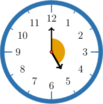
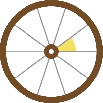

# Solving Angle Problems

Source: https://www.mathacademy.com/topics/3965?courseId=75
Topic ID: 3965

## Prerequisites

- [Sums of Angles](./1505-sums-of-angles.md)
- [Acute, Obtuse, and Reflex Angles](./1510-acute-obtuse-and-reflex-angles.md)
- [Two-Digit by One-Digit Multiplication Using Place Value](./2416-two-digit-by-one-digit-multiplication-using-place-value.md)
- [Strategies to Simplify Whole Number and Fraction Multiplication](./2458-strategies-to-simplify-whole-number-and-fraction-multiplication.md)
- [Connecting Angles and Circles](./3981-connecting-angles-and-circles.md)

## Lesson

### Introduction

In this lesson, we'll extend our understanding of angles to real-world and mathematical problems.

For example, let's find the angle formed by the minute and hour hands of a clock at $5$:$00,$ as shown below.

If we connect the center of the clock face and the hour marks, we get $12$ identical angles. And, since a full angle has a measure of $360^\circ,$ each of these angles has a measure of

$$
\dfrac{360^\circ}{12}.
$$

Now, let's compute the value of this fraction:

$$
\begin{aligned}\frac{360}{12} & = \\ 360÷12 & = \\ 36×10÷12 & = \\ (36÷12)×10 & = \\ 3×10 & = \\ 30 & \end{aligned}
$$

Therefore, $\dfrac{360^\circ}{12} = 30^\circ.$

The angle formed by the minute and hour hands of a clock at $5$:$00$ contains $5$ such angles, so its measure is

$$
5 \times 30^\circ = 150^\circ.
$$

### Example: Calculating Angles From Full Angles Given in Context

#### Question

A wheel has $10$ spokes, as shown below. The angles between the adjacent spokes are identical. Find the measure of the angle formed by adjacent spokes.

#### Explanation

The spokes of a wheel form $10$ identical central angles. These $10$ angles form a full angle of $360^\circ,$ so the measure of each angle is $\dfrac{360^\circ}{10}.$

Now, let's compute the value of the fraction:

$$
\begin{aligned}\frac{360}{10} & = \\ 360÷10 & = \\ 36\,0 & = \\ 36 & \end{aligned}
$$

Therefore, $\dfrac{360^\circ}{10} = 36^\circ.$

### Example: Finding Fractions of a Full Angle Given in Context

#### Question

A wheel has $18$ spokes. The angles between the adjacent spokes are identical. Find the measure of the shaded angle.

#### Explanation

The spokes of the wheel form $18$ identical angles. Since a full angle has a measure of $360^\circ,$ the measure of one division is $\dfrac{360^\circ}{18}.$

Now, let's compute the value of the fraction:

$$
\begin{aligned}\frac{360}{18} & = \\ 360÷18 & = \\ (36÷18)×10 & = \\ 2×10 & = \\ 20 & \end{aligned}
$$

Therefore, $\dfrac{360^\circ}{18} = 20^\circ.$

The shaded angle consists of $4$ divisions, so its measure is

$$
4 \times 20^\circ = 80^\circ.
$$

### Example: Identifying Possible Angles

#### Question

Sketch an angle with a measure of $115^\circ.$

#### Explanation

Notice that $115^\circ$ lies between $90^\circ$ (a right angle) and $180^\circ$ (a straight angle).

As a result, our angle must be obtuse.

