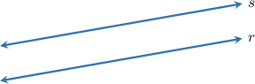
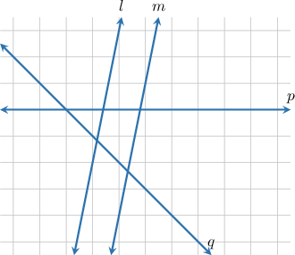
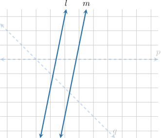
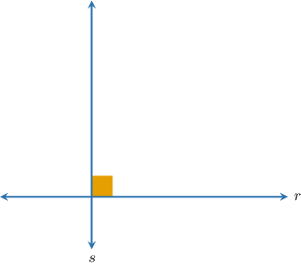
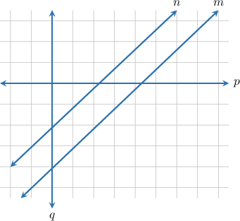
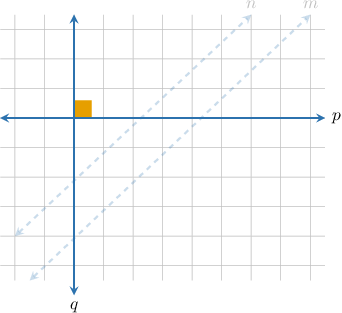
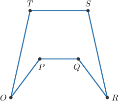
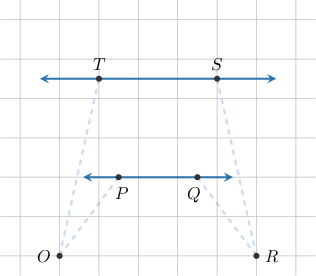

# Parallel and Perpendicular Lines

Source: https://www.mathacademy.com/topics/3979?courseId=75
Topic ID: 3979

## Prerequisites

- [Right, Straight, Full, and Null Angles](./1509-right-straight-full-and-null-angles.md)

## Lesson

### Introduction

Two lines are **parallel** if they never meet. So, for example, the lines $r$ and $s$ below are parallel.

If two lines are parallel, we can express this using the $\parallel$ symbol as follows:

$$

r \parallel s

$$

In words, we say, "the line $r$ is parallel to the line $s.$"

If two lines are not parallel, they must have a common point. In this case, we say that the lines **intersect**.

For example, the lines $v$ and $w$ below intersect at the point $P{:}$

We have the following important property about lines in two-dimensional space.

*Any two distinct lines are either parallel or intersect at exactly one point.*

### Example: Parallel Lines

#### Question

List all of the parallel lines in the diagram below.

#### Explanation

Two lines are parallel if they never intersect.

In the given diagram, the only parallel lines are $l$ and $m.$

### Perpendicular Lines

Two lines are **perpendicular** if they intersect and form a $90^\circ$ angle.

For example, the lines $r$ and $s$ below are perpendicular.

When two lines are perpendicular, we can express this with the symbol $\perp,$ as follows:

$$

r \perp s

$$

In words, we say, "the line $r$ is perpendicular to the line $s$."

### Example: Perpendicular Lines

#### Question

List all of the perpendicular lines in the diagram below.

#### Explanation

Two lines are perpendicular if they intersect and form a $90^\circ$ angle.

In the given diagram, the only perpendicular lines are $p$ and $q.$

### Example: Identifying Parallel and Perpendicular Lines in Figures

#### Question

In the figure above, find the parallel sides.

#### Explanation

Two lines are parallel if they never intersect.

First, notice that the lines $\overset{\longleftrightarrow}{PQ}$ and $\overset{\longleftrightarrow}{TS}$ are parallel.

Therefore, we conclude that the sides $\overline{PQ}$ and $\overline{TS}$ are parallel. We can write this as follows:

$$

\overline{PQ} \parallel \overline{TS}

$$
