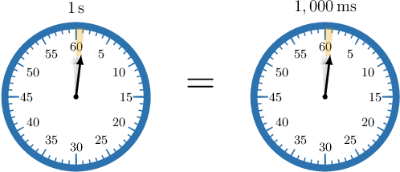

# Units of Time

Source: https://www.mathacademy.com/topics/4197?courseId=75
Topic ID: 4197

## Prerequisites

- [Multiplying Fractions by Whole Numbers](https://www.mathacademy.com/topics/multiplying-fractions-by-whole-numbers-2360)

## Lesson

### Introduction

**Measuring** means finding a number that describes the size of something. In particular, we determine the duration between two events by measuring the **time** between those events. We use **time units** for this purpose.

The most popular measurement system within the scientific community is the **metric system**. Within the metric system, the most common units of measurement are called **base units**.

The base unit for time is the **second**, which we denote using the symbol "$\textrm{s}.$" We measure the time between two events using clocks like the ones shown below.

We use **milliseconds** to measure smaller time intervals. The symbol for milliseconds is "$\textrm{ms}.$" The prefix $\textrm m$ stands for **milli,** which means $\dfrac{1}{1\,000}.$ Therefore, $1\,\textrm{ms}$ equals $\dfrac{1}{1\,000}\,\textrm s.$

Notice that if we add $1\,\textrm{ms}$ to itself $1\,000$ times, we get exactly $1\,\textrm{s}{:}$

$$
\begin{aligned}\overset{\overset{1\,ms+1\,ms+⋯+1\,ms}{}}{1\,000 times} & = \\ \frac{1}{1\,000}\,s+\frac{1}{1\,000}\,s+⋯+\frac{1}{1\,000}\,s & = \\ 1\,000×\frac{1}{1\,000}\,s & = \\ \frac{1\,000×1}{1\,000}\,s & = \\ \frac{1\,000}{1\,000}\,s & = \\ 1\,s & \end{aligned}
$$

Therefore, $1\,000\,\textrm{ms}$ equals $1\,\textrm{s},$ as stated in the diagram.

One millisecond is a very short time interval. To put this into context, a single blink of a human eye is around $200$ milliseconds on average.

### Example: Metric Units of Time

#### Question

Suppose we want to measure the duration of the collision between two billiard balls. Which metric unit could we use?

1. $\textrm{kg}$

2. $\textrm{m}$

3. $\textrm{ms}$

#### Explanation

A table showing the metric units of time is given below.

Therefore, from the given options, the only unit of time is $\textrm{ms}.$

### Other Units of Time

Other time units in common usage are **minute**, **hour**, **day**, and **week**.

A table showing our units of time is given below.

### Example: Identifying Conversions Between Time Units

#### Question

A fitness class lasts exactly $1\,\textrm{h}.$ What is this time in minutes?

#### Explanation

A table showing the units of time is given below.

Therefore, $1\,\textrm{h}$ is equivalent to $60\,\textrm{min}.$
