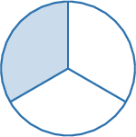
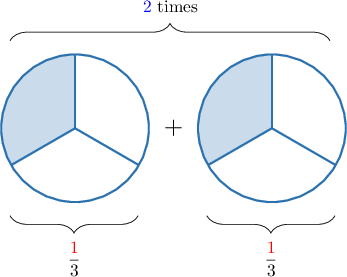
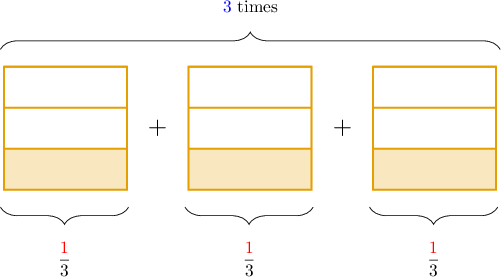
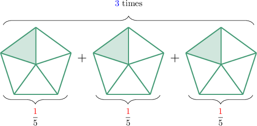
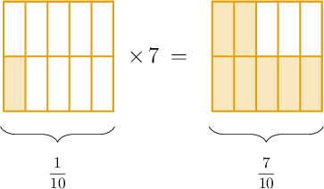
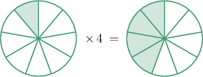
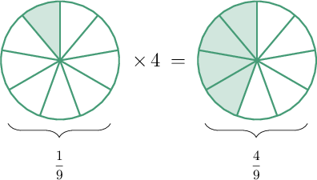
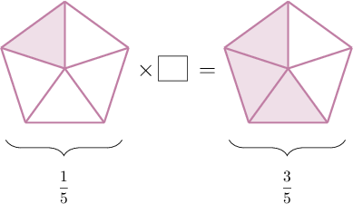

# Multiplying Unit Fractions by Whole Numbers Using Models

Source: https://www.mathacademy.com/topics/564?courseId=75
Topic ID: 564

## Prerequisites

- [Adding Fractions With Like Denominators Using Models](./2370-adding-fractions-with-like-denominators-using-models.md)

## Lesson

### Introduction

We can use fraction models to multiply unit fractions by whole numbers.

For example, let's consider the following product:

$$
\dfrac 13 \times 2
$$

First, we represent $\dfrac{1}{3}$ using a model:

Multiplication by a whole number is simply a repeated addition. And, since we need to multiply $\dfrac{\color{red}1}{3}$ by ${\color{blue}2},$ we repeat the fraction model $\color{blue}2$ times, as shown below.

There are ${\color{blue}2} \times {\color{red}1} = 2$ shaded pieces in total. Therefore, we conclude that

$$
2 \times \dfrac{1}{3} = \dfrac{2}{3}.
$$

### Example: Representing a Product as a Repeated Addition

#### Question

Consider the diagram above. Write down this multiplication as a repeated addition of fraction models.

#### Explanation

In the model, we have $\dfrac{\color{red}1}{3}$ multiplied by ${\color{blue}3}.$ This means that we need to make $\color{blue}3$ copies of the given fraction model.

So, the missing fraction model is:

### Example: Multiplying a Unit Fraction by a Whole Number Using Repeated Addition

#### Question

Use the model above to calculate $3 \times \dfrac{1}{5}.$

#### Explanation

Since we need to multiply $\dfrac{\color{red}1}{5}$ by $\color{blue}3$, we repeat the fraction model $\color{blue}3$ times, as shown below.

There are ${\color{blue}3} \times {\color{red}1} = 3$ shaded pieces in total. Therefore,

$$
3 \times \dfrac{1}{5} = \dfrac{3}{5}.
$$

### A Faster Way of Computing a Product Using Models

There's another way we can use fraction models to multiply unit fractions by whole numbers.

To demonstrate, let's consider the multiplication problem below:

$$
\dfrac{1}{10} \times 7
$$

We start by drawing a fraction model to represent $\dfrac{1}{10}.$

Now, rather than repeating our model $7$ times (which would take a long time), we can instead multiply the number of shaded pieces by $7.$

Our model has $1$ shaded piece. So, the resulting model must have $1 \times 7 = 7$ shaded pieces:

Therefore, we conclude that

$$
\dfrac{1}{10}\times 7 = \dfrac{7}{10}.
$$

### Example: Identifying a Multiplication Problem Given a Model

#### Question

What multiplication problem is represented by the model above?

#### Explanation

We have $\dfrac{1}{9}$ on the left and $\dfrac{4}{9}$ on the right.

Therefore, we have

$$
\dfrac{1}{9} \times 4 = \dfrac{4}{9}.
$$

**** We can swap the factors on the left-hand side. So, the following would be a correct answer too:

$$
4 \times \dfrac{1}{9} = \dfrac{4}{9}
$$

### Example: Identifying a Missing Factor Given a Model

#### Question

What number is missing from the multiplication problem above?

#### Explanation

We have $\dfrac{1}{5}$ on the left and $\dfrac{3}{5}$ on the right.

The shape on the left has $1$ shaded piece, and the shape on the right has $3$ shaded pieces. So the number of shaded pieces has increased by a factor of ${\color{blue}3}.$

Therefore, we have

$$
\dfrac{1}{5} \times {\color{blue}3} = \dfrac{3}{5}.
$$

So, the missing number is ${\color{blue}3}.$
