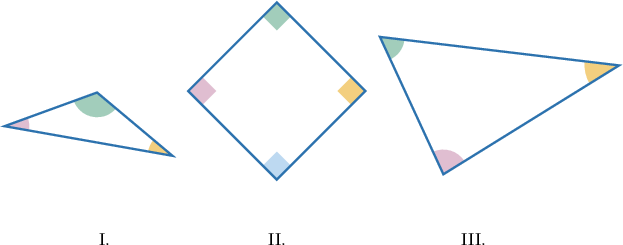
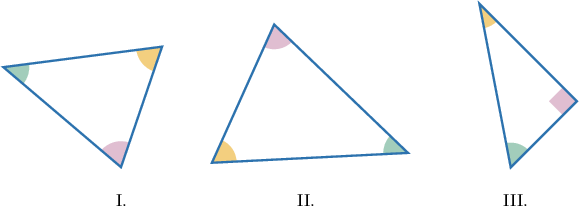
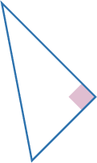

# Classifying Figures Based on Angles

Source: https://www.mathacademy.com/topics/6368?courseId=75
Topic ID: 6368

## Prerequisites

- [Acute, Obtuse, and Reflex Angles](https://www.mathacademy.com/topics/acute-obtuse-and-reflex-angles-1510)

## Lesson

### Introduction

Consider the triangle below.

The highlighted angle is a **right angle**, an angle whose measure is exactly $90^\circ.$ We highlight right angles with a square.

A triangle that contains a right angle, such as the one above, is called a **right triangle**.

Next, consider the triangle below.

Notice that the highlighted angle is larger than a right angle.

This is an **obtuse angle**, an angle whose measure is greater than $90^\circ$ and less than $180^\circ.$

On the other hand, in the same triangle, the other two angles are smaller than a right angle.

These are **acute angles**, angles whose measures are greater than $0^\circ$ and less than $90^\circ.$

In this lesson, we will classify figures by identifying whether they contain acute angles, obtuse angles, or right angles.

### Example: Classifying Figures With Acute and Obtuse Angles

#### Question

Which of the figures above contains an obtuse angle?

#### Explanation

An obtuse angle has a measure between $90^\circ$ and $180^\circ.$

Among the given options, the only figure that contains an obtuse angle is the following:

Therefore, the correct answer is "I only".

### Example: Classifying Right Triangles

#### Question

Which of the triangles above is a right triangle?

#### Explanation

A right triangle is a triangle that has a right angle.

Among the given options, the only triangle with a right angle is the following:

Therefore, the correct answer is "III only".
