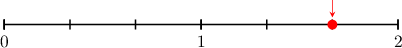
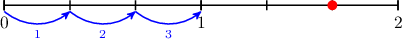
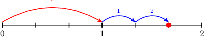
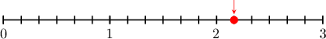
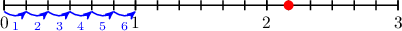
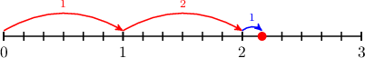
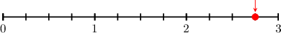
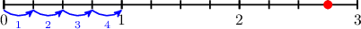
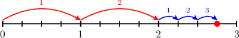

# Modeling Mixed Numbers Using Number Lines

Source: https://www.mathacademy.com/topics/7008?courseId=75
Topic ID: 7008

## Prerequisites

- [Models for Mixed Numbers](./3893-models-for-mixed-numbers.md)

## Lesson

### Introduction

We can represent mixed numbers with number lines.

For example, let's write the number shown on the number line below as a mixed number.

First, notice that the line segment from $0$ to $1$ is split into $\color{blue}3$ equal parts.

We can land on our point by making $\color{red}1$ whole step plus $\color{blue}2$ part steps (out of a possible ${\color{blue}{3}}).$

Therefore, the mixed number is ${\color{red}1}{\color{blue}\dfrac{2}{3}}.$

### Example: Identifying Mixed Numbers Using Number Lines

#### Question

What mixed number is shown on the number line?

#### Explanation

The line segment from $0$ to $1$ is split into $\color{blue}6$ equal parts. Each part represents $\dfrac{1}{\color{blue}6}$ of a whole.

Starting from zero, we land on our point by making $\color{red}2$ whole steps plus $\color{blue}1$ part step:

Therefore, the mixed number is ${\color{red}2}{\color{blue}\dfrac{1}{6}}.$

### Example: Identifying Mixed Numbers With Non-Unit Fractional Parts

#### Question

What mixed number is shown on the number line?

#### Explanation

The line segment from $0$ to $1$ is split into $\color{blue}4$ equal parts. Each part represents $\dfrac{1}{\color{blue}4}$ of a whole.

Starting from zero, we land on our point by making $\color{red}2$ whole steps plus $\color{blue}3$ part steps (out of a possible ${\color{blue}{4}}$).

Therefore, the mixed number is ${\color{red}2}{\color{blue}\dfrac{3}{4}}$
