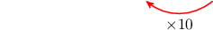
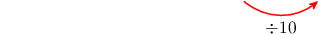
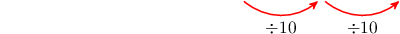

# Comparing Place Values With Decimals

Source: https://www.mathacademy.com/topics/2283?courseId=30
Topic ID: 2283

## Prerequisites

- [The Place Value System With Decimals](https://www.mathacademy.com/topics/the-place-value-system-with-decimals-2282)
- [Multiplying Numbers by Powers of Ten Using Place Value](https://www.mathacademy.com/topics/multiplying-numbers-by-powers-of-ten-using-place-value-2322)

## Lesson

### Introduction

How much bigger is the size of the digit ${\color{blue}9}$ in $3.{\color{blue}9}6$ than the size of the digit ${\color{red}9}$ in $4.3{\color{red}9}?$

Let's start by writing down the place values for $3.{\color{blue}9}6.$ We see that the $\color{blue}9$ is in the tenths place.

Now, we write the place values for $4.3{\color{red}9}.$ Here, the $\color{red}9$ is in the hundredths place.

To compare the two digits, we move one step to the left in the place value chart. Each step to the left is an *increase* by a factor of $10$:

Therefore, the value of the digit $\color{blue}9$ in the tenths place is $10$ times greater than the value of the digit $\color{red}9$ in the hundredths place.

### Example: Comparing Place Values by Moving Left One Step

#### Question

How many times greater is the value of the digit $6$ in $2.361$ than the value of the digit $6$ in $2.856?$

#### Explanation

Let's start by writing down the place values for $2.3{\color{blue}6}1.$

Now, we write the place values for $2.85{\color{red}6}.$

To compare the two digits, we move $1$ step to the left in the place value chart. Each step to the left is an ** by a factor of $10$:

Therefore, the value of the digit $\color{blue}6$ in the hundredths place is $10$ times greater than the value of the digit $\color{red}6$ in the thousandths place.

### Comparing Place Values by Moving Left Multiple Steps

How many times greater is the size of the digit $\color{blue}2$ in ${\color{blue}2}3.5$ than the size of the digit $\color{red}2$ in $98.{\color{red}2}?$

Let's start by writing down the place values for ${\color{blue}{2}}3.5$:

Then we write the place values for $98.{\color{red}{2}}$:

Now, let's jump from the tenths place to the tens place. Remember that the decimal does not correspond to a place value, so we jump right over it.

We have that

$$
\underbrace{10\times10}_{\color{black}2\,\text{steps}}=100.
$$

Therefore, the value of the digit $\color{blue}2$ in the tens place is $100$ times larger than the value of the digit $\color{red}2$ in the tenths place.

### Example: Comparing Place Values by Moving Left Multiple Steps

#### Question

Find a number in which the digit $9$ has a value that is $1,000$ times larger than the value of the digit $9$ in $313.9.$

#### Explanation

Let's start by writing down the place values for $313.9.$

We need to find a digit that is $1,000$ times greater than this ${\color{red}{9}}.$

Notice that

$$
1,000 = \underbrace{10\times 10\times 10}_{3\,\text{steps}}.
$$

Therefore, we move this digit $\color{red}9$ three steps to the left in the place value chart. This gives:

Thus, the required number is ** number that has the digit $\color{blue}9$ in the hundreds place. Some examples include:

$$
{\color{blue}9}15.74, \qquad 2,{\color{blue}9}80.2, \qquad 32,{\color{blue}9}01.56.
$$

### Comparing Place Values With Decimals by Moving Right

The digit $\color{red}3$ in $9.15{\color{red}3}$ is *smaller* than the digit $\color{blue}3$ in $4.7{\color{blue}3},$ but by how much?

Let's start by writing down the place values for $9.15{\color{red}{3}}.$

Then, we write the place values for $4.7{\color{blue}{3}}.$

Now, we move from tenths place to thousands place. Each step to the right is a *decrease* by a factor of $10.$

Therefore, the value of the digit $\color{red}3$ in the thousandths place is $10$ times *smaller* than the value of the digit $\color{blue}3$ in the hundredths place.

Alternatively, we can also say that the value of the digit $\color{red}3$ in the thousandths place is $\dfrac{1}{10}$ the value of the digit $\color{blue}3$ in the hundredths place.

### Example: Comparing Place Values by Moving Right One Step

#### Question

How many times smaller is the digit $\color{blue}6$ in $11.{\color{blue}6}2$ than the digit $\color{red}6$ in ${\color{red}6}.751?$

#### Explanation

Let's start by writing down the place values for $11.{\color{red}6}2.$

Now we write the place values for ${\color{blue}6}.751.$

Now let's jump from the ones place to the tenths place.

Therefore, the value of the digit $\color{red}6$ in the tenths place is $10$ times smaller than the value of the digit $\color{blue}6$ in the ones place.

Alternatively, we can also say that the value of the digit $\color{red}6$ in the tenths place is $\dfrac{1}{10}$ the value of the digit $\color{blue}6$ in the ones place.

### Comparing Place Values With Decimals by Moving Right Multiple Steps

How many times *smaller* is the value of the digit $5$ in the tenths place than the value of the digit $5$ in the tens place?

Let's move from the tens place to the tenths place in the place value chart:

We see that the value of the digit $5$ in the tenths place is $100$ times *smaller* than the value of the digit $5$ in the tens place, because

$$
\underbrace{10\times10}_{\color{black}2\,\text{steps}}=100.
$$

This is the same as saying that the size of the digit $\color{red}5$ in the tenths place is $\dfrac{1}{100}$ the size digit $\color{blue}5$ in the tens place.

### Example: Comparing Place Values by Moving Right Multiple Steps

#### Question

What is missing in the following sentence?

$\qquad$ The digit $4$ in $57.934$ is $\underline{\phantom{{}^{000000000000000000000000000}}}$ the value of the digit $4$ in $0.416.$

#### Explanation

Let's start by writing down the place values for $57.93{\color{red}{4}}.$

Then, we write the place values for $0.{\color{blue}{4}}16.$

Now let's jump from the tenths place to the thousandths place.

We see that the value of the digit $4$ in the thousandths place is

$$
\underbrace{10\times 10}_{\color{black}2\,\text{steps}}=100
$$

times **** than the value of the digit $4$ in the tenths place.

Therefore, the complete sentence is "The digit $4$ in $57.934$ is $\dfrac{1}{100}$ the value of the digit $4$ in $0.416.$"
