# Dividing Decimals by Powers of Ten Using Decimal Point Placement

Source: https://www.mathacademy.com/topics/2289?courseId=30
Topic ID: 2289

## Prerequisites

- [Multiplying Decimals by Powers of Ten Using Decimal Point Placement](https://www.mathacademy.com/topics/multiplying-decimals-by-powers-of-ten-using-decimal-point-placement-2318)
- [Dividing Decimals by Powers of Ten Using Place Value](https://www.mathacademy.com/topics/dividing-decimals-by-powers-of-ten-using-place-value-2323)

## Lesson

### Introduction

Remember that to *multiply* a decimal by $10,$ we shift the decimal point one space to the *right*.

So, to *divide* a decimal by $10,$ we shift the decimal point one place to the *left*.

To demonstrate, let's use this method to find the value of

$$
38.7 \div 10.
$$

First, we write down our number. We can attach as many leading zeros as we want to the whole number part:

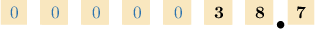

Now, we count the zeros in $10.$ Since $10$ contains $1$ zero, we move the decimal point $1$ place to the left:

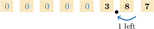

This gives the following diagram:

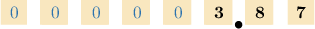

We ignore the leading zeros in the whole number part and trailing zeros in the decimal part. This gives the following number:

$$
3.87
$$

Therefore:

$$
38.7 \div 10 = 3.87
$$

### Example: Dividing a Number by Ten

#### Question

Calculate $256 \div 10.$

#### Explanation

First, we write down our number. We can attach as many leading zeros to the whole number part as we want:

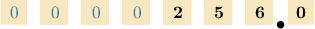

Now, we count the zeros in $10.$ Since $10$ contains $1$ zero, we move the decimal point $1$ place to the left:

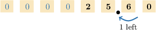

This gives the following diagram:

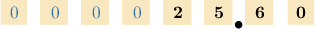

We ignore the leading zeros in the whole number part and trailing zeros in the decimal part. This gives the following number:

$$
25.60 = 25.6
$$

Therefore:

$$
256 \div 10 = 25.6
$$

### Example: Dividing a Number Smaller Than Ten by Ten

#### Question

Calculate $8 \div 10.$

#### Explanation

First, we write down our number. We can attach as many leading zeros to the whole number part as we want:

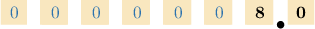

Now, we count the zeros in $10.$ Since $10$ contains $1$ zero, we move the decimal point $1$ place to the left:

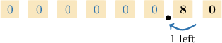

This gives the following diagram:

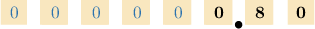

We ignore the leading zeros in the whole number part and trailing zeros in the decimal part. This gives the following number:

$$
0.80 = 0.8
$$

Therefore:

$$
8 \div 10 = 0.8
$$

### Dividing Decimals by Larger Powers of Ten

To divide a decimal by a larger power of $10,$ we shift the decimal point to the left by one place for each zero in the power of $10.$

To illustrate, let's use this method to find the value of

$$
9 \div 100.
$$

First, we write down our number. We can attach as many trailing zeros as we want to the whole number part.

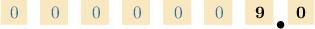

Now, we count the zeros in $100.$ Since $100$ contains $2$ zeros, we move the decimal point $2$ places to the left:

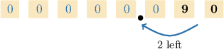

This gives the following diagram:

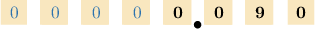

We ignore the leading zeros in the whole number part and trailing zeros in the decimal part. This gives the following number:

$$
0.090 = 0.09
$$

Therefore:

$$
9 \div 100 = 0.09
$$

### Example: Dividing a Number by One Hundred

#### Question

Calculate $66.3 \div 100.$

#### Explanation

First, we write down our number. We can attach as many leading zeros to the whole number part as we want:

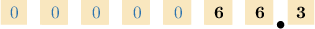

Now, we count the zeros in $100.$ Since $100$ contains $2$ zeros, we move the decimal point $2$ places to the left:

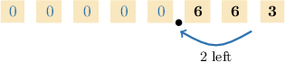

This gives the following diagram:

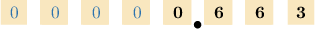

We ignore the leading zeros in the whole number part and trailing zeros in the decimal part. This gives the following number:

$$
0.663
$$

Therefore:

$$
66.3 \div 100 = 0.663
$$

### Example: Dividing a Number by One Thousand

#### Question

Find the value of $769 \div 1,000.$

#### Explanation

First, we write down our number. We can attach as many leading zeros to the whole number part as we want:

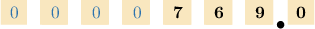

Now, we count the zeros in $1,000.$ Since $1,000$ contains $3$ zeros, we move the decimal point $3$ places to the left:

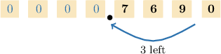

This gives the following diagram:

We ignore the leading zeros in the whole number part and trailing zeros in the decimal part. This gives the following number:

$$
0.7690 = 0.769
$$

Therefore:

$$
769 \div 1,000 = 0.769
$$
