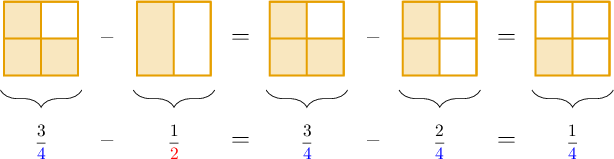

# Subtracting Fractions With Unlike Denominators

Source: https://www.mathacademy.com/topics/2357?courseId=30
Topic ID: 2357

## Prerequisites

- [Subtracting Fractions and Whole Numbers](./545-subtracting-fractions-and-whole-numbers.md)
- [Adding Fractions With Unlike Denominators](./2353-adding-fractions-with-unlike-denominators.md)
- [Subtracting Fractions With Unlike Denominators Using Models](./2372-subtracting-fractions-with-unlike-denominators-using-models.md)

## Lesson

### Introduction

Subtracting fractions with unlike denominators is just like adding them. Before subtracting two fractions, we must express them as equivalent fractions with a common denominator.

For example, suppose that we want to find the value of

$$
\dfrac 3 {\color{blue}{4}} - \dfrac 1 {\color{red}{2}}.
$$

The denominators are ${\color{blue}{4}}$ and ${\color{red}{2}}.$ Since ${\color{blue}{4}}$ is a multiple of ${\color{red}{2}},$ we can make a common denominator of ${\color{blue}{4}}.$

We can put $\dfrac{1}{\color{red}2}$ over a denominator of $4$ by multiplying the numerator and denominator by $2\mathbin{:}$

$$
\dfrac{1}{{\color{red}{2}}} = \dfrac{1\times 2}{{\color{red}{2}}\times 2} = \dfrac{2}{\color{blue}4}
$$

Now, let's subtract the fractions. We keep the denominator the same, and we subtract the numerators.

$$
\begin{aligned}\frac{3}{4}−\frac{2}{4}=\frac{1}{4}\end{aligned}
$$

Therefore, the answer is $\dfrac{1}{4}.$

If we use a fraction model instead, we get the same answer:

### Example: Subtracting Fractions Where One Denominator Is a Multiple of the Other

#### Question

Find the value of $\dfrac{2}{3} - \dfrac 1 6.$

#### Explanation

To subtract two fractions with unlike denominators, we must express each fraction as an equivalent fraction with a common denominator.

Since $\color{blue}6$ is a multiple of ${\color{red}{3}},$ we can make a common denominator of ${\color{blue}{6}}.$

To put $\dfrac 2 {\color{red}{3}}$ over a denominator of ${\color{blue}{6}},$ we multiply the numerator and denominator by $2\mathbin{:}$

$$
\dfrac{2}{\color{red}3} = \dfrac{2\times 2}{{\color{red}{3}}\times 2} = \dfrac{4}{\color{blue}6}
$$

We can now subtract the fractions. We keep the denominator the same, and we subtract the numerators.

$$
\begin{aligned}\frac{4}{6}−\frac{1}{6}=\frac{3}{6}\end{aligned}
$$

We can simplify this fraction by dividing the numerator and denominator by $3\mathbin{:}$

$$
\dfrac{3\div 3}{6\div 3} = \dfrac{1}{2}
$$

### Subtracting Fractions With Unlike Denominators and No Common Factors

When one denominator is not a multiple of the other, a common denominator can always be found by taking the product of the denominators.

For example, let's compute

$$
\dfrac{1}{\color{red}2} - \dfrac{1}{\color{blue}3}.
$$

The number ${\color{red}2}$ is not a multiple of ${\color{blue}3}$ and vice-versa. But we can make a common denominator of ${\color{red}2} \times {\color{blue}3} = 6.$

To put $\dfrac 1 {\color{red}2}$ over a denominator of $6,$ we multiply the numerator and denominator by ${\color{blue}3}\mathbin{:}$

$$
\dfrac{1}{{\color{red}2} } = \dfrac{1\times {\color{blue}3} }{{\color{red}2} \times {\color{blue}3} } = \dfrac{3}{6}
$$

To put $\dfrac 1 {\color{blue}3}$ over a denominator of $6,$ we multiply the numerator and denominator by ${\color{red}2}\mathbin{:}$

$$
\dfrac{1}{\color{blue}3 } = \dfrac{1\times {\color{red}2} }{{\color{blue}3} \times {\color{red}2} } = \dfrac{2}{6}
$$

We can now subtract the fractions. We keep the denominator the same and subtract the numerators:

$$
\begin{aligned}\frac{3}{6}−\frac{2}{6}=\frac{1}{6}\end{aligned}
$$

### Example: Making a Common Denominator by Multiplying the Denominators

#### Question

Find the value of $\dfrac{3}{4} - \dfrac 1 5.$

#### Explanation

To subtract two fractions with unlike denominators, we must express each fraction as an equivalent fraction with a common denominator.

Let's look at the denominators:

$$
\dfrac{3}{\color{red}4} - \dfrac{1}{\color{blue}5}
$$

The number ${\color{red}4}$ is not a multiple of ${\color{blue}5}$ and vice-versa. But we can make a common denominator of ${\color{red}4} \times {\color{blue}5} = 20.$

To put $\dfrac 3 {\color{red}4}$ over a denominator of $20,$ we multiply the numerator and denominator by ${\color{blue}5}\mathbin{:}$

$$
\dfrac{3}{{\color{red}4} } = \dfrac{3\times {\color{blue}5} }{{\color{red}4} \times {\color{blue}5} } = \dfrac{15}{20}
$$

To put $\dfrac 1 {\color{blue}5}$ over a denominator of $20,$ we multiply the numerator and denominator by ${\color{red}4}\mathbin{:}$

$$
\dfrac{1}{{\color{blue}5} } = \dfrac{1\times {\color{red}4} }{{\color{blue}5} \times {\color{red}4} } = \dfrac{4}{20}
$$

We can now subtract the fractions. We keep the denominator the same, and we subtract the numerators:

$$
\begin{aligned}\frac{15}{20}−\frac{4}{20}=\frac{11}{20}\end{aligned}
$$

### Subtracting Fractions Using the Least Common Multiple

When two denominators have a common factor, finding the lowest common multiple is sometimes easier.

For example, let's compute

$$
\dfrac{5}{6} - \dfrac{1}{8}.
$$

Notice that the denominators ${6}$ and ${8}$ have a common factor of $2.$ So let's look at their multiples:

- Multiples of $6: \quad 6,12,18,{\color{blue}{24}},30,\ldots$

- Multiples of $8: \quad 8,16,{\color{blue}{24}},32,40,\ldots$

The lowest common multiple is ${\color{blue}{24}}.$ This is the lowest common denominator, too.

To put $\dfrac 5 6$ over a denominator of $24,$ we multiply the numerator and denominator by $4\mathbin{:}$

$$
\dfrac{5}{6} = \dfrac{5\times 4}{6 \times 4 } = \dfrac{20}{24}
$$

To put $\dfrac 1 8$ over a denominator of $24,$ we multiply the numerator and denominator by $3\mathbin{:}$

$$
\dfrac{1}{8} = \dfrac{1\times 3 }{8 \times 3 } = \dfrac{3}{24}
$$

We can now subtract the fractions. We keep the denominator the same, and we subtract the numerators:

$$
\begin{aligned}\frac{20}{24}−\frac{3}{24}=\frac{17}{24}\end{aligned}
$$

### Example: Subtracting Fractions Using the Least Common Multiple

#### Question

What is the value of $\dfrac{7}{15} - \dfrac 2 9?$

#### Explanation

To subtract two fractions with unlike denominators, we must express each fraction as an equivalent fraction with a common denominator.

Let's look at the denominators:

$$
\dfrac{7}{15} - \dfrac{2}{9}
$$

The denominators $15$ and $9$ share a common factor of $3.$ So let's look at their multiples:

- Multiples of $15: \quad 15,30,{\color{blue}{45}},60,\ldots$

- Multiples of $9: \quad 9,18,27,36,{\color{blue}{45}},\ldots$

To put $\dfrac 7 {15}$ over a denominator of $45,$ we multiply the numerator and denominator by $3\mathbin{:}$

$$
\dfrac{7}{{15} } = \dfrac{7\times 3 }{{15} \times 3 } = \dfrac{21}{45}
$$

To put $\dfrac 2 9$ over a denominator of $45,$ we multiply the numerator and denominator by $5\mathbin{:}$

$$
\dfrac{2}{{9} } = \dfrac{2\times 5 }{9 \times 5 } = \dfrac{10}{45}
$$

We can now subtract the fractions. We keep the denominator the same, and we subtract the numerators:

$$
\begin{aligned}\frac{21}{45}−\frac{10}{45}=\frac{11}{45}\end{aligned}
$$
