# Adding Fractions With Unlike Denominators Using Models

Source: https://www.mathacademy.com/topics/2374?courseId=30
Topic ID: 2374

## Prerequisites

- [Adding Fractions and Whole Numbers Using Models](https://www.mathacademy.com/topics/adding-fractions-and-whole-numbers-using-models-543)
- [Least Common Denominators](https://www.mathacademy.com/topics/least-common-denominators-2365)

## Lesson

### Introduction

We can add fractions with unlike denominators using fraction models. To illustrate, let's use the fraction model below to find the value of $\dfrac{1}{6} + \dfrac{2}{3}.$

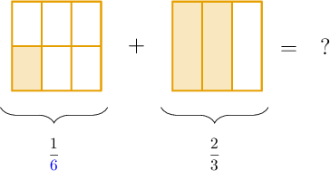

We *cannot* add the fractions at the moment because they are split into different numbers of parts. In other words, they have different denominators.

To get around this, we split the shape on the right into a total of $\color{blue}6$ equal parts by drawing a horizontal line. This turns the fraction $\dfrac 2 3$ into the equivalent fraction $\dfrac 4 6.$

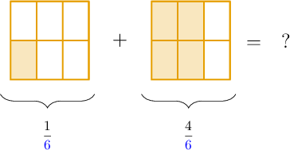

Now that both fractions have the same number of parts, we can add them:

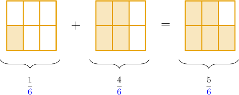

So now, we have:

$$
\dfrac{1}{6} + \dfrac{2}{3} = \dfrac{1}{\color{blue}6} + \dfrac{4}{\color{blue}6} = \dfrac{5}{\color{blue}6}
$$

To add fractions, they need a **common denominator**. Splitting up the second shape meant that the fractions had a common denominator of $\color{blue}6$, which allowed us to add them.

### Example: Adding Fractions When One Split is Required

#### Question

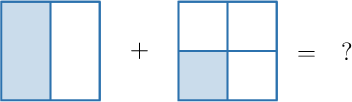

Use the fraction model above to find the value of $\dfrac{1}{2}+\dfrac{1}{4}.$

#### Explanation

We split the shape on the left into $4$ equal parts by drawing a horizontal line:

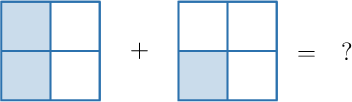

Now that they have the same number of parts, we can add them:

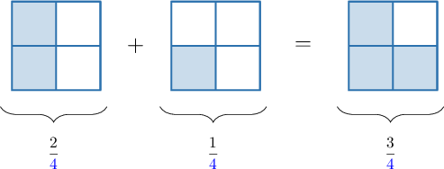

Therefore,

$$
\dfrac{1}{2} + \dfrac{1}{\color{blue}4} = \dfrac{2}{\color{blue}4} + \dfrac{1}{\color{blue}4} = \dfrac{3}{\color{blue}4}
$$

In this case, we made a common denominator of ${\color{blue}{4}}.$

### Example: Adding Fractions When Multiple Splits are Required

#### Question

Use the model below to find the value of $\dfrac{2}{9} + \dfrac{2}{3}.$

#### Explanation

The denominators are $9$ and $3.$ Since $9$ is a multiple of $3$, we can make a common denominator of $\color{blue}9.$

We split the shape on the right into $9$ parts by drawing two vertical lines:

Now that both shapes have a common denominator of $\color{blue}9$, we can add them:

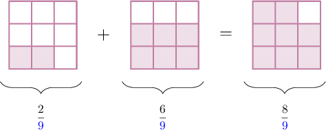

Therefore, we have:

$$
\dfrac{2}{9} + \dfrac{2}{3} = \dfrac{2}{\color{blue}9} + \dfrac{6}{\color{blue}9} = \dfrac{8}{\color{blue}9}
$$

### Making a Common Denominator

Let's suppose that we want to work out $\dfrac{1}{2} + \dfrac{2}{5}.$ The fraction model for this is given below.

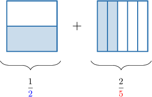

We cannot alter the shape on the left so that it contains $5$ equal parts. So what do we do?

The denominators are $\color{blue}2$ and $\color{red}5$. So we can make a common denominator of ${\color{blue}{2}} \times {\color{red}{5}} = 10,$ as follows:

- We split the shape on the left into $\color{red}5$ parts vertically.

- We split the shape on the right into $\color{blue}2$ parts horizontally.

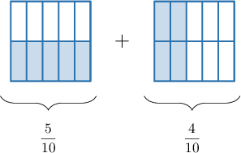

We can now add the two numbers:

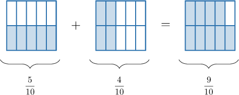

Therefore, we have:

$$
\dfrac{1}{2} + \dfrac{2}{5} = \dfrac{5}{10} + \dfrac{4}{10} = \dfrac{9}{10}
$$

### Example: Making a Common Denominator by Altering Both Fractions

#### Question

Use the model above to determine the number that is missing in the statement below.

$$
\,0\,
$$

#### Explanation

The denominators are $5$ and $6.$ So we can make a common denominator of $5\times 6 = \color{blue}30.$

We split the shape on the left of the addition sign into $6$ parts vertically, and we split the shape on the right into $5$ parts horizontally:

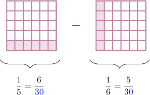

Now, the shape to the left shows $\dfrac{6}{\color{blue}30}$ and the shape to the right shows $\dfrac{5}{\color{blue}30}.$

We add the number of shaded parts and get:

$$
6 + 5 = {\color{red}11}.
$$

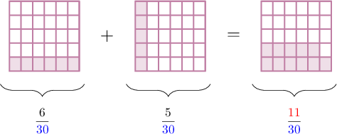

Therefore, we have

$$
\,11\,
$$

So, the missing number is $\color{red}11.$
