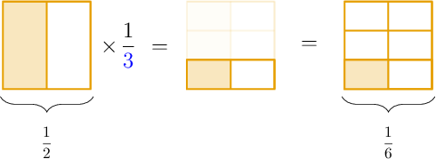

# Multiplying Fractions

Source: https://www.mathacademy.com/topics/2378?courseId=30
Topic ID: 2378

## Prerequisites

- [Multiplying Fractions by Whole Numbers](../grade-4/2360-multiplying-fractions-by-whole-numbers.md)
- [Multiplying Fractions Using Models](./3079-multiplying-fractions-using-models.md)

## Lesson

### Introduction

To multiply fractions, we multiply the numerators, multiply the denominators, and simplify (if necessary).

For example, to multiply $\dfrac 1 {2} \times \dfrac 1 {3},$ we multiply the numerators and we multiply the denominators:

$$

\dfrac{\color{blue}1}{\color{red}2} \times \dfrac{\color{blue}1}{\color{red}3} = \dfrac {{\color{blue}1}\times {\color{blue}1}} {{\color{red}2}\times {\color{red}3}} = \dfrac{1}{6}

$$

Notice that we get the same answer when we use a fraction model.

### Example: Multiplying Fractions by Unit Fractions

#### Question

Find the value of $\dfrac 3 {7} \times \dfrac 1 {4}.$

#### Explanation

To multiply two fractions, we multiply the numerators, and we multiply the denominators:

$$

\dfrac 3 {7} \times \dfrac 1 {4} = \dfrac {3\times 1} {7\times 4} = \dfrac{3}{28}

$$

### Example: Multiplying Fractions

#### Question

Multiply $\dfrac 2 {9} \times \dfrac 4 {5}.$

#### Explanation

To multiply two fractions, we multiply the numerators, and we multiply the denominators:

$$

\dfrac 2 {9} \times \dfrac 4 {5} = \dfrac {2\times 4} {9\times 5} = \dfrac{8}{45}

$$

### Example: Multiplying Fractions When Simplification is Needed

#### Question

Multiply $\dfrac 5 {6} \times \dfrac 3 {4}.$

#### Explanation

To multiply two fractions, we multiply the numerators, and we multiply the denominators:

$$

\dfrac 5 {6} \times \dfrac 3 {4} = \dfrac {5\times 3} {6\times 4} = \dfrac{15}{24}

$$

We reduce this fraction to its simplest form by dividing the numerator and denominator by $3\mathbin{:}$

$$

\dfrac {15} {24} = \dfrac {15\div 3} {24\div 3} = \dfrac{5}{8}

$$
