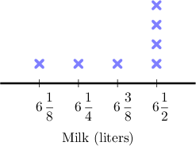
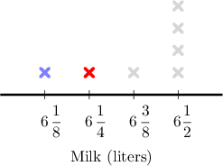
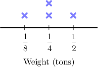
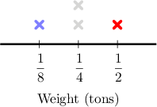
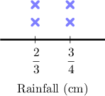
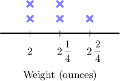

# Operations on Fractions With Line Plots

Source: https://www.mathacademy.com/topics/2401?courseId=30
Topic ID: 2401

## Prerequisites

- [Subtracting Mixed Numbers With Unlike Denominators Using Improper Fractions](./525-subtracting-mixed-numbers-with-unlike-denominators-using-improper-fractions.md)
- [Two-Digit by One-Digit Division](./535-two-digit-by-one-digit-division.md)
- [Creating and Interpreting Line Plots With Fractions](../grade-4/2408-creating-and-interpreting-line-plots-with-fractions.md)

## Lesson

### Introduction

We can gather information from line plots to help us solve more complex problems.

For example, suppose that Charles has several cows on his farm. The following line plot shows the daily volume of milk his cows produce. How much milk is produced by the two least productive cows?

First, we collect the data points of interest. We want the two least productive cows.

Then, we write down the total amount of milk produced by these two cows:

$$

6 \,\dfrac{1}{8} + 6 \, \dfrac{1}{4}

$$

To add two mixed numbers, we add whole numbers with whole numbers and fractions with fractions.

Adding the whole numbers, we get

$$

6 + 6 = 12.

$$

To add two fractions with unlike denominators, we need to express each fraction as an equivalent fraction with a common denominator. Here, we can make a common denominator of $8.$

To put $\dfrac{1}{4}$ over a denominator of $8$, we multiply the numerator and denominator by $2$:

$$

\dfrac{1}{4} = \dfrac{1 \times 2}{4 \times 2} = \dfrac{2}{8}

$$

We can now add the fractions. We keep the denominator the same, and we add the numerators:

$$

\dfrac{1}{8} + \dfrac{1}{4} = \dfrac{1}{8} + \dfrac{2}{8} = \dfrac{3}{8}

$$

Therefore, the sum of the two mixed numbers is

$$

6 \,\dfrac{1}{8} + 6 \, \dfrac{1}{4} = 12 \, \dfrac{3}{8} .

$$

In conclusion, the two least productive cows produce $12 \, \dfrac{3}{8}$ liters of milk per day.

### Example: Calculating a Difference

#### Question

The line plot above gives the weight of four vehicles in a scrapyard. Each cross represents a different vehicle. What is the difference between the weights of the heaviest and the lightest vehicles?

#### Explanation

The plot tells us that the lightest vehicle weighs $\color{blue}\dfrac{1}{8}$ tons, and the heaviest vehicle weighs $\color{red}\dfrac{1}{2}$ tons.

The difference between the weights is

$$

\dfrac{1}{2} - \dfrac{1}{8} \, .

$$

To subtract two fractions with unlike denominators, we need to express each fraction as an equivalent fraction with a common denominator.

Here, we can make a common denominator of $8.$

To put $\dfrac{1}{2}$ over a denominator of $8,$ we multiply the numerator and denominator by $4\mathbin{:}$

$$

\dfrac{1}{2} = \dfrac{1 \times 4}{2 \times 4} = \dfrac{4}{8}

$$

We can now subtract the fractions. We keep the denominator the same, and we subtract the numerators.

$$

\begin{aligned}\frac{1}{2}−\frac{1}{8}=\frac{4}{8}−\frac{1}{8}=\frac{3}{8}\end{aligned}

$$

Therefore, the difference between the weights of the heaviest and lightest vehicles is $\dfrac{3}{8}$ tons.

### Example: Calculating a Total

#### Question

The line plot above shows the amount of rain, in centimeters, that fell in Houston, Texas, over four days. Each cross represents a different day. Find the total amount of rain that fell in Houston during those four days.

#### Explanation

From the graph, we note the following:

- There were $2$ days on which $\dfrac{2}{3}$ centimeters of rain fell.

- There were $2$ days on which $\dfrac{3}{4}$ centimeters of rain fell.

So the total amount of rain that fell is given by

$$

2 \times \dfrac{2}{3} + 2 \times \dfrac{3}{4} = \dfrac{4}{3} + \dfrac{6}{4} \, .

$$

We can simplify the fraction $\dfrac{6}{4}$ by dividing the numerator and denominator by $2\mathbin{:}$

$$

\dfrac{6 \div 2}{4 \div 2} = \dfrac{3}{2}

$$

Now, we need to add the two fractions:

$$

\dfrac{4}{3} + \dfrac{3}{2}

$$

To add two fractions with unlike denominators, we need to express each fraction as an equivalent fraction with a common denominator.

Here, we can make a common denominator of $6.$

- To put $\dfrac{4}{3}$ over a denominator of $6,$ we multiply the numerator and denominator by $2\mathbin{:}$

- To put $\dfrac{3}{2}$ over a denominator of $6,$ we multiply the numerator and denominator by $3\mathbin{:}$

We can now add the fractions. We keep the denominator the same, and we add the numerators.

$$

\begin{aligned}\frac{4}{3}+\frac{3}{2}=\frac{8}{6}+\frac{9}{6}=\frac{17}{6}\end{aligned}

$$

Finally, we convert $\dfrac{17}{6}$ to a mixed number.

$$

17 \div 6 = 2 \,\textrm{R} \,5 = 2 \, \dfrac{5}{6}

$$

Therefore, $2 \, \dfrac{5}{6}$ centimeters of rain fell during this period.

### Example: Redistributing a Total

#### Question

The line plot shows the weight, in ounces, of some bags of fries in a restaurant. Each cross represents a different bag. If the chef redistributes the weight equally among each bag of fries, how much would each bag weigh?

#### Explanation

The total weight of the bags (in ounces) is

$$

2 + 2 + 2 \, \dfrac{1}{4} + 2 \, \dfrac{1}{4} + 2 \, \dfrac{2}{4} \, .

$$

To add mixed numbers, we add whole numbers to whole numbers and fractions to fractions.

- Adding the whole numbers, we get

- Adding the fractions, we get Simplifying this fraction, we get

Therefore, the total weight of the bags (in ounces) is

$$

2 + 2 + 2 \, \dfrac{1}{4} + 2 \, \dfrac{1}{4} + 2 \, \dfrac{2}{4} = 10 + 1 = 11 \, .

$$

To redistribute this total weight equally among each bag of fries, we divide the total weight by the number of bags:

$$

11 \div 5 = 2 \,\textrm{R} \, 1 = 2 \, \dfrac{1}{5}

$$

Therefore, each bag would weigh $2 \, \dfrac{1}{5}$ ounces.
