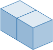
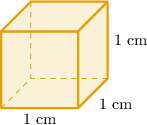
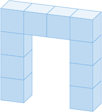
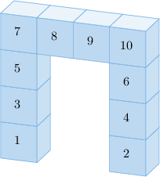
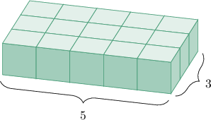
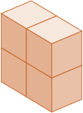
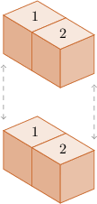
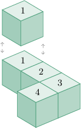

# Understanding Volume Using Unit Cubes

Source: https://www.mathacademy.com/topics/2403?courseId=30
Topic ID: 2403

## Prerequisites

- [Units of Length](../grade-4/236-units-of-length.md)
- [Units of Volume](../grade-4/4198-units-of-volume.md)

## Lesson

### Introduction

**Volume** is the amount of space that an object takes up. We can measure volume with **unit cubes**, like the one below.

These are called unit cubes because each one represents $1$ cubic unit. The volume of a figure is the number of unit cubes that make it up.

For example, let's find the volume of the figure below:

The figure consists of $2$ cubes.

Therefore, its volume is $2$ cubic units.

### Units of Volume

We can use metric and customary units to measure volume.

Consider the cube below, whose length, width, and height all equal $1$ centimeter.

Since the length, width, and height of this cube all equal $1$ centimeter, the volume of this cube is $\mathbf 1$ **cubic centimeter.**

Commonly used metric units of volume are:

- cubic meters

- cubic centimeters

- cubic millimeters

Commonly used customary units of volume are:

- cubic feet

- cubic inches

We'll learn more about units of volume in future lessons.

### Example: Finding the Volume of a Figure by Counting

#### Question

If each cube represents one cubic unit, what is the volume of the figure?

#### Explanation

The figure consists of $10$ cubes.

Therefore, the volume is $10$ cubic units.

### Example: Finding the Volume of a Figure by Multiplying

#### Question

If each cube represents $1$ cubic unit, what is the volume of the figure?

#### Explanation

The figure consists of $3$ rows, and each row has $5$ cubes.

So, there are $5 \times 3 = 15$ cubes in total.

Therefore, the volume of the figure is $15$ cubic units.

### Figures With Multiple Layers

If a figure has multiple layers, we can find its volume by first finding the volume of each layer and then adding the results.

Each cube in the figure below represents one cubic unit. Let's find its volume.

The figure consists of two layers:

- The bottom layer consists of $2$ cubes.

- The top layer consists of $2$ cubes, too.

Therefore, the volume is $2+2=4$ cubic units.

### Example: Finding the Volume of a Figure Containing Multiple Layers

#### Question

An object is assembled as shown below. Given that each small cube represents one cubic unit, what is the volume of the object?

#### Explanation

The figure consists of two layers:

- The bottom layer consists of $4$ cubes.

- The top layer consists of $1$ cube.

Therefore, the volume is $4+1=5$ cubic units.
