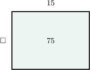
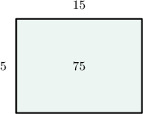
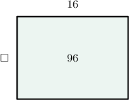
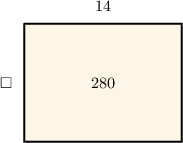
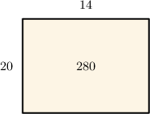
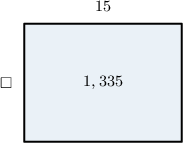
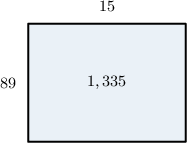

# Dividing by Two-Digit Numbers by Connecting Multiplication and Division

Source: https://www.mathacademy.com/topics/2406?courseId=30
Topic ID: 2406

## Prerequisites

- [Two-Digit by Two-Digit Multiplication](./258-two-digit-by-two-digit-multiplication.md)
- [Two-Digit by One-Digit Division Using Partial Quotients](../grade-4/2424-two-digit-by-one-digit-division-using-partial-quotients.md)

## Lesson

### Introduction

Multiplication and division are "opposite" operations. For example, since

$$

{\color{blue}2} \times {\color{red}3} = 6,

$$

we also know that

$$

6 \div {\color{red}3} = {\color{blue}2}\,.

$$

We can use this idea to figure out the solution to some division problems. For example, suppose we are told that the result of calculating $75 \div 15$ is either

$$

4,\quad 5,\quad \text{or} \quad 6.

$$

To find which choice is correct, we start by writing the corresponding multiplication equation. If $75 \div 15 = \square,$ then

$$

\square \times 15 = 75.

$$

We can represent this multiplication problem using an area model:

We'll try each of the given numbers ($4,5,6$) until we find one that satisfies the multiplication equation.

- $4 \times 15 = 60 \quad{\color{red}{\times}}$

- $5 \times 15 = 60 + 15 = 75 \quad{\color{green}{\checkmark}}$

So we have:

Therefore, $75 \div 15 = 5.$

### Example: Dividing a Two-Digit Number by a Two-Digit Number

#### Question

Given the following options, what is the result of calculating $96 \div 16$ using the relationship between multiplication and division?

1. $5$

2. $6$

3. $7$

#### Explanation

To find which choice is correct, we start by writing the corresponding multiplication equation. If $96 \div 16 = \square,$ then

$$

\square \times 16 = 96.

$$

We can represent this multiplication problem using an area model:

We'll try each of the given numbers ($5,6,7$) until we find one that satisfies the multiplication equation.

- $5 \times 16 = 80 \quad{\color{red}{\times}}$

- $6 \times 16 = 80 + 16 = 96 \quad{\color{green}{\checkmark}}$

So we have:

Therefore, $96 \div 16 = 6.$

### Example: Dividing a Three-Digit Number by a Two-Digit Number

#### Question

A group of environmentalists planted $280$ trees along $14$ rows. If there are the same number of trees in each row, how many trees are in each row? Use the relationship between multiplication and division.

1. $18$ trees

2. $20$ trees

3. $19$ trees

#### Explanation

To find out how many trees are in each row, we divide the number of trees ($280$) by the number of rows ($14$). So, we need to work out $280 \div 14.$

If $280 \div 14 = \square,$ then the corresponding multiplication equation is:

$$

\square\times 14 = 280

$$

We can represent this multiplication problem using an area model:

First, let's list the possible answers, from smallest to largest:

$$

18,\quad 19,\quad 20

$$

We'll try each of the given numbers until we find one that satisfies the multiplication equation.

- $18 \times 14 = 252 \quad{\color{red}{\times}}$

- $19 \times 14 = 252 + 14 = 266 \quad{\color{red}{\times}}$

- $20 \times 14 = 266 + 14 = 280 \quad{\color{green}{\checkmark}}$

So we have:

Therefore, $280 \div 14 = 20.$ So there are $20$ trees in each row.

### Example: Dividing a Four-Digit Number by a Two-Digit Number

#### Question

Given the following options, what is the result of calculating $1,335 \div 15$ using the relationship between multiplication and division?

1. $89$

2. $88$

3. $90$

#### Explanation

If $1,335 \div 15 = \square,$ then the corresponding multiplication equation is:

$$

\square \times 15 = 1,335

$$

We can represent this multiplication problem using an area model:

First, let's list the possible answers, from smallest to largest:

$$

88,\quad 89,\quad 90

$$

We'll try each of the given numbers until we find one that satisfies the multiplication equation.

- $88 \times 15 = 1,320 \quad{\color{red}{\times}}$

- $89 \times 15 = 1,320 + 15 = 1,335 \quad{\color{green}{\checkmark}}$

So we have:

Therefore, $1,335 \div 15 = 89.$
