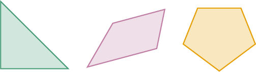
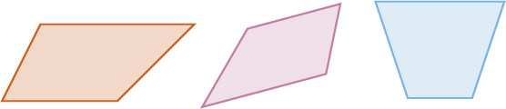
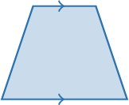
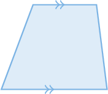

# Quadrilaterals

Source: https://www.mathacademy.com/topics/2407?courseId=30
Topic ID: 2407

## Prerequisites

- [Polygons](./2470-polygons.md)

## Lesson

### Introduction

A **polygon** is any shape with at least $3$ straight sides. Below are some polygons with $3,$ $4,$ and $5$ sides, respectively:

A polygon with exactly $4$ straight sides is called a **quadrilateral**:

Let's remind ourselves of our table of polygons:

### Example: Completing the Sentence: Polygons and Quadrilaterals

#### Question

Place the following words into the sentence below.

$\qquad\qquad$ (**, **)

$\qquad$ A $\text{___________}$ is a $\text{___________}$ that has exactly $4$ sides.

#### Explanation

By the definition of a quadrilateral, the correct answer is

$\qquad$ A **** is a **** that has exactly $4$ sides.

### Trapezoids and Parallelograms

There are a few special types of quadrilaterals.

A **trapezoid** is a quadrilateral with *exactly one* pair of opposite sides parallel to each other:

A **parallelogram** is a quadrilateral with *exactly* two pairs of opposite sides parallel to each other:

### Example: Identifying Shapes: Trapezoids and Parallelograms

#### Question

Which of the shapes below is a parallelogram?

#### Explanation

Let's examine the shapes one by one:

- Shape I is a triangle since it has only $3$ sides.

- Shape II is a trapezoid. It has $4$ sides and only one pair of parallel sides.

- Shape III represents a parallelogram since it has $4$ sides and $2$ pairs of parallel sides.

Therefore, only III is a parallelogram.

### Example: Identifying Types of Quadrilaterals Given Information About Their Sides

#### Question

What word is missing from the sentence below?

$\qquad$ **

1. parallelogram

2. trapezoid

3. quadrilateral

#### Explanation

The correct answer is II: ****. The correct sentence is:

$\qquad$ **

By contrast, any parallelogram has exactly $2$ pairs of parallel sides, and a quadrilateral can have $0,$ $1,$ or $2$ pairs of parallel sides.
