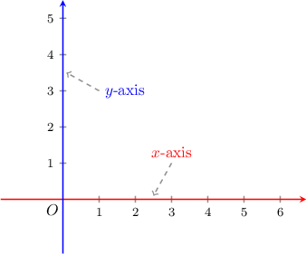
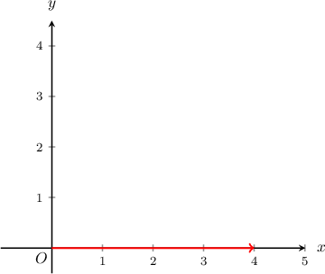
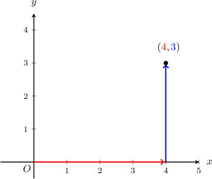
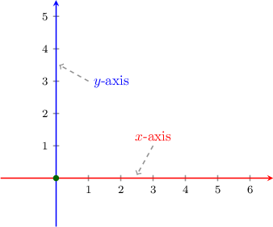
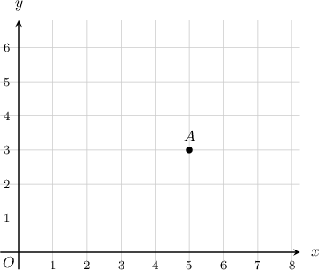
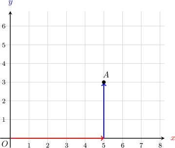
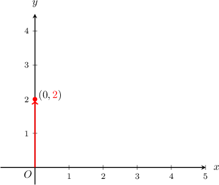
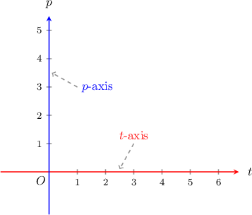
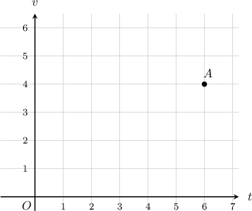
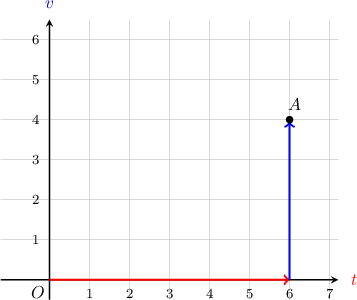

# Describing the Coordinate Plane

Source: https://www.mathacademy.com/topics/2410?courseId=30
Topic ID: 2410

## Prerequisites

- None listed on the topic page.

## Lesson

### Introduction

A **coordinate plane** consists of two number lines that intersect at zero on both lines, as shown below.

The *horizontal* number line is called the $\color{red}x$-axis, and the *vertical* number line is the $\color{blue}y$-axis.

The point of intersection of the two lines is called the **origin** and is labeled $O.$

### Graphing Points in the Coordinate Plane

An **ordered pair** is a collection of two numbers shown with parentheses. Some examples of ordered pairs are:

$$

(2,0)\qquad(0,3)\qquad (4,3)

$$

Every point in the coordinate plane can be represented using an ordered pair, and we use an ordered pair to plot a point.

For example, let's see how to plot the point $({\color{red}{4}},{\color{blue}{3}})$.

Starting at the origin:

- The first number tells us to move ${\color{red}{4}}$ units along the $x$-axis

- The second number tells us to move $\color{blue}3$ units up.

And that's it! We have successfully plotted the point.

Each number in the ordered pair has a special name:

- The first number is called the **$x$-coordinate**.

- The second number is called the **$y$-coordinate**.

So in the point $({\color{red}{4}},{\color{blue}{3}}),$ the $x$-coordinate is $\color{red}4$ and the $y$-coordinate is $\color{blue}3$.

**Important**! The coordinates of the origin are $(0,0).$

### Example: Describing the Coordinate Plane

#### Question

What is missing in the following sentence?

In the coordinate plane, the vertical number line is called the $\underline{\phantom{{}^{0000000000000000000}}}.$

#### Explanation

In the coordinate plane, the vertical number line is called the ****.

### Example: Graphing Points in the Coordinate Plane

#### Question

What is the $x$-coordinate of the point $A?$

#### Explanation

To find the $x$-coordinate of the point $A,$ we start at the origin, move $\color{red}5$ units right (along the $\color{red}x$-axis) and then $\color{blue}3$ units up (along the $\color{blue}y$-axis). Therefore, the $x$-coordinate is $5.$

So the coordinates of $A$ are $({\color{red}5}, {\color{blue}3}).$ Therefore, the $x$-coordinate is $5.$

### Example: Graphing Points on the Coordinate Axes

#### Question

What is missing in the following sentence?

To graph the point $(0,2)$ in the coordinate plane, start at the origin and move $\underline{\phantom{{}^{0000000000000000000}}}.$

#### Explanation

The $x$-coordinate is zero. Therefore, we do not need to move along the $x$-axis to plot the point. We only need to move along the $y$-axis.

So, to graph the point $(0,2)$, we start at the origin and move ****

### Graphing Points in a Coordinate Plane With Different Axes

Sometimes, we might want to call the coordinate axes by different names.

For example, if we wanted to compare price vs. time, it's more convenient to label our axes $t$ and $p,$ as shown below:

In this case, the horizontal axis is called the $t$-axis, and the vertical axis is called the $p$-axis.

If we're given an ordered pair, for example $({\color{red}{4}},{\color{blue}{3}}),$ in this coordinate plane, the number ${\color{red}{4}}$ is the $\color{red}t$-coordinate and the number ${\color{blue}{3}}$ is the $\color{blue}p$-coordinate.

It's important to realize that we can call the axes whatever we want. However, $x$ and $y$ are the most common names that we use.

### Example: Graphing Points in a Coordinate Plane With Different Axes

#### Question

What is the $v$-coordinate of the point $A?$

#### Explanation

To get to point $A,$ we start at the origin, move $\color{red}6$ units right (along the $\color{red}t$-axis) and then $\color{blue}4$ units up (along the $\color{blue}v$-axis).

So the coordinates of $A$ are $({\color{red}{6}},{\color{blue}{4}}).$ Therefore, the $v$-coordinate is ${\color{blue}{4}}.$
