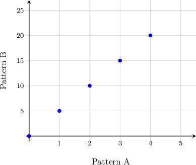
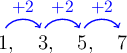
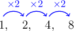
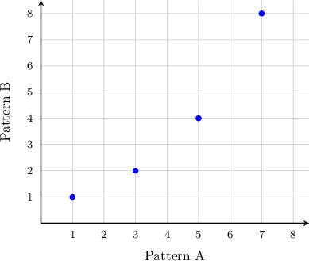
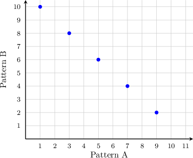
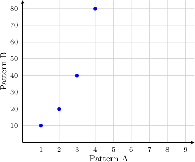
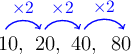
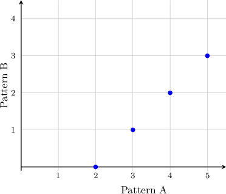

# Graphing Patterns

Source: https://www.mathacademy.com/topics/2433?courseId=30
Topic ID: 2433

## Prerequisites

- [Describing the Coordinate Plane](https://www.mathacademy.com/topics/describing-the-coordinate-plane-2410)
- [Comparing Patterns](https://www.mathacademy.com/topics/comparing-patterns-2432)

## Lesson

### Introduction

We can plot the relationship between two patterns, such as those given in the table below, in a coordinate plane.

To do this, we choose the horizontal axis ($x$-axis) to correspond to pattern A and the vertical axis ($y$-axis) to correspond to pattern B.

We add one more row to the table that contains the ordered pairs corresponding to each point. Here, the $x$ and $y$-coordinates are the terms from patterns A and B, respectively.

Plotting each ordered pair in the coordinate plane, we get the following graph:

### Example: Plotting a Graph Given a Table Containing Two Patterns

#### Question

Find the numbers for the patterns shown in the table below and plot the corresponding graph.

#### Explanation

The rule of pattern A is "add $2$", and the first number is $1.$ So, we have the following pattern:

The rule of pattern B is "multiply by $2$", and the first number is $1.$ So, we have the following pattern:

Let's fill in the table:

We choose the horizontal axis ($x$-axis) to correspond to pattern A and the vertical axis ($y$-axis) to correspond to pattern B. We add one more row to the table with ordered pairs corresponding to each point.

Plotting each ordered pair on the coordinate plane, we get the following graph:

### Example: Constructing a Table of Two Patterns Given a Graph

#### Question

Create a table that gives the pattern shown in the graph above.

#### Explanation

The horizontal axis ($x$-axis) corresponds to pattern A, and the vertical axis ($y$-axis) corresponds to pattern B. We have the following coordinates of points:

$$
(1,10),\, (3,8),\, (5,6),\, (7,4),\, (9,2)
$$

So, we can fill the table:

Removing the first row, we get:

### Example: Identifying a Rule Given a Graph

#### Question

What is the rule for pattern B, shown in the graph below?

#### Explanation

The horizontal axis ($x$-axis) corresponds to pattern A, and the vertical axis ($y$-axis) corresponds to pattern B. We have the following coordinates of points:

$$
(1,10),\, (2,20),\, (3,40),\, (4,80).
$$

So, we can fill the table:

Looking at pattern B only, we see that the rule is "multiply by $2$":

### Example: Forming a Statement of Comparison Given a Graph

#### Question

What is missing from the following statement?

$\qquad$ Each term in pattern B is $\underline{\phantom{{}^{000000000000000000000}}}$ than the corresponding term in pattern A.

#### Explanation

The horizontal axis ($x$-axis) corresponds to pattern A, and the vertical axis ($y$-axis) corresponds to pattern B. We have the following coordinates of points:

$$
(2,0),\, (3,1),\, (4,2),\, (5,3).
$$

So, we can fill the table:

Comparing the terms in both patterns, we note that we can add $2$ to each term of pattern B to get the corresponding term in pattern A:

$$
\begin{aligned}0+2 & =2 \\ 1+2 & =3 \\ 2+2 & =4 \\ 3+2 & =5\end{aligned}
$$

Therefore, the correct statement is:

$\qquad$ Each term in pattern B is **** than the corresponding term in pattern A.
