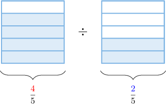
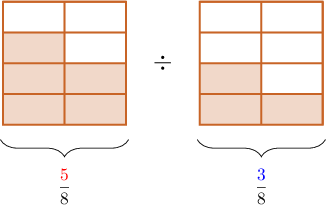
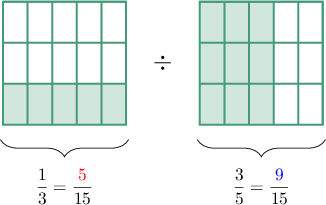
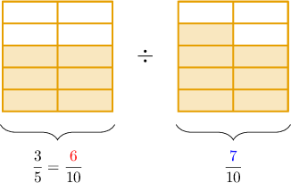
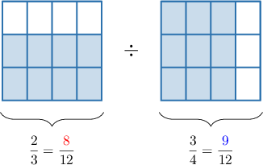
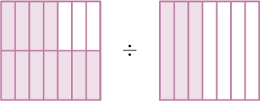

# Dividing Fractions Using Models

Source: https://www.mathacademy.com/topics/2438?courseId=30
Topic ID: 2438

## Prerequisites

- [Converting Improper Fractions to Mixed Numbers](../grade-4/2359-converting-improper-fractions-to-mixed-numbers.md)
- [Using Fractions to Represent Division of Whole Numbers](./2412-using-fractions-to-represent-division-of-whole-numbers.md)
- [Dividing Fractions by Whole Numbers Using Models](./2436-dividing-fractions-by-whole-numbers-using-models.md)
- [Dividing Whole Numbers by Fractions Using Models: Fractional Results](./4698-dividing-whole-numbers-by-fractions-using-models-fractional-results.md)

## Lesson

### Introduction

We can use fraction models to divide fractions that have a common denominator.

For example, suppose we wish to compute the fraction division

$$

\dfrac{4}{5} \div \dfrac{2}{5}.

$$

Let's start by writing down a fraction model to represent this division.

We can break down our division problem as follows:

- Computing $\dfrac{{\color{red}4}}{5}\div\dfrac{\color{blue}2}{5}$ means we want to determine how many times $\dfrac{\color{blue}2}{5}$ fits into $\dfrac{\color{red}4}{5}.$

- Since both fractions have a *common denominator*, this is the *same* as determining how many times ${\color{blue}2}$ fits into ${\color{red}4}.$

- Therefore, instead of $\dfrac{{\color{red}4}}{5}\div\dfrac{\color{blue}2}{5}$, we can simply compute ${\color{red}4}\div {\color{blue}2}.$

So, we have

$$

{\color{red}4} \div {\color{blue}2} = 2.

$$

Therefore, we conclude that

$$

\dfrac{4}{5} \div \dfrac{2}{5} = 2 \, .

$$

Finally, looking at our fraction model again, we can see that the shaded parts on the right of the division sign fit exactly twice into the shaded parts on the left. So, our result makes sense.

### Example: Dividing Fractions With Equal Denominators

#### Question

Use the model above to find the value of $\dfrac{5}{8} \div \dfrac{3}{8}.$

#### Explanation

We can break down our division problem as follows:

- Computing $\dfrac{{\color{red}5}}{8}\div\dfrac{\color{blue}3}{8}$ means we want to determine how many times $\dfrac{\color{blue}3}{8}$ fits into $\dfrac{\color{red}5}{8}.$

- Since both fractions have a **, this is the ** as determining how many times ${\color{blue}3}$ fits into ${\color{red}5}.$

- Therefore, instead of $\dfrac{{\color{red}5}}{8}\div\dfrac{\color{blue}3}{8}$, we can simply compute ${\color{red}5}\div {\color{blue}3}.$

So, we have

$$

{\color{red}5} \div {\color{blue}3} = \dfrac{5}{3}.

$$

Therefore, we conclude that

$$

\dfrac{5}{8} \div \dfrac{3}{8} = \dfrac{5}{3}.

$$

### Dividing Fractions With Different Denominators

We can use similar reasoning to divide fractions with different denominators. The only difference is that we must put the fractions over a common denominator before dividing them.

To illustrate, let's consider the following division problem:

$$

\dfrac{1}{3} \div \dfrac{3}{5}

$$

A fraction model for this problem is shown below.

Our fractions have the denominators $3$ and $5.$ Therefore, we can make a common denominator of $3\times 5 = 15.$

To create our common denominator, we split the shape on the left of the division sign into $5$ parts vertically, and we split the shape on the right into $3$ parts horizontally:

So, our division problem now is

$$

\dfrac{\color{red}5}{15} \div \dfrac{\color{blue}9}{15}.

$$

Since the denominators are equal, this is equivalent to

$$

{\color{red}5} \div {\color{blue}9} = \dfrac{5}{9}.

$$

Therefore, we conclude that

$$

\dfrac{1}{3} \div \dfrac{3}{5} = \dfrac{5}{9} \, .

$$

### Example: Determining a Missing Number

#### Question

Use the model above to determine the missing number in the equation below.

$$

\,6\,

$$

#### Explanation

The denominators are $5$ and $10.$ We can make a common denominator of $10$ by splitting the shape on the left into $2$ parts vertically:

So, our division problem now is

$$

\dfrac{\color{red}6}{10} \div \dfrac{\color{blue}7}{10}.

$$

Since the denominators are equal, this is equivalent to

$$

{\color{red}6} \div {\color{blue}7} = \dfrac{6}{7}.

$$

Therefore, we conclude that

$$

\,6\,

$$

Hence, the missing number is $6.$

### Example: Dividing Fractions Using Models

#### Question

Calculate $\dfrac{2}{3} \div \dfrac{3}{4}$ using the model above.

#### Explanation

The denominators are $4$ and $3.$ We can make a common denominator of $4\times 3 = 12.$

We split the shape on the left of the division sign into $4$ parts vertically, and we split the shape on the right into $3$ parts horizontally:

So, our division problem now is

$$

\dfrac{\color{red}8}{12} \div \dfrac{\color{blue}9}{12}.

$$

Since the denominators are equal, this is equivalent to

$$

{\color{red}8} \div {\color{blue}9} = \dfrac{8}{9}.

$$

Therefore, we conclude that

$$

\dfrac{2}{3} \div \dfrac{3}{4} = \dfrac{8}{9} \, .

$$

### Example: Dividing Fractions When the Result Is a Mixed Number

#### Question

Use the model above to find the value of $\dfrac{11}{14} \div \dfrac{3}{7}.$

#### Explanation

The denominators are $7$ and $14.$ We can make a common denominator of $14.$

We split the shape on the right of the division sign into $2$ parts horizontally:

So, our division problem now is

$$

\dfrac{\color{red}11}{14} \div \dfrac{\color{blue}6}{14}.

$$

Since the denominators are equal, this is equivalent to

$$

{\color{red}11} \div {\color{blue}6} = 1\,\dfrac56.

$$

Therefore, we conclude that

$$

\dfrac{11}{14} \div \dfrac{3}{7} = 1\,\dfrac56 \, .

$$
