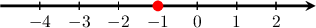
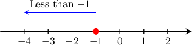
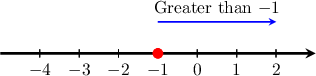
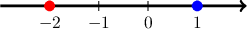
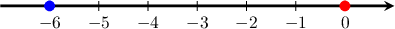
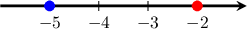
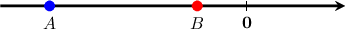

# Comparing Negative Numbers

Source: https://www.mathacademy.com/topics/2444?courseId=30
Topic ID: 2444

## Prerequisites

- [Negative Numbers](https://www.mathacademy.com/topics/negative-numbers-2442)
- [Comparing Whole Numbers Using Place Value](https://www.mathacademy.com/topics/comparing-whole-numbers-using-place-value-3919)

## Lesson

### Introduction

Let's consider the number We can plot it on a number line, as follows:

All of the numbers to the *left* of are *less than*

On the other hand, any number to the *right* of is *greater than*

The same idea is true for all numbers. For any given number:

- all numbers to the left on a number line are *smaller*

- all numbers to the right on a number line are *larger*

### Example: Comparing a Positive and Negative Number

#### Question

Which symbols could replace the empty box below to make the statement true?

#### Explanation

First, we plot both numbers on a number line.

We see that is to the right of Therefore, is **

So, the correct statement must be:

### Example: Comparing a Negative Number and Zero

#### Question

Which symbols could replace the empty box below to make the statement true?

#### Explanation

First, we plot both numbers on a number line.

We see that is to the left of Therefore, is **

So, the correct statement must be:

### Example: Comparing Two Negative Numbers

#### Question

Which symbols could replace the empty box below to make the statement true?

#### Explanation

First, we plot both numbers on a number line.

We see that is to the left of Therefore, is **

So, the correct statement must be:

### Example: Comparing Two Points on a Number Line

#### Question

Which of the following is true regarding numbers and

#### Explanation

Let's analyze each statement in turn.

- Statement I is true. The number is to the left of zero. Therefore, is ** which we write as

- Statement II is true. The number is to the left of zero. Therefore, is ** which we write as This is the same as saying that is ** which we write as

- Statement III is false. The number is to the left of Therefore, is ** which we write as

Therefore, the correct answer is "I and II only."
