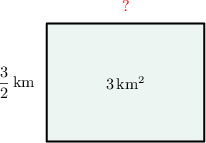

# Dividing Fractions and Whole Numbers: Word Problems

Source: https://www.mathacademy.com/topics/2497?courseId=30
Topic ID: 2497

## Prerequisites

- [Dividing Fractions by Whole Numbers](./2369-dividing-fractions-by-whole-numbers.md)
- [Dividing Whole Numbers by Fractions](./2377-dividing-whole-numbers-by-fractions.md)
- [Dividing Numbers by One-Digit Numbers: Interpreting the Remainder](./2434-dividing-numbers-by-one-digit-numbers-interpreting-the-remainder.md)

## Lesson

### Introduction

This lesson will consider real-life situations where we have to divide fractions and whole numbers.

For example, suppose that a store assistant wants to split $3$ pounds of raisins into packages, where each packet contains $\dfrac {1}{16}$ pounds of raisins. How many packages will he make?

To find out how many packages of raisins the store assistant will make, we need to divide $3$ by $\dfrac{1}{16}\mathbin{:}$

$$

3 \div \dfrac {1}{16}

$$

To divide a whole number by a fraction, we instead multiply the whole number by the reciprocal of the fraction.

The reciprocal of $\dfrac {1}{16}$ is $\dfrac{16}1,$ which simplifies to $16.$ So, we have

$$

3 \div \dfrac {1}{16} = 3 \times 16 = 48 \, .

$$

Therefore, the store assistant will make $48$ packages of raisins.

### Example: Dividing a Fraction by a Whole Number

#### Question

A farmer wants to divide a field that is $\dfrac 45$ acres into $3$ equal lots. How many acres would each lot be?

#### Explanation

To find the area of each lot, we need to divide $\dfrac{4}{5}$ by $3.$ That is, we need to compute

$$

\dfrac {4}{5} \div 3 \, .

$$

To divide a fraction by a whole number, we instead multiply the fraction by the reciprocal of the whole number.

The reciprocal of $3$ is $\dfrac{1}{3}.$ So, we have

$$

\dfrac {4}{5} \div 3 = \dfrac {4}{5} \times \dfrac{1}{3} \, .

$$

Now, we multiply the fractions. We multiply the numerators, and we multiply the denominators:

$$

\dfrac {4}{5} \times \dfrac{1}{3} = \dfrac {4 \times 1} {5 \times 3} = \dfrac{4}{15}

$$

Therefore, each lot will be $\dfrac{4}{15}$ acres.

### Example: Dividing a Whole Number by a Fraction

#### Question

Perl made a presentation of her trip around the world. The presentation lasts $6$ minutes, and each slide lasts $\dfrac{3}{8}$ minutes. How many slides does her presentation have?

#### Explanation

To determine the number of slides, we need to divide $6$ by $\dfrac{3}{8}.$ That is, we need to compute

$$

6 \div \dfrac{3}{8} \, .

$$

To divide a whole number by a fraction, we instead multiply the whole number by the reciprocal of the fraction.

First, we write $6$ as an improper fraction:

$$

6=\dfrac{6}{1}

$$

Next, we note that the reciprocal of $\dfrac{3}{8}$ is $\dfrac{8}{3}.$ So, we have

$$

6 \div \dfrac 3 8 = \dfrac 6 1 \div \dfrac{3}{8} = \dfrac 6 1 \times \dfrac{8}{3} \, .

$$

Now, we multiply fractions. We multiply the numerators, and we multiply the denominators:

$$

\dfrac 6 {1} \times \dfrac{8}{3} = \dfrac {6 \times 8} {1 \times 3} = \dfrac{48}{3}

$$

Finally, we simplify:

$$

\dfrac{48}{3} = 48 \div 3 = 16

$$

Therefore, there are $16$ slides.

### Example: Dividing a Whole Number by a Fraction: Area Problems

#### Question

The area of a rectangular plantation is $3 \, \text{km}^2$ and its width is $\dfrac{3}{2} \, \text{km}.$ What is its length?

#### Explanation

To find out the length, we need to divide $3$ by $\dfrac{3}{2}.$

That is, we need to compute

$$

3 \div \dfrac{3}{2} \, .

$$

To divide a whole number by a fraction, we instead multiply the whole number by the reciprocal of the fraction.

First, we write $3$ as an improper fraction:

$$

3=\dfrac{3}{1}

$$

Next, we note that the reciprocal of $\dfrac{3}{2}$ is $\dfrac{2}{3}.$ So, we have

$$

3 \div \dfrac 3 2 = \dfrac 3 1 \div \dfrac{3}{2} = \dfrac 3 1 \times \dfrac{2}{3} \, .

$$

Now, we multiply the fractions. We multiply the numerators, and we multiply the denominators:

$$

\dfrac 3 {1} \times \dfrac{2}{3} = \dfrac {3 \times 2} {1 \times 3} = \dfrac{6}{3}

$$

Finally, we simplify:

$$

\dfrac{6}{3} = 6 \div 3 = 2

$$

Therefore, the length is $2 \, \text{km}.$

### Example: Dividing Fractions and Whole Numbers When Interpretation Is Needed

#### Question

Paul's internet connection allows him to download a complete file of a certain size in $\dfrac{8}{3}$ minutes. If he has a total of $12$ minutes to download some files of the same size, how many complete files can he download?

#### Explanation

To determine the number of files Paul can download, we need to divide $12$ by $\dfrac{8}{3}.$ That is, we need to compute

$$

12 \div \dfrac{8}{3} \, .

$$

To divide a whole number by a fraction, we instead multiply the whole number by the reciprocal of the fraction.

First, we write $12$ as an improper fraction:

$$

12=\dfrac{12}{1}

$$

Next, we note that the reciprocal of $\dfrac{8}{3}$ is $\dfrac{3}{8}.$ So, we have

$$

12 \div \dfrac{8}{3} = \dfrac {12} 1 \div \dfrac{8}{3} = \dfrac {12} 1 \times \dfrac{3}{8} \, .

$$

Now, we multiply fractions. We multiply the numerators, and we multiply the denominators:

$$

\dfrac{12} {1} \times \dfrac{3}{8} = \dfrac {12 \times 3} {1 \times 8} = \dfrac{36}{8}

$$

Next, we simplify:

$$

\dfrac{36}{8} = \dfrac{36 \div 4}{8 \div 4} = \dfrac{9}{2}

$$

Finally, we write down the result as a mixed number:

$$

\dfrac{9}{2} = 4 \, \text{R} \, 1 = 4 \, \dfrac{1}{2}

$$

Therefore, Paul can download $4$ ** files in $12$ minutes.
