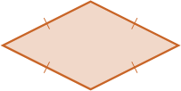
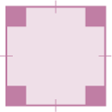
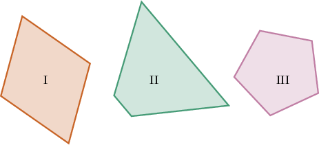
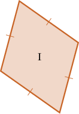
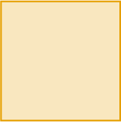
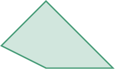

# Rectangles, Rhombuses, and Squares

Source: https://www.mathacademy.com/topics/3751?courseId=30
Topic ID: 3751

## Prerequisites

- [Quadrilaterals](https://www.mathacademy.com/topics/quadrilaterals-2407)

## Lesson

### Introduction

There are even more special types of quadrilaterals.

A **rhombus** is a quadrilateral with $2$ pairs of parallel sides, where all $4$ sides are equal:

A **rectangle** is a quadrilateral with $2$ pairs of parallel sides and $4$ right angles:

A **square** is a quadrilateral with $2$ pairs of parallel sides, where all $4$ sides are equal, and also all $4$ angles are right angles:

### Example: Identifying Shapes: Rhombuses and Rectangles

#### Question

Which of the shapes below is a rhombus?

#### Explanation

Let's examine each of the shapes one by one:

- Shape I is a **. It has $4$ equal sides and $2$ pairs of parallel sides (but no right angle).

- Shape II shows a trapezoid (not a rhombus) since it has $4$ sides but only $1$ pair of parallel sides.

- Shape III represents a polygon with $5$ sides, so it's not a rhombus.

Therefore, the correct answer is "I only".

### Example: Reasoning About Rhombuses and Rectangles

#### Question

The shape above is a square because

1. it has $4$ sides and $4$ right angles

2. it has $4$ sides

3. it has $4$ equal sides and $4$ equal angles

#### Explanation

The correct answer is that "**".

The description "**" is not enough because it describes a rectangle, where not all the sides are necessarily equal:

Likewise, having $4$ sides is not enough to be considered a square. The following quadrilateral is not a square:

