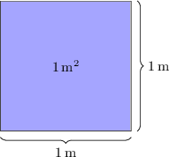
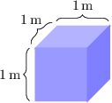
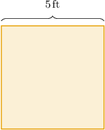
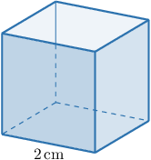
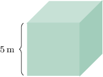

# Units of Area and Volume

Source: https://www.mathacademy.com/topics/3872?courseId=30
Topic ID: 3872

## Prerequisites

- [Evaluating Exponents](./2321-evaluating-exponents.md)
- [Understanding Volume Using Unit Cubes](./2403-understanding-volume-using-unit-cubes.md)

## Lesson

### Introduction

**Area** measures how much space there is on a flat surface. In this lesson, we'll learn about the various measurement units of area and how they relate to units of length.

Consider a square with sides of length $1\,\textrm{m},$ shown below.

To find the area of a square, we multiply its side lengths. Therefore, the area of this square is equal to

$$

1\,\textrm{m}\times 1\,\textrm{m} = 1\,\textrm{m}^2.

$$

The unit of area $(\textrm m^2)$ we used is called a **square meter.** In this case, we say that the area of our square is **one square meter.**

In previous lessons, we learned that length can also be measured in kilometers $(\textrm{km}),$ centimeters $(\textrm{cm}),$ and millimeters $(\textrm{mm}).$ Each of these length units has a corresponding area unit:

- A square with sides of length $1\,\textrm{km}$ has an area of $1\,\textrm{km}^2,$ or **one square kilometer**.

- A square with sides of length $1\,\textrm{cm}$ has an area of $1\,\textrm{cm}^2,$ or **one square centimeter**.

- A square with sides of length $1\,\textrm{mm}$ has an area of $1\,\textrm{mm}^2,$ or **one square millimeter**.

The same idea applies when measuring area in customary units. For example:

- A square with sides of length $1\,\textrm{in}$ has an area of $1\,\textrm{in}^2,$ or **one square inch**.

- A square with sides of length $1\,\textrm{ft}$ has an area of $1\,\textrm{ft}^2,$ or **one square foot**.

### Units of Volume

**Volume** measures how much three-dimensional space there is inside something.

Consider a cube with sides of length $1\,\textrm{m},$ shown below.

To find the volume of a cube, we multiply its side lengths. Therefore, the volume of this cube is equal to

$$

1\,\textrm{m}\times 1\,\textrm{m}\times 1\,\textrm{m} = 1\,\textrm{m}^3.

$$

The unit of volume $(\textrm m^3)$ we used is called a **cubic meter.** In this case, we say that the volume of our cube is **one cubic meter.**

As with area, each unit of length has a corresponding volume unit. For example:

- A cube with sides of length $1\,\textrm{cm}$ has a volume of $1\,\textrm{cm}^3,$ or **one cubic centimeter**.

- A cube with sides of length $1\,\textrm{in}$ has a volume of $1\,\textrm{in}^3,$ or **one cubic inch**.

### Example: Determining Appropriate Units of Area and Volume

#### Question

Suppose we want to measure the volume of a shoe box. What units could we use?

1. $\textrm{cm}^2$

2. $\textrm{cm}^3$

3. $\textrm{kg}$

#### Explanation

We can measure length in centimeters $(\textrm{cm}).$ When measuring lengths in centimeters, volumes are measured in $\textrm{cm} \times \textrm{cm} \times \textrm{cm},$ which is usually written as $\textrm{cm}^3.$

Therefore, the correct answer is "II only."

### Calculating Area

A square is a special type of rectangle whose length and width are equal. For example, consider the square below.

We say that the **side length** of this square equals $3\,\textrm{m}.$

Since a square is a special type of rectangle, we find its area by multiplying its length and width. However, since its length and width are equal, we can find its area by *squaring* its side length:

Therefore, the area of the square is

$$

\begin{aligned}𝐴 & =(3\,m)^{2} \\ & =3\,m×3\,m \\ & =(3×3)×(m×m) \\ & =9\,m^{2}.\end{aligned}

$$

### Example: Computing an Area With the Correct Units

#### Question

What is the area of the square above?

#### Explanation

To calculate the area $A$ of a square, we square its side length. Therefore, the area of the square is

$$

\begin{aligned}𝐴 & =(5\,ft)^{2} \\ & =5\,ft×5\,ft \\ & =(5×5)×(ft×ft) \\ & =25\,ft^{2}.\end{aligned}

$$

### Calculating Volume

A **cube** is a special type of rectangular solid whose length, width, and height are equal.

We say that the **side length** of this cube equals $2\,\textrm{cm}.$

Since a cube is a special type of rectangular solid, we find its volume by multiplying its length, width, and height. However, since its length, width, and height are all equal, we can find its volume by *cubing* its side length:

$$

\begin{aligned}𝑉 & =(2\,cm)^{3} \\ & =(2\,cm)×(2\,cm)×(2\,cm) \\ & =(2×2×2)×(cm×cm×cm) \\ & =8\,cm^{3}\end{aligned}

$$

### Example: Computing a Volume With the Correct Units

#### Question

What is the volume of the cube shown in the diagram above?

#### Explanation

To find the volume $V$ of a cube, we cube its side length. Therefore,

$$

\begin{aligned}𝑉 & =(5\,m)^{3} \\ & =5\,m×5\,m×5\,m \\ & =(5×5×5)×(m×m×m) \\ & =125\,m^{3}.\end{aligned}

$$
