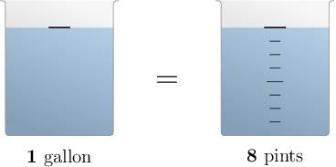

# Converting Units of Volume to Larger Units

Source: https://www.mathacademy.com/topics/3974?courseId=30
Topic ID: 3974

## Prerequisites

- [Two-Digit by One-Digit Division](./535-two-digit-by-one-digit-division.md)
- [Dividing Decimals by Powers of Ten Using Decimal Point Placement](./2289-dividing-decimals-by-powers-of-ten-using-decimal-point-placement.md)
- [Converting Units of Volume to Smaller Units](../grade-4/2402-converting-units-of-volume-to-smaller-units.md)

## Lesson

### Introduction

In previous lessons, we explored converting larger units of volume to smaller ones. In this lesson, we will learn how to convert smaller units of volume to larger ones.

To convert between customary units of volume, we use the following unit conversions:

- $1$ gallon $=8$ pints

- $1$ pint $=2$ cups

- $1$ cup $=8$ fluid ounces

We can visualize equivalent units of volume using measuring jugs filled with water.

For example, the two jugs below show the equivalence between $1$ gallon and $8$ pints.

Let's get some practice at converting between different units of volume.

### A Worked Example

Let's determine how many cups are in $96$ fluid ounces.

We start with the unit conversion between fluid ounces and cups:

$$

1\, \textrm{cup} =8\, \textrm{fluid ounces}

$$

Since we are converting *from* fluid ounces *to* cups, we divide both sides of the above equation by $8$ and obtain the following:

$$

\dfrac{1}{8} \, \textrm{cups} = 1 \, \textrm{fluid ounce}

$$

The right-hand side reads $1$ fluid ounce, and we want to know how many cups are in ${\color{blue}{96}}$ fluid ounces. So, we multiply both sides of the above equation by ${\color{blue}{96}}{:}$

$$

\begin{aligned}96×\frac{1}{8}\,cups & =96×1\,fluid ounce \\ \frac{96}{8}\,cups & =96\,fluid ounces \\ 12\,cups & =96\,fluid ounces\end{aligned}

$$

Therefore, $96$ fluid ounces equals $12$ cups.

### Example: Converting From Fluid Ounces to Cups

#### Question

How many cups are there in $68$ fluid ounces?

#### Explanation

We start with the unit conversion between fluid ounces and cups:

$$

1 \, \textrm{cup} = 8 \, \textrm{fluid ounces}

$$

Now, we divide both sides by $8$ and obtain the following:

$$

\dfrac{1}{8} \, \textrm{cups} = 1 \, \textrm{fluid ounce}

$$

We want to figure out how many cups are in $68$ fluid ounces. So, we multiply both sides of the above equation by $68{:}$

$$

\begin{aligned}68×\frac{1}{8}\,cups & =68×1\,fluid ounce \\ \frac{68}{8}\,cups & =68\,fluid ounces \\ \frac{68÷4}{8÷4}\,cups & =68\,fluid ounces \\ \frac{17}{2}\,cups & =68\,fluid ounces \\ 8\,\frac{1}{2}\,cups & =68\,fluid ounces\end{aligned}

$$

Therefore, $68$ fluid ounces equals $8 \, \dfrac{1}{2}$ cups.

### Example: Converting From Cups to Pints

#### Question

How many pints are there in $36$ cups?

#### Explanation

We start with the unit conversion between pints and cups:

$$

1 \, \textrm{pint} = 2 \, \textrm{cups}

$$

Now, we divide both sides by $2$ and obtain the following:

$$

\dfrac{1}{2} \, \textrm{pints} = 1 \, \textrm{cup}

$$

We want to figure out how many pints are in $36$ cups. So, we multiply both sides of the above equation by $36{:}$

$$

\begin{aligned}36×\frac{1}{2}\,pints & =36×1\,cup \\ \frac{36}{2}\,pints & =36\,cups \\ 18\,pints & =36\,cups\end{aligned}

$$

Therefore, $36$ cups equals $18$ pints.

### Example: Converting From Pints to Gallons

#### Question

How many gallons are there in $22$ pints?

#### Explanation

We start with the unit conversion between pints and gallons:

$$

1\, \textrm{gallon} = 8\, \textrm{pints}

$$

Now, we divide both sides by $8$ and obtain the following:

$$

\dfrac{1}{8}\, \textrm{gallons} = 1\, \textrm{pint}

$$

We want to figure out how many gallons are in $22$ pints. So, we multiply both sides of the above equation by $22{:}$

$$

\begin{aligned}22×\frac{1}{8}\,gallons=22×1\,pint \\ \frac{22}{8}\,gallons=22\,pints \\ \frac{22÷2}{8÷2}\,gallons=22\,pints \\ \frac{11}{4}\,gallons=22\,pints \\ 2\,\frac{3}{4}\,gallons=22\,pints\end{aligned}

$$

Therefore, $22$ pints equals $2\,\dfrac{3}{4}$ gallons.

### Converting Between Metric Units of Volume

For metric units of volume, there is one conversion we need to be aware of. That is

$$

1 \,\textrm{L} = 1,000 \,\textrm{mL}.

$$

Let's use this to determine how many liters are in $3,000$ milliliters.

Since we are converting *from* milliliters *to* liters, we divide both sides of the above equation by $1\,000$ and obtain the following:

$$

\dfrac{1}{1,000} \,\textrm{L} = 1 \,\textrm{mL}

$$

The right-hand side reads $1\,\textrm{mL},$ and we want to know how many liters are in $\color{blue}3\,000$ milliliters. So, we multiply *both* sides of this equation by ${\color{blue}{3000}}.$

$$

\begin{aligned}3000×\frac{1}{1,000}\,L & =3000×1\,mL \\ (3,000÷1,000)\,L & =3,000\,mL \\ 3\,L & =3,000\,mL\end{aligned}

$$

Therefore, $3,000\,\textrm{mL}$ equals $3\,\textrm{L}.$

### Example: Converting From Milliliters to Liters

#### Question

How many liters are there in $750$ milliliters?

#### Explanation

We start with the unit conversion between liters and milliliters:

$$

1 \,\textrm{L} = 1,000 \,\textrm{mL}

$$

Now, we divide both sides by $1,000$ and obtain the following:

$$

\dfrac{1}{1,000} \,\textrm{L} = 1 \,\textrm{mL}

$$

We want to figure out how many liters are in $750$ milliliters. So, we multiply both sides of the above equation by $750{:}$

$$

\begin{aligned}750×\frac{1}{1,000}\,L & =750×1\,mL \\ (750÷1,000)\,L & =750\,mL \\ 0.75\,L & =750\,mL\end{aligned}

$$

Therefore, $750\,\textrm{mL}$ equals $0.75\,\textrm{L}.$
