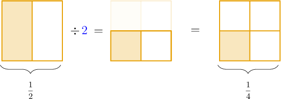
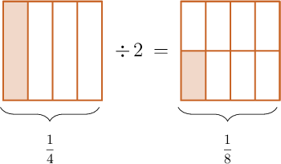
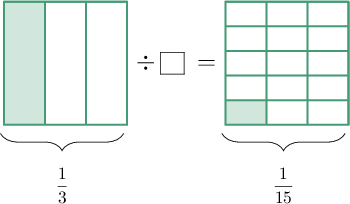
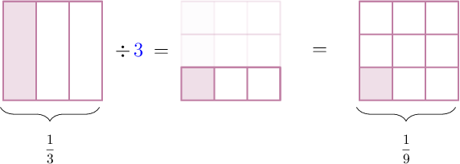
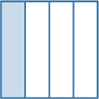
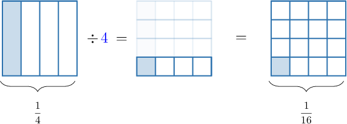

# Dividing Unit Fractions by Whole Numbers Using Models

Source: https://www.mathacademy.com/topics/528?courseId=30
Topic ID: 528

## Prerequisites

- [Multiplying Unit Fractions by Whole Numbers Using Models](../grade-4/564-multiplying-unit-fractions-by-whole-numbers-using-models.md)

## Lesson

### Introduction

Remember that a *unit* fraction is a fraction containing ${\color{blue}{1}}$ in the numerator. So, for example, the fractions

$$
\dfrac{\color{blue}{1}}2, \qquad\dfrac{\color{blue}{1}}{12}
$$

are both unit fractions, whereas

$$
\dfrac{\color{red}{2}}9, \qquad \dfrac{\color{red}{3}}{5}
$$

are *not* unit fractions

In this lesson, we will use models to divide unit fractions by whole numbers.

Let's use a fraction model to find the value of

$$
\dfrac{1}{2} \div 2.
$$

We start with a square model of $\dfrac12,$ split *vertically*.

To divide $\dfrac{1}{2}$ by ${\color{blue}2},$ we split the above whole into $\color{blue}2$ equal parts *horizontally*. Then, we remove any shaded parts that are not in the bottom row.

From the picture on the right, we obtain that the shaded part represents $\dfrac{1}{4}$ of the whole.

Therefore,

$$
\dfrac{1}{2} \div 2 = \dfrac{1}{4}.
$$

### Example: Identifying the Division Problem Represented by a Model

#### Question

What division problem is represented by the model below?

#### Explanation

We have $\dfrac{1}{4}$ on the left and $\dfrac{1}{8}$ on the right.

The division operation splits the shaded region on the left into $2$ equal parts. So the shaded part on the left is $2$ times larger than the shaded part on the right.

Therefore, the division problem shown is:

$$
\dfrac{1}{4} \div 2 = \dfrac{1}{8}
$$

### Example: Identifying the Missing Divisor in a Division Model

#### Question

What number is missing from the division problem below?

#### Explanation

We have $\dfrac{1}{3}$ on the left and $\dfrac{1}{15}$ on the right.

The division operation splits the shaded region on the left into $5$ equal parts. So the shaded part on the left is $5$ times larger than the shaded part on the right.

Therefore, the division problem shown is:

$$
\dfrac{1}{3} \div {\color{blue}{5}} = \dfrac{1}{15}
$$

So, the missing number is $\color{blue}5.$

### Example: Identifying the Missing Result in a Division Model

#### Question

What picture is missing from the division model below?

#### Explanation

Notice that in the model, we have $\dfrac{1}{3}$ on the left.

Since we need to divide by $\color{blue}3$, we split the whole into $\color{blue}3$ equal parts horizontally.

From the picture on the right, we obtain that the shaded part represents $\dfrac{1}{9}$ of the whole.

So, the missing picture is:

### Example: Using a Model to Solve a Division Problem

#### Question

Use the model below to calculate $\dfrac{1}{4} \div 4.$

#### Explanation

Since we need to divide by $\color{blue}4$, we split the whole into $\color{blue}4$ equal parts horizontally.

From the picture on the right, we obtain that the shaded part represents $\dfrac{1}{16}$ of the whole.

Therefore,

$$
\dfrac{1}{4} \div 4 = \dfrac{1}{16}\,.
$$
