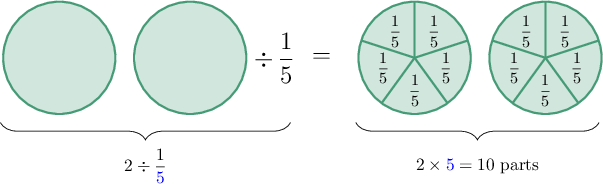

# Dividing Whole Numbers by Unit Fractions

Source: https://www.mathacademy.com/topics/533?courseId=30
Topic ID: 533

## Prerequisites

- [Dividing Whole Numbers by Unit Fractions Using Models](https://www.mathacademy.com/topics/dividing-whole-numbers-by-unit-fractions-using-models-529)
- [Two-Digit by One-Digit Multiplication](https://www.mathacademy.com/topics/two-digit-by-one-digit-multiplication-2392)

## Lesson

### Introduction

To divide a whole number by a unit fraction, we can multiply the whole number by the fraction's denominator.

So, to divide $2 \div \dfrac{1}{\color{blue}5},$ we multiply the $2$ by ${\color{blue}5}\!:$

$$
2 \div \dfrac{1}{\color{blue}5} = 2 \times {\color{blue}5} = 10
$$

And that's the answer! Notice that this method does the same job as the fraction model method we used before:

### Example: Dividing a Whole Number by a Unit Fraction When the Denominator has One Digit

#### Question

Divide $14 \div \dfrac{1}{3}.$

#### Explanation

To divide a whole number by a unit fraction, we multiply the whole number by the fraction's denominator:

$$
14 \div \dfrac{1}{3} = 14 \times 3 = 42
$$

### Example: Dividing a Whole Number by a Unit Fraction When the Denominator has Two Digits

#### Question

What is the value of $5 \div \dfrac{1}{15}?$

#### Explanation

To divide a whole number by a unit fraction, we multiply the whole number by the fraction's denominator:

$$
5 \div \dfrac{1}{15} = 5 \times 15 = 75
$$

### Example: Dividing Whole Numbers by Unit Fractions: Word Problems

#### Question

Johnny has $5$ kilograms of wheat flour with which he wants to make some pizzas. If each pizza needs $\dfrac{1}{10}$ of a kilogram of wheat flour, how many pizzas can Johnny make?

#### Explanation

To determine the number of pizzas that Johnny can make, we divide the amount of wheat flour by the amount of wheat flour each pizza needs.

$$
5 \div \dfrac{1}{10}
$$

To divide a whole number by a unit fraction, we multiply the whole number by the fraction's denominator:

$$
5 \div \dfrac{1}{10} = 5 \times 10 = 50
$$

Therefore, Johnny can make $50$ pizzas.
