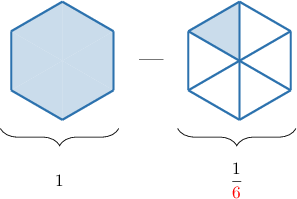
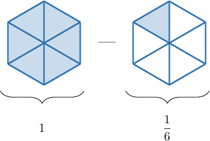

# Subtracting Fractions and Whole Numbers Using Models

Source: https://www.mathacademy.com/topics/544?courseId=30
Topic ID: 544

## Prerequisites

- [Adding Fractions and Whole Numbers Using Models](./543-adding-fractions-and-whole-numbers-using-models.md)

## Lesson

### Introduction

We can use fraction models to subtract fractions from whole numbers.

For example, let's find the value of $1 - \dfrac{1}{6}$ using the model below:

We cannot subtract the two numbers straight away because they are split into different numbers of parts (i.e., they have different denominators).

In order to subtract, we split the whole number ($1$ in this case) into $\color{red}6$ equal parts, as follows:

Now, both shapes are split into $\color{red}6$ equal parts, and we have $6-1={\color{blue}{5}}$ parts in total. Therefore:

$$
1 - \dfrac{1}{6} = \dfrac{\color{blue}5}{\color{red}6}
$$

### Example: Subtracting Fractions From Whole Numbers

#### Question

Use the model below to find the value of $2 - \dfrac{1}{3}$ as an improper fraction.

#### Explanation

All three shapes are already split into $\color{red}3$ equal parts, and we have $3+3-1 = {\color{blue}{5}}$ parts in total.

Therefore,

$$
2 - \dfrac{1}{3} = \dfrac{{\color{blue}5}}{{\color{red}3}}.
$$

### Example: Splitting Whole Numbers Into Parts

#### Question

Use the model above to determine the missing number in the statement below.

$$
\,0\,
$$

#### Explanation

The shape on the right is split into $\color{red}5$ equal parts. We can split the first and second shapes into $\color{red}5$ equal parts as follows:

We have $5 + 5 - 3=\color{blue}7$ shaded parts in total.

Therefore,

$$
2 - \dfrac{3}{5} = \dfrac{\color{blue}7}{5}.
$$

So, the missing number is $\color{blue}7.$

### Example: Solving a Subtraction Problem Using a Fraction Model

#### Question

Use a visual fraction model to find the value of $2 - \dfrac{1}{6}$ as an improper fraction.

#### Explanation

Writing $2 - \dfrac{1}{6}$ as a visual fraction model, we get:

The shape on the right is split into $\color{red}6$ equal parts. We can split the other two shapes into $\color{red}6$ equal parts as follows:

We have $6 + 6 - 1 = \color{blue}11$ shaded parts in total.

Therefore,

$$
2 - \dfrac{1}{6} = \dfrac{\color{blue}11}{\color{red}6}.
$$
