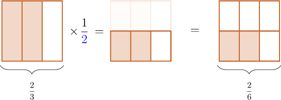
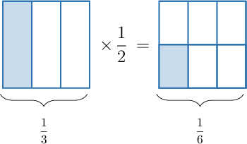
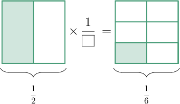
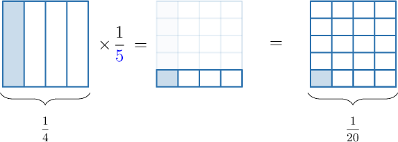
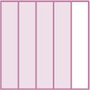
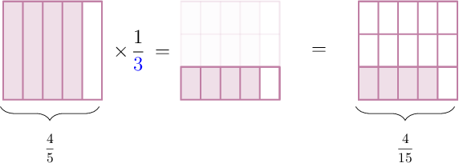

# Multiplying Fractions by Unit Fractions Using Models

Source: https://www.mathacademy.com/topics/565?courseId=30
Topic ID: 565

## Prerequisites

- [Multiplying Fractions by Whole Numbers Using Models](../grade-4/3968-multiplying-fractions-by-whole-numbers-using-models.md)

## Lesson

### Introduction

We can use fraction models to understand how to multiply fractions.

For example, let's suppose that we wish to compute the following product of fractions:

$$
\dfrac{2}{3} \times \dfrac{1}{2}
$$

Let's start by representing $\dfrac23$ using a square fraction model, like the one below. Notice that we have split the fraction *vertically*.

Since we need to multiply the above fraction by $\dfrac{1}{\color{blue}2}$, we split the whole into $\color{blue}2$ equal parts *horizontally*. This way, each of the original pieces is split in half. Then, we only keep the shaded pieces in the bottom row.

From the picture on the right, we see that the shaded part represents $\dfrac{2}{6}$ of the whole.

Therefore,

$$
\dfrac{2}{3} \times \dfrac{1}{2} = \dfrac{2}{6}.
$$

Notice that we can simplify this answer further by dividing the numerator and denominator by $2.$ However, in this lesson, we'll focus just on multiplication and not worry about simplifying the final answers.

### Example: Identifying a Multiplication Problem Corresponding to a Model

#### Question

What multiplication problem is represented by the model above?

#### Explanation

We have $\dfrac{1}{3}$ on the left and $\dfrac{1}{6}$ on the right.

Therefore, the multiplication problem shown is:

$$
\dfrac{1}{3} \times \dfrac{1}{2} = \dfrac{1}{6}
$$

### Example: Identifying a Missing Number in a Model

#### Question

What number is missing from the multiplication problem below?

#### Explanation

We have $\dfrac{1}{2}$ on the left and $\dfrac{1}{6}$ on the right.

The shape on the right-hand side is split into $\color{blue}3$ equal parts by horizontal lines. So, the shaded part on the left is $\color{blue}3$ times larger than the shaded part on the right.

Therefore, the multiplication problem shown is:

$$
\dfrac{1}{2} \times \dfrac{1}{\color{blue}{3}} = \dfrac{1}{6}
$$

So, the missing number is $\color{blue}3.$

### Example: Identifying a Model Corresponding to a Multiplication Problem

#### Question

What picture is missing from the multiplication model below?

#### Explanation

In the model, we have $\dfrac{1}{4}$ on the left.

Since we are multiplying by $\dfrac{1}{\color{blue}5}$, we need to split the whole into $\color{blue}5$ equal parts horizontally.

From the picture on the right, we obtain that the shaded part represents $\dfrac{1}{20}$ of the whole.

The missing picture is:

### Example: Multiplying a Fraction by a Unit Fraction Using a Model

#### Question

Use the model above to calculate $\dfrac{4}{5} \times \dfrac{1}{3}.$

#### Explanation

Since we need to multiply by $\dfrac{1}{\color{blue}3}$, we split the whole into $\color{blue}3$ equal parts horizontally.

From the picture on the right, we obtain that the shaded part represents $\dfrac{4}{15}$ of the whole.

Therefore,

$$
\dfrac{4}{5} \times \dfrac{1}{3} = \dfrac{4}{15}.
$$
