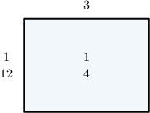
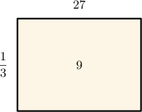
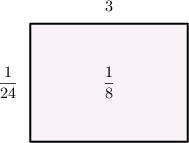
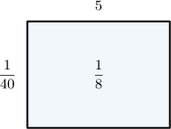

# Interpreting Fraction Division Using Area Models

Source: https://www.mathacademy.com/topics/568?courseId=30
Topic ID: 568

## Prerequisites

- [Finding Areas Using Fraction Multiplication](https://www.mathacademy.com/topics/finding-areas-using-fraction-multiplication-572)

## Lesson

### Introduction

We can use area models to understand what it means to divide a fraction by a whole number.

For example, let's consider the area model below:

The area of a rectangle equals its length multiplied by its width.

For the given rectangle:

- its length is $3$

- its width is $\dfrac{1}{12}$

- its area is $\dfrac{1}{4}$

Therefore, this area model shows the following multiplication problem:

$$
3\times \dfrac{1}{12} = \dfrac{1}{4}
$$

Using the relationship between multiplication and division, we can turn this multiplication problem into the following division problem:

$$
\dfrac{1}{12} = \dfrac14\div 3
$$

We can also use area models to interpret the division of a whole number by a fraction. Let's see an example.

### Example: Using an Area Model to Solve a Division Problem

#### Question

Use the area model above to find the value of $9\div\dfrac 1 3.$

#### Explanation

The area of a rectangle equals its length multiplied by its width.

For the given rectangle:

- its length is $27$

- its width is $\dfrac{1}{3}$

- its area is ${9}$

Therefore, this area model shows the following multiplication problem:

$$
27\times\dfrac 1 {3} = 9
$$

Using the relationship between multiplication and division, we can turn this multiplication problem into the following division problem:

$$
27 = 9\div \dfrac 13
$$

So, the answer is $27.$

### Example: Identifying a Missing Expression in a Division Problem

#### Question

Using the area model above, determine an expression that could be missing from the left-hand side of the equation below.

$$
\bbox[2pt, border: 1pt solid black]{\phantom{\dfrac{A}{A}\times\dfrac{A}{A}}} = \dfrac{1}{24}
$$

#### Explanation

The area of a rectangle equals its length multiplied by its width.

For the given rectangle:

- its length is $3$

- its width is $\dfrac{1}{24}$

- its area is $\dfrac{1}{8}$

Therefore, the area model represents the following multiplication problems:

$$
3 \times {\color{blue}\dfrac{1}{24}} = \dfrac{1}{8} \qquad\textrm{or}\qquad {\color{blue}\dfrac{1}{24}} \times 3 = \dfrac{1}{8}
$$

Using the relationship between multiplication and division, we can turn this multiplication problem into a division problem where the quotient equals ${\color{blue}\dfrac{1}{24}}{:}$

$$
\bbox[5pt, border: 1pt solid black]{\dfrac{1}{8} \div 3} = {\color{blue}\dfrac{1}{24}}
$$

So, the answer is $\dfrac{1}{8} \div 3.$

### Example: Finding the Area Model that Represents a Division Problem

#### Question

Draw an area model that could be used to represent the division problem $\dfrac 1 {8}\div 5 = \dfrac 1 {40}.$

#### Explanation

Our division problem is

$$
\dfrac 1 {8} \div 5 = \dfrac 1{40}.
$$

Using the relationship between multiplication and division, we can turn this division problem into the following multiplication problems:

$$
\dfrac 1{8} = \dfrac 1 {40} \times 5 \qquad\textrm{or}\qquad \dfrac 1{8} = 5 \times \dfrac 1 {40}
$$

To describe these multiplication problems using an area model, we need a rectangle with the following properties:

- its area is $\dfrac 1{8}$

- its sides have lengths $\dfrac1{40}$ and $5$

An area model that represents this multiplication problem could be the following:

