# Connecting Fraction Multiplication and Area

Source: https://www.mathacademy.com/topics/569?courseId=30
Topic ID: 569

## Prerequisites

- [Multiplying Fractions](./2378-multiplying-fractions.md)

## Lesson

### Introduction

Fraction multiplication can often be interpreted as the area of a part of a unit square.

Let's consider the unit square below. It has sides of length $1$ unit, divided into lots of little tiles.

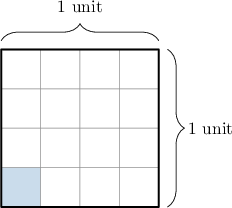

Each side of the unit square is divided into $\color{blue}4$ equal pieces. So, each side of a tile is $\dfrac{1}{\color{blue}4}$ units long.

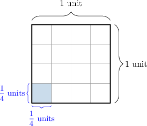

The area of each tile is the product of the two side lengths. Therefore, the area of each tile is

$$
\dfrac{1}{4} \times \dfrac{1}{4}\;\textrm{square units}.
$$

### Example: Representing the Area of a Single Tile as a Product of Fractions

#### Question

What is the area, in square units, of each of the small tiles inside the unit square shown below?

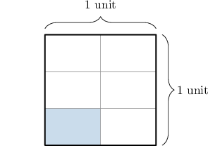

#### Explanation

First, notice the unit square is divided into $\color{blue}2$ equal slices vertically and into $\color{red}3$ slices horizontally. So, each of the small tiles is $\dfrac{1}{\color{blue}2}$ units long and $\dfrac{1}{\color{red}3}$ units high.

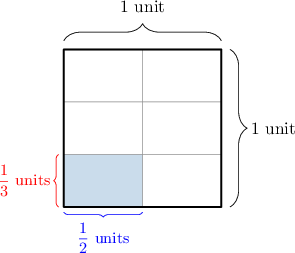

The area of each tile is

$$
\dfrac{1}{2} \times \dfrac{1}{3}\;\textrm{square units}.
$$

### Another Method for Finding the Area of a Tile

Another way of computing the area of a part of a unit square is to realize that we can find the area of a single tile using the following formula:

$$
\textrm{area of a single tile} = \dfrac{1}{\textrm{number of tiles}}.
$$

Knowing this, what is the area of the shaded region below, in square units?

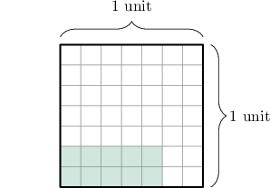

First, note that the region is $7$ tiles long and $7$ tiles high.

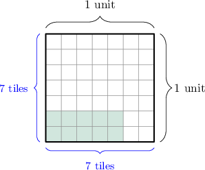

So there are a total of $7 \times 7 = 49$ small square tiles. Therefore, the area of each tile is $\dfrac{1}{49}$ square units.

Since $10$ tiles are shaded, the total shaded area is:

$$
10\times\dfrac{1}{49} = \dfrac{10}{49} \,\textrm{square units}.
$$

### Example: Finding the Area of Multiple Shaded Tiles by Counting the Number of Tiles

#### Question

The area of each small square tile in the unit square below is $\dfrac{1}{36}$ square units. In square units, what is the area of the shaded part?

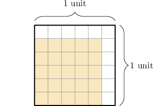

#### Explanation

The shaded region is $5$ tiles long and $5$ tiles high. Therefore, the shaded part consists of $5 \times 5 = 25$ small square tiles.

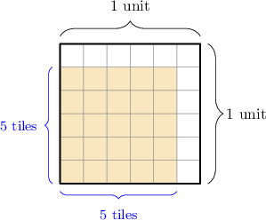

Since each tile has an area of $\dfrac{1}{36}$ square units, the area of the shaded part is

$$
25\times\dfrac{1}{36} = \dfrac{25}{36}\;\textrm{square units}.
$$

### Finding the Area of Rectangles With the Length of the Sides

Instead of counting the number of tiles in a shaded region, we can find the length of its sides and multiply them together. So, what is the area of the shaded part below?

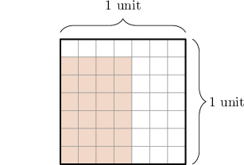

First, notice that each side of the unit square is divided into $\color{blue}7$ equal pieces. So, each of the smaller tiles has sides that are $\dfrac{1}{\color{blue}7}$ units long.

The shaded region is $4$ tiles long and $6$ tiles high, which means that it has dimensions $\dfrac{4}{7}$ units by $\dfrac{6}{7}$ units.

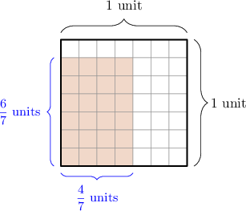

Finally, we find the area of the shaded rectangle by multiplying the lengths of the sides. So, the area is:

$$
\dfrac{4}{7} \times \dfrac{6}{7}\,\,\textrm{square units}.
$$

### Example: Finding the Area of Multiple Shaded Tiles by Multiplying the Side Lengths

#### Question

What is the area of the shaded part of the unit square below, measured in square units?

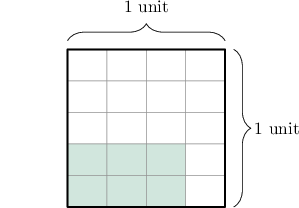

#### Explanation

First, notice the unit square is divided into $\color{blue}4$ equal slices horizontally and into $\color{red}5$ slices vertically. So, each of the small tiles is $\dfrac{1}{\color{blue}4}$ units long and $\dfrac{1}{\color{red}5}$ units high.

The shaded region is $3$ tiles long and $2$ tiles high, which means that it has dimensions $\dfrac{3}{4}$ units by $\dfrac{2}{5}$ units.

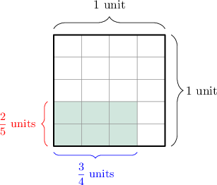

Finally, we find the area of the shaded rectangle by multiplying the lengths of the sides. So, the area is

$$
\dfrac{3}{4} \times \dfrac{2}{5}\,\,\textrm{square units}.
$$

### Example: Finding Numbers Missing From a Product by Multiplying Side Lengths

#### Question

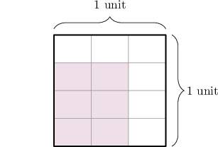

The equation below gives the area of the shaded region. From **, what numbers are missing?

$$
\,0\,
$$

#### Explanation

First, notice the unit square is divided into $3$ equal slices horizontally and into $4$ slices vertically. So, each of the small tiles is $\dfrac{1}{3}$ units long and $\dfrac{1}{4}$ units high.

The shaded region is $2$ tiles long and $3$ tiles high, which means that it has dimensions $\dfrac{2}{3}$ units by $\dfrac{3}{4}$ units.

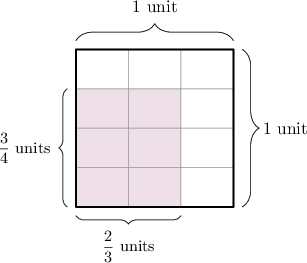

We find the area of the shaded rectangle by multiplying the lengths of the sides:

$$
\,2\,
$$

So, from left to right, the missing numbers are ${\color{blue}2},{\color{red}4}$ and $\color{magenta}6.$
