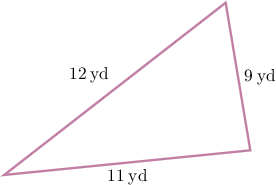
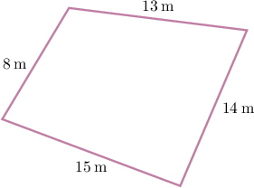
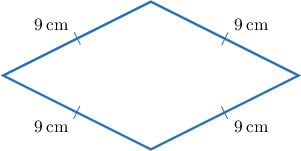
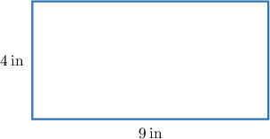
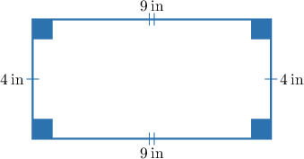
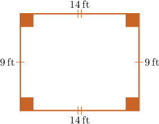

# Perimeters of Shapes

Source: https://www.mathacademy.com/topics/7743?courseId=30
Topic ID: 7743

## Prerequisites

- [Units of Length](../grade-4/236-units-of-length.md)
- [Rectangles, Rhombuses, and Squares](./3751-rectangles-rhombuses-and-squares.md)

## Lesson

### Introduction

The **perimeter** of a polygon is the total distance around its boundary. So, to find the perimeter, we add the lengths of all the polygon's sides.

For example, let's find the perimeter of the triangle shown below.

Therefore, the perimeter of the triangle is

$$
P = 12 + 9 + 11 = 32 \: \text{yd}.
$$

### Example: Finding the Perimeter of a Polygon

#### Question

What is the perimeter of the quadrilateral shown above (not drawn to scale)?

#### Explanation

The perimeter of a polygon is the total distance around its boundary, so we add the lengths of all its sides.

Therefore, the perimeter of the quadrilateral is

$$
P = 8 + 13 + 14 + 15 = \bbox[4pt,border: 1px solid lightgray]{50} \: \text{m}.
$$

### Perimeters of Rhombuses and Squares

Recall the following properties of rhombuses and squares:

- A square is a quadrilateral with two pairs of parallel sides, where *all four sides are equal*, and all four angles are right angles.

- A rhombus is a quadrilateral with two pairs of parallel sides, where *all four sides are equal*.

The special properties of these shapes allow us to find their perimeters even more easily than usual.

For example, the perimeter of a square with a side of length $7\:\text{m}$ is given by

$$
\begin{aligned}Perimeter & =4×(Side Length) \\ & =4×7 \\ & =28\,m.\end{aligned}
$$

Let's see another example.

### Example: Finding the Perimeter of a Rhombus

#### Question

What is the perimeter of a rhombus with side length $9\:\text{cm}$?

#### Explanation

The perimeter of a polygon is the total distance around its boundary, so we add the lengths of all its sides.

Recall that a rhombus is a quadrilateral with two pairs of parallel sides, where all four sides are equal.

Therefore, the perimeter of the rhombus is

$$
\begin{aligned}Perimeter & =4×(Side Length) \\ & =4×9 \\ & =36\,cm.\end{aligned}
$$

### Perimeters of Rectangles

Now, let's see how to find the perimeter of the rectangle shown below.

To find the perimeter, we add the lengths of all the rectangle's sides.

Recall that a rectangle is a quadrilateral with two pairs of equal parallel sides and four right angles.

Therefore, the perimeter of the rectangle is

### Example: Finding the Perimeter of a Rectangle

#### Question

What is the perimeter of a rectangle with a length of and a width of?

#### Explanation

The perimeter of a polygon is the total distance around its boundary, so we add the lengths of all its sides.

Recall that a rectangle is a quadrilateral with two pairs of equal parallel sides and four right angles.

Therefore, the perimeter of the rectangle is
