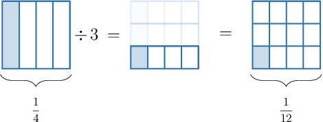

# Dividing Fractions by Whole Numbers

Source: https://www.mathacademy.com/topics/2369?courseId=31
Topic ID: 2369

## Prerequisites

- [Dividing Unit Fractions by Whole Numbers](../grade-5/530-dividing-unit-fractions-by-whole-numbers.md)
- [Multiplying Fractions](../grade-5/2378-multiplying-fractions.md)
- [Dividing Fractions by Whole Numbers Using Models](./2436-dividing-fractions-by-whole-numbers-using-models.md)

## Lesson

### Introduction

To divide a fraction by a whole number, we multiply the fraction by the whole number's reciprocal.

Let's use this rule to solve the following division problem:

$$

\dfrac14 \div {\color{blue}{3}}

$$

The reciprocal of $\color{blue}3$ is $\dfrac{1}{{\color{blue}{3}}}.$ So, we have

$$

\dfrac 1 4\, {\color{red}\div} \, {\color{blue}3} = \dfrac 1 4\, {\color{red}\times} \,\dfrac{1}{\color{blue}3}.

$$

Now, we multiply fractions. We multiply the numerators, and we multiply the denominators:

$$

\dfrac 1 4 \times \dfrac{1}{3} = \dfrac {1\times 1} {4\times 3} = \dfrac{1}{12}

$$

Therefore, we conclude that

$$

\dfrac14 \div 3 = \dfrac{1}{12}.

$$

We get the same result by using a fraction model:

### Example: Dividing a Unit Fraction by a Whole Number

#### Question

What is the value of $\dfrac 1 6 \div 5?$

#### Explanation

Dividing a fraction by a whole number is equivalent to multiplying the fraction by the reciprocal of that whole number.

The reciprocal of $\color{blue}5$ is $\dfrac{1}{{\color{blue}{5}}}.$ So, we have

$$

\dfrac 1 6\, {\color{red}\div} \, {\color{blue}5} = \dfrac 1 6\, {\color{red}\times} \,\dfrac{1}{\color{blue}5}.

$$

Now, we multiply the fractions. We multiply the numerators, and we multiply the denominators:

$$

\dfrac 1 6 \times \dfrac{1}{5} = \dfrac {1\times 1} {6\times 5} = \dfrac{1}{30}

$$

### Example: Dividing a Fraction by a Whole Number

#### Question

What is the values of $\dfrac 2 3 \div 7?$

#### Explanation

Dividing a fraction by a whole number is equivalent to multiplying the fraction by the reciprocal of that whole number.

The reciprocal of $\color{blue}7$ is $\dfrac{1}{{\color{blue}{7}}}.$ So, we have

$$

\dfrac 2 3\, {\color{red}\div} \, {\color{blue}7} = \dfrac 2 3\, {\color{red}\times} \,\dfrac{1}{\color{blue}7} .

$$

Now, we multiply fractions. We multiply the numerators, and we multiply the denominators:

$$

\dfrac 2 3 \times \dfrac{1}{7} = \dfrac {2\times 1} {3\times 7} = \dfrac{2}{21}

$$

### Example: Cases Where Simplification Is Required

#### Question

Find the value of $\dfrac{6}{11} \div 3.$

#### Explanation

Dividing a fraction by a whole number is equivalent to multiplying the fraction by the reciprocal of that whole number.

The reciprocal of $\color{blue}3$ is $\dfrac{1}{{\color{blue}{3}}}.$ So, we have

$$

\dfrac {6}{11} \, {\color{red}\div} \, {\color{blue}3} = \dfrac {6}{11}\, {\color{red}\times} \,\dfrac{1}{\color{blue}3}.

$$

Now, we multiply fractions. We multiply the numerators, and we multiply the denominators:

$$

\dfrac {6}{11} \times \dfrac{1}{3} = \dfrac {6\times 1} {11\times 3} = \dfrac{6}{33}

$$

Finally, we simplify our result by dividing the numerator and denominator by $3\mathbin{:}$

$$

\dfrac{6}{33} = \dfrac{6\div 3}{33\div 3} = \dfrac{2}{11}

$$
