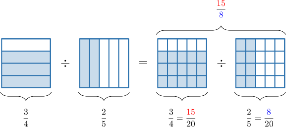

# Dividing Fractions

Source: https://www.mathacademy.com/topics/2382?courseId=31
Topic ID: 2382

## Prerequisites

- [Dividing Fractions by Whole Numbers](./2369-dividing-fractions-by-whole-numbers.md)
- [Dividing Whole Numbers by Fractions](./2377-dividing-whole-numbers-by-fractions.md)
- [Dividing Fractions Using Models](./2438-dividing-fractions-using-models.md)

## Lesson

### Introduction

To divide two fractions, we multiply the first fraction by the reciprocal of the second fraction.

As an example, let's consider the following division problem:

$$

\dfrac{3}{4}\div\dfrac{2}{5}

$$

The second fraction is $\dfrac{\color{blue}2}{\color{red}5},$ and the reciprocal of this fraction is $\dfrac{\color{red}5}{\color{blue}2}.$ So, we have

$$

\dfrac 3 4 \div \dfrac{\color{blue}2}{\color{red}5} = \dfrac 3 4 \times \dfrac{\color{red}5}{\color{blue}2} .

$$

Now, we multiply fractions. We multiply the numerators, and we multiply the denominators:

$$

\dfrac 3 {4} \times \dfrac{5}{2} = \dfrac {3 \times 5} {4 \times 2} = \dfrac{15}{8}

$$

Therefore, we conclude that

$$

\dfrac{3}{4}\div\dfrac{2}{5} = \dfrac{15}{8}.

$$

Solving this problem using fraction models gives the same result:

### Example: Dividing Unit Fractions

#### Question

Find the value of $\dfrac{1}{4} \div \dfrac{1}{8}.$

#### Explanation

Dividing a fraction by another fraction is equivalent to multiplying the first fraction by the reciprocal of the second fraction.

The reciprocal of $\dfrac{\color{blue}1}{\color{red}8}$ is $\dfrac{\color{red}8}{\color{blue}1}.$ So, we have:

$$

\dfrac 1 4 \div \dfrac{\color{blue}1}{\color{red}8} = \dfrac 1 4 \times \dfrac{\color{red}8}{\color{blue}1}

$$

Now, we multiply fractions. We multiply the numerators, and we multiply the denominators:

$$

\dfrac 1 {4} \times \dfrac{8}{1} = \dfrac {1\times 8} {4\times 1} = \dfrac{8}{4}

$$

Finally, we simplify:

$$

8\div 4=2

$$

Therefore,

$$

\dfrac{1}{4} \div \dfrac{1}{8} = 2 \, .

$$

### Example: Dividing Fractions When Simplification Is Needed: Finding a Missing Number

#### Question

What is the missing digit in the following equality?

$$

0

$$

#### Explanation

Dividing a fraction by another fraction is equivalent to multiplying the first fraction by the reciprocal of the second fraction.

The reciprocal of $\dfrac{\color{blue}4}{\color{red}3}$ is $\dfrac{\color{red}3}{\color{blue}4}.$ So, we have:

$$

\dfrac 6 {7} \div \dfrac{\color{blue}4}{\color{red}3} = \dfrac 6 {7} \times \dfrac{\color{red}3}{\color{blue}4}

$$

Now, we multiply fractions. We multiply the numerators, and we multiply the denominators:

$$

\dfrac 6 {7} \times \dfrac{3}{4} = \dfrac {6\times 3} {7\times 4} = \dfrac{18}{28}

$$

Finally, we simplify:

$$

\dfrac{18}{28} = \dfrac{18\div 2}{28\div 2} = \dfrac{\color{blue}9}{14}

$$

Therefore,

$$

\dfrac 6 {7}\div \dfrac 4 {3} = \dfrac{\color{blue}9}{14} \, .

$$

We conclude that the missing number is ${\color{blue}{9}}.$

### Example: Dividing Fractions When Simplification Is Needed

#### Question

Calculate the value of $\dfrac{1}{12} \div \dfrac{2}{3}.$

#### Explanation

Dividing a fraction by another fraction is equivalent to multiplying the first fraction by the reciprocal of the second fraction.

The reciprocal of $\dfrac{\color{blue}2}{\color{red}3}$ is $\dfrac{\color{red}3}{\color{blue}2}.$ So, we have

$$

\dfrac 1 {12} \div \dfrac{\color{blue}2}{\color{red}3} = \dfrac 1 {12} \times \dfrac{\color{red}3}{\color{blue}2}.

$$

Now, we multiply the fractions. We multiply the numerators, and we multiply the denominators:

$$

\dfrac 1 {12} \times \dfrac{3}{2} = \dfrac {1\times 3} {12\times 2} = \dfrac{3}{24}

$$

Finally, we simplify:

$$

\dfrac{3}{24} = \dfrac{3\div 3}{24\div 3} = \dfrac{1}{8}

$$

Therefore,

$$

\dfrac{1}{12} \div \dfrac{2}{3} = \dfrac{1}{8} \, .

$$

### Example: Dividing Fractions When the Result Is a Mixed Number

#### Question

Calculate the value of $\dfrac{1}{3} \div \dfrac 2 {13}.$

#### Explanation

Dividing a fraction by another fraction is equivalent to multiplying the first fraction by the reciprocal of the second fraction.

The reciprocal of $\dfrac{\color{blue}2}{\color{red}13}$ is $\dfrac{\color{red}13}{\color{blue}2}.$ So, we have

$$

\dfrac 1 {3} \div \dfrac{\color{blue}2}{\color{red}13} = \dfrac 1 {3} \times \dfrac{\color{red}13}{\color{blue}2}.

$$

Now, we multiply fractions. We multiply the numerators, and we multiply the denominators:

$$

\dfrac 1 {3} \times \dfrac{13}{2} = \dfrac {1\times 13} {3 \times 2} = \dfrac{13}{6}

$$

Finally, we write the resulting improper fraction as a mixed number:

$$

\dfrac{13}{6} =2\,\textrm{R} 1 = 2\,\dfrac 1 {6}

$$

Therefore,

$$

\dfrac{1}{3} \div \dfrac 2 {13} = 2\,\dfrac 1 {6} \, .

$$
