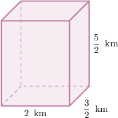
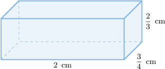
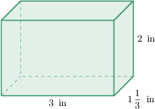
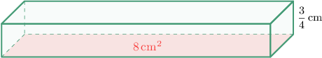
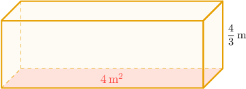

# Volumes of Rectangular Prisms With Fractional Edge Lengths

Source: https://www.mathacademy.com/topics/2447?courseId=31
Topic ID: 2447

## Prerequisites

- [Multiplying Mixed Numbers by Whole Numbers](../grade-5/2379-multiplying-mixed-numbers-by-whole-numbers.md)
- [Volumes of Right Rectangular Prisms: Word Problems](./2411-volumes-of-right-rectangular-prisms-word-problems.md)

## Lesson

### Introduction

The volume of a shape is the amount of $3$-dimensional space inside it. We can calculate the volume of a rectangular prism with the following formula:

$$

V = \text{length} \times \text{width} \times \text{height}

$$

Let's use this to calculate the volume of the rectangular prism shown below.

This rectangular prism has a length of $2\,\text{km}$, a width of $\dfrac{3}{2} \,\text{km}$, and a height of $\dfrac{5}{2}\,\text{km}.$

So, the volume of the rectangular prism is:

$$

\begin{aligned}𝑉 & =length×width×height \\ & =2×\frac{3}{2}×\frac{5}{2} \\ & =\frac{2×3×5}{1×2×2} \\ & =\frac{30}{4}\end{aligned}

$$

We can simplify the fraction above by dividing the numerator and denominator by $2\mathbin{:}$

$$

\dfrac{30 \div 2}{4 \div 2}= \dfrac{15}{2}

$$

Finally, we write the resulting improper fraction as a mixed number:

$$

\dfrac{15}{2} = 7 \, \textrm{R} \, 1 = 7 \, \dfrac{1}{2}

$$

Therefore, the volume is $7 \, \dfrac{1}{2}\,\text{km}^3.$

### Example: Calculating the Volume of a Rectangular Prism

#### Question

What is the volume of the rectangular prism shown below?

#### Explanation

The rectangular prism has a length of $2\,\text{cm}$, a width of $\dfrac{3}{4}\,\text{cm}$, and a height of $\dfrac{2}{3}\,\text{cm}.$

So, the volume of the rectangular prism is:

$$

\begin{aligned}𝑉 & =length×width×height \\ & =2×\frac{3}{4}×\frac{2}{3} \\ & =\frac{2}{1}×\frac{3}{4}×\frac{2}{3} \\ & =\frac{2×3×2}{1×4×3} \\ & =\frac{12}{12}\end{aligned}

$$

We now simplify the above fraction by dividing the numerator and denominator by $12\mathbin{:}$

$$

\dfrac{12 \div 12}{12 \div 12}= \dfrac{1}{1} = 1

$$

Therefore, the volume of the rectangular prism is $1 \,\text{cm}^3.$

### Example: Calculating the Volume of a Rectangular Prism Given Mixed Number Edge Lengths

#### Question

Determine the volume of the figure shown above.

#### Explanation

The rectangular prism has a length of $3 \, \text{in}$, a width of $1\,\dfrac{1}{3} \,\text{in}$, and a height of $2\,\text{in}.$

So, the volume of the rectangular prism is:

$$

\begin{aligned}𝑉 & =length×width×height \\ & =3×1\,\frac{1}{3}×2\end{aligned}

$$

We write $1 \, \dfrac{1}{3}$ as an improper fraction:

$$

1 \, \dfrac{1}{3} = \dfrac{(1 \times 3) + 1}{3} = \dfrac{4}{3}

$$

Now, we can multiply the numbers:

$$

\begin{aligned}𝑉 & =3×\frac{4}{3}×2 \\ & =\frac{3×4×2}{3} \\ & =\frac{24}{3} \\ & =8\end{aligned}

$$

Therefore, the volume is $8 \,\text{in}^3.$

### Volumes of Rectangular Prisms Given the Height and Base Area

We can also calculate the volume of a rectangular prism if we know the height and the area of the base. All we have to do is multiply these quantities together:

$$

V = \text{base} \times \text{height}

$$

Let's apply this formula to find the volume of the rectangular prism shown below.

For this rectangular prism, the area of the base is $8 \, \text{cm}^2$ and the height is $\dfrac{3}{4} \, \text{cm}.$

So, the volume of the rectangular prism is:

$$

\begin{aligned}𝑉 & =base×height \\ & =8×\frac{3}{4} \\ & =\frac{8×3}{4} \\ & =\frac{24}{4} \\ & =6\end{aligned}

$$

Therefore, the volume is $6 \, \text{cm}^3.$

**Note:** Where does this formula come from? The key is to realize that the area of the base of a rectangular prism is equal to the length multiplied by the width:

$$

\text{base} = \text{length} \times \text{width}

$$

Looking at the original formula for calculating the volume of a rectangular prism, we have:

$$

\begin{aligned}𝑉 & =length×width×height \\ & =(length×width)×height \\ & =base×height\end{aligned}

$$

### Example: Calculating the Volume of a Rectangular Prism Given the Height and Base Area

#### Question

Find the volume of the figure shown below.

#### Explanation

The picture shows a rectangular prism, where the area of the base is $4 \, \text{m}^2$ and the height is $\dfrac{4}{3} \, \text{m}.$

So, the volume of the rectangular prism is:

$$

\begin{aligned}𝑉 & =base×height \\ & =4×\frac{4}{3} \\ & =\frac{4×4}{3} \\ & =\frac{16}{3}\end{aligned}

$$

Therefore, the volume is $\dfrac{16}{3} \, \text{m}^3.$
