# Polygons in the Coordinate Plane

Source: https://www.mathacademy.com/topics/2448?courseId=31
Topic ID: 2448

## Prerequisites

- [Distances Between Points in the Coordinate Plane](./573-distances-between-points-in-the-coordinate-plane.md)
- [Rectangles, Rhombuses, and Squares](../grade-5/3751-rectangles-rhombuses-and-squares.md)

## Lesson

### Introduction

Remember that the corners of a polygon are called vertices. If we place each vertex of a polygon at a coordinate, we can plot the shape on a coordinate plane.

Let's place the vertices of a rectangle $ABCD$ at the coordinates

$$

A(-2,-1), \qquad B(4,-1), \qquad C(4,3), \qquad D(-2,3),

$$

as shown below.

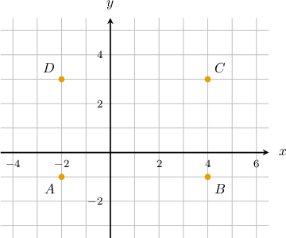

Then, we connect the consecutive points by line segments $A$ to $B,$ $B$ to $C,$ $C$ to $D,$ and $D$ to $A.$

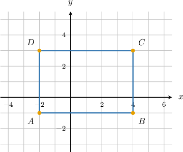

### Example: Plotting a Polygon

#### Question

A triangle $ABC$ has vertices at $A(-2,0),$ $B(4,0),$ and $C(1,3).$ Plot the triangle.

#### Explanation

First, we plot the given points.

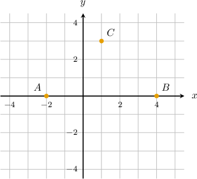

Then, we connect the consecutive points by line segments.

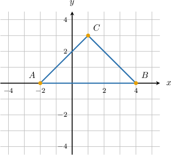

### Finding the Length of a Side of a Polygon on the Coordinate Plane

Now that we can plot shapes on a coordinate plane, we can find the length of a side using our knowledge of distances between two points.

Let's consider the rectangle $ABCD$ with vertices at

$$

A(-2,-1), \qquad B(4,-1), \qquad C(4,3), \qquad D(-2,3).

$$

What is the length of the side $BC?$

Let's draw this rectangle in the coordinate plane.

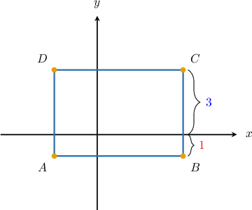

From the diagram, we can see that

- the distance from $B$ to the $x$-axis is $\color{red}1$, and

- the distance from $C$ to the $x$-axis is $\color{blue}3.$

Therefore, the length of $BC$ is ${\color{red}{1}}+{\color{blue}{3}}=4.$

### Example: Finding the Length of a Side

#### Question

A parallelogram $KLMN$ has vertices at $K(-7,0),$ $L(-4,0),$ $M(-2,5),$ and $N(-5,5).$ What is the length of the side $MN?$

#### Explanation

Let's draw this parallelogram in the coordinate plane.

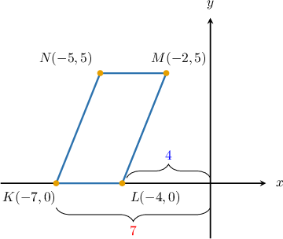

The length of $MN$ and the length of $KL$ are the same.

From the diagram, we can see that

- the distance from $L$ to the $y$-axis is $\color{red}4$, and

- the distance from $K$ to the $y$-axis is $\color{blue}7.$

Therefore, the length of both $MN$ and $KL$ is ${\color{red}{7}}-{\color{blue}{4}}=3.$

### Example: Finding the Length of a Side: Crossing the Axis

#### Question

A square $ABCD$ has vertices at $A(2,-2),$ $B(8,-2),$ $C(8,4),$ and $D(2,4).$ What is the length of the side $BC?$

#### Explanation

Let's draw this square in the coordinate plane.

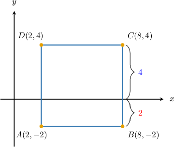

From the diagram, we can see that

- the distance from $B$ to the $x$-axis is $\color{red}2$, and

- the distance from $C$ to the $x$-axis is $\color{blue}4.$

Therefore, the length of $BC$ is ${\color{red}{2}}+{\color{blue}{4}}=6.$

### Finding the Coordinates of a Missing Vertex of a Rectangle

Let's say we're given only three vertices of the rectangle $ABCD,$ which are

$$

A(-3,1), \qquad B(3,1), \qquad D(-3,6).

$$

We can find the location of the missing vertex by extending a vertical line and a horizontal line from the two adjacent vertices.

First, we plot the points $A(-3,1),$ $B(3,1),$ and $D(-3,6),$ and connect them:

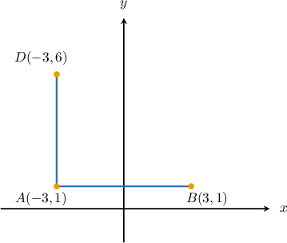

To find $C,$ we draw a vertical line from $B$ and a horizontal line from $D.$

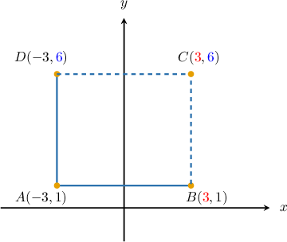

The coordinates of $C$ are $({\color{red}{3}},{\color{blue}{6}}).$

Notice that $C$ has the same $x$-coordinate as $B$ and the same $y$-coordinate as $D.$

### Example: Finding the Coordinates of a Vertex

#### Question

A rectangle $KLMN$ has vertices at $K(-2,1),$ $L(3,1),$ and $M(3,4).$ What are the coordinates of the vertex $N?$

#### Explanation

First, we plot the points $K(-2,1),$ $L(3,1),$ and $N(3,4)$ and connect them:

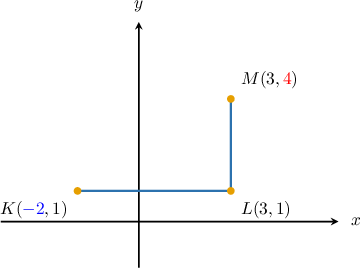

To find $N$ we draw a vertical line from $K$ and a horizontal line from $M.$

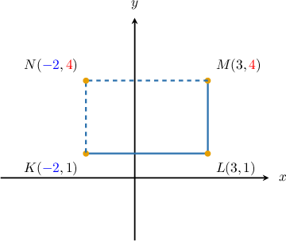

The coordinates of $N$ are $({\color{blue}{-2}},{\color{red}{4}}).$

Notice that $N$ has the same $x$-coordinate as $K$ and the same $y$-coordinate as $M.$
