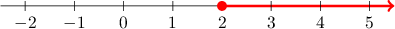
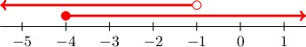
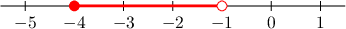
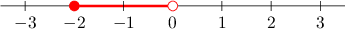
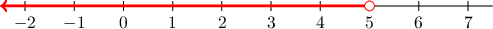
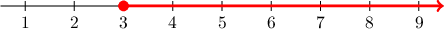

# Representing Inequalities on Number Lines

Source: https://www.mathacademy.com/topics/2462?courseId=31
Topic ID: 2462

## Prerequisites

- [Identifying Solutions to Linear Inequalities](./2505-identifying-solutions-to-linear-inequalities.md)

## Lesson

### Introduction

An **inequality** is a mathematical statement that compares two expressions. An inequality with one variable can represent a set of numbers on the number line. For example, the set of numbers that are greater than or equal to $0$ can be represented by the inequality

$$

x \; {\color{red}\geq} \; 0

$$

Here, the sign ${\color{red}\geq}$ means "greater than or equal to." So the above statement in words is "$x$ is greater than or equal to zero." For example,

- the numbers $0,$ $1,$ and $7.321$ all satisfy the inequality, while

- the numbers $-0.01,$ $-8,$ and $-123$ do not.

We can represent this inequality visually using a number line. To do so, we first plot the number zero as a filled red circle on the number line. The rest of the numbers that are greater than or equal to $0$ lie to the right of $0,$ so we represent them using a red line that extends to the right of $0\mathbin{:}$

In general, there are four types of inequalities:

- $\ge\quad$ *greater than or equal* This is represented by a filled circle $\Large\color{red}\bullet$ and an arrow that goes to the right $\Large\color{red}\boldsymbol{\rightarrow}$

- $>\quad$ *greater than* This is represented by an empty circle $\Large\color{red}\circ$ and an arrow that goes to the right $\Large\color{red}\boldsymbol{\rightarrow}$

- $\le\quad$ *less than or equal* This is represented by a filled circle $\Large\color{red}\bullet$ and an arrow that goes to the left $\Large\color{red}\boldsymbol{\leftarrow}$

- $<\quad$ *less than* This is represented by an empty circle $\Large\color{red}\circ$ and an arrow that goes to the left $\Large\color{red}\boldsymbol{\leftarrow}$

### Example: Finding the Inequality Represented by a Number Line

#### Question

What inequality corresponds to the red colored graph shown in the number line below?

#### Explanation

The red arrow indicates that $x$ should consist of all the values greater than $2.$ In addition, the filled red circle at $2$ implies that $x$ can be equal to $2.$

Therefore, the highlighted region represents the numbers that are greater than or equal to $2.$ This corresponds the inequality $x \geq 2.$

### Example: Constructing the Number Line for an Inequality

#### Question

Represent $x < -1$ on a number line.

#### Explanation

The symbol "$<$" means "less than." So, the inequality $x < -1$ represents the numbers that are less than $-1.$

On a number line, the numbers less than $-1$ are the numbers that are left of $-1.$ So, we should draw an arrow going to the left of $-1.$

However, the number $-1$ itself is not less than $-1,$ so we should not include it in our representation. To exclude $-1,$ we draw an empty circle around $-1.$

### Compound Inequalities

Compound inequalities can also be written with the word "and." However, such inequalities are often written together as *a* single expression with two inequality signs. For example, the compound inequality

$$

-4 \leq x < -1

$$

means that $-4 \leq x$ *and* $x < -1.$

For the compound "and" inequality to be satisfied, both of the separate inequalities must be satisfied. To illustrate:

- $x=-3$ satisfies the inequality because both $-4 \leq -3$ and $-3 < -1$ are true.

- $x=-5$ does not satisfy the inequality because $-4 \leq -5$ is false.

- $x=0$ does not satisfy the inequality because $0 < -1$ is false.

To graph the compound inequality $-4 \leq x < -1,$ we first graph the two inequalities separately to see where they overlap.

Then, we find the *intersection* — the values included in *both* graphs. The result is the segment where the lines overlap.

### Example: Matching a Compound Inequality and the Corresponding Number Line

#### Question

What inequality corresponds to the highlighted region shown on the number line above?

#### Explanation

The red segment contains all values between $-2$ and $0.$ In addition,

- the closed circle at $-2$ implies that $x$ can be equal to $-2,$ while

- the open circle at $0$ implies that $x$ cannot be equal to $0.$

Therefore, the highlighted region represents $-2 \leq x < 0.$

### Integer Solutions of Inequalities

What is the largest integer solution to $x < 5?$

The condition $x < 5$ implies that $x$ can be any value that is less than $5.$

To represent this on a number line:

- We draw an open circle at $x=5.$

- We draw an arrow starting from $5$ and going to the left.

Any number in the highlighted region is a solution. Since there are infinitely many numbers in the highlighted region, there are infinitely many solutions to the inequality $x < 5.$

From the number line, we see that *integer* solutions to $x < 5$ are

$$

\ldots,-2,\,-1,\,0,\,1,\,2,\,3,\,4

$$

Among them, the *largest* is $\boxed{4}.$

### Example: Finding the Integer Solution of an Inequality

#### Question

What is the smallest integer solution to $x \geq 3?$

#### Explanation

The condition $x \geq 3$ implies that $x$ can be any value that is greater than or equal to $3.$

To represent this on a number line:

- We draw a closed circle at $x=3.$

- We draw an arrow starting from $3$ and going to the right.

From the number line, we see that **** solutions to $x \geq 3$ are

$$

3, \, 4, \, 5, \, 6, \, 7, \, 8, \, 9, \, \ldots

$$

Among them, the **** is $3.$
