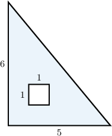
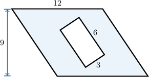
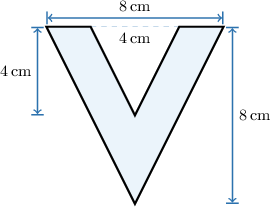
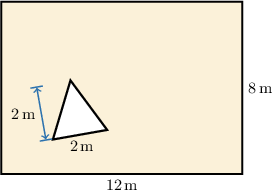
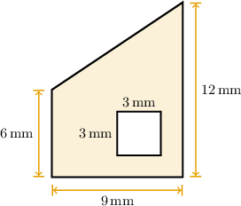
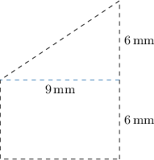

# Finding Areas Between Shapes

Source: https://www.mathacademy.com/topics/2483?courseId=31
Topic ID: 2483

## Prerequisites

- [Finding Areas of Polygons Using Decomposition](./576-finding-areas-of-polygons-using-decomposition.md)
- [Areas and Perimeters of Parallelograms](./2473-areas-and-perimeters-of-parallelograms.md)

## Lesson

### Introduction

We can find the area of a **composite shape** with a piece removed by subtracting the area of the piece from the area of the larger shape.

To find the shaded area, we will use the **subtraction method**: subtract the area of the inner shape (the square) from the area of the outer shape (the triangle).

First, we find the area of the triangle:

$$

\begin{aligned}Area of Triangle & =\frac{1}{2}×base×height \\ & =\frac{1}{2}×5×6 \\ & =\frac{1}{2}×30 \\ & =15\end{aligned}

$$

Then, we find the area of the square:

$$

\begin{aligned}Area of Square & =base×height \\ & =1×1 \\ & =1\end{aligned}

$$

Finally, we subtract the area of the square from the area of the triangle:

$$

\begin{aligned}Shaded Area & =Area of Triangle−Area of Square \\ & =15−1 \\ & =14\end{aligned}

$$

### Example: Finding the Area of a Polygon with a Polygonal Hole

#### Question

Determine the area of the shaded region shown below.

#### Explanation

This shape is a parallelogram with a rectangle cut out.

To find the total area, we need to subtract the area of the inner shape (the rectangle) from the area of the outer shape (the parallelogram).

First, we find the area of the parallelogram:

$$

\begin{aligned}Area of Parallelogram & =base×height \\ & =12×9 \\ & =108\end{aligned}

$$

Then, we find the area of the rectangle:

$$

\begin{aligned}Area of Rectangle & =base×height \\ & =6×3 \\ & =18\end{aligned}

$$

Finally, to find the total area, we subtract the area of the rectangle from the area of the parallelogram:

$$

\begin{aligned}Total Area & =Area of Parallelogram−Area of Rectangle \\ & =108−18 \\ & =90\end{aligned}

$$

### Example: Finding the Area of a Polygon with a Polygonal Hole that Shares an Edge

#### Question

Margaret used two triangles to form the letter **. The letter is shown in the diagram below. What is the area of this letter?

#### Explanation

The shaded region is a large triangle with a smaller triangle cut out of it.

To find the total area, we need to subtract the area of the inner triangle from the area of the outer triangle.

First, we find the area of the outer triangle:

$$

\begin{aligned}Area of Outer Triangle & =\frac{1}{2}×base×height \\ & =\frac{1}{2}×8×8 \\ & =\frac{64}{2} \\ & =32\end{aligned}

$$

Then, we find the area of the inner triangle:

$$

\begin{aligned}Area of Inner Triangle & =\frac{1}{2}×base×height \\ & =\frac{1}{2}×4×4 \\ & =\frac{16}{2} \\ & =8\end{aligned}

$$

Finally, to find the total area, we subtract the area of the inner triangle from the area of the outer triangle:

$$

\begin{aligned}Total Area & =Area of Outer Triangle−Area of Inner Triangle \\ & =32−8 \\ & =24\end{aligned}

$$

Now, let's find the units. Since all lengths are measured in centimeters, the area is measured in square centimeters. Therefore,

$$

\textrm{Total Area} = 24 \, \textrm{cm}^2.

$$

### Example: Finding the Area of a Polygon with a Polygonal Hole: Word Problem

#### Question

Rose pitches a tent in her back yard, shown below. What area of the yard isn't taken up by the tent?

#### Explanation

The area of the yard not taken up by Rose's tent corresponds to the shaded region. This region is a rectangle with a triangle cut out.

To find the total area, we need to subtract the area of the inner shape (the triangle) from the area of the outer shape (the rectangle).

First, we find the area of the rectangle:

$$

\begin{aligned}Area of Rectangle & =base×height \\ & =12×8 \\ & =96\end{aligned}

$$

Then, we find the area of the triangle:

$$

\begin{aligned}Area of Triangle & =\frac{1}{2}×base×height \\ & =\frac{1}{2}×2×2 \\ & =\frac{4}{2} \\ & =2\end{aligned}

$$

Finally, to find the total area, we subtract the area of the triangle from the area of the rectangle:

$$

\begin{aligned}Total Area & =Area of Rectangle−Area of Triangle \\ & =96−2 \\ & =94\end{aligned}

$$

Now, let's find the units. Since all lengths are measured in meters, the area is measured in square meters. Therefore,

$$

\textrm{Total Area} = 94 \, \textrm{m}^2.

$$

### Example: Finding the Area of a Trapezoid with a Polygonal Hole

#### Question

Find the area of the shaded region.

#### Explanation

This shaded region is a trapezoid with a square cut out.

To find the total area, we need to subtract the area of the inner shape (the square) from the area of the outer shape (the trapezoid).

First, we find the area of the trapezoid. The trapezoid consists of a square and a triangle.

The area of the rectangle is

$$

\begin{aligned}Area of Rectangle & =base×height \\ & =6×9 \\ & =54.\end{aligned}

$$

The area of the triangle is

$$

\begin{aligned}Area of Triangle & =\frac{1}{2}×base×height \\ & =\frac{1}{2}×6×9 \\ & =\frac{54}{2} \\ & =27.\end{aligned}

$$

To find the area of the trapezoid, we add the area of the rectangle and the area of the triangle together:

$$

\begin{aligned}Area of Trapezoid & =54+27=81\end{aligned}

$$

On the other hand, the area of the square is

$$

\begin{aligned}Area of Square & =base×height \\ & =3×3 \\ & =9.\end{aligned}

$$

Finally, to find the total area of the shaded region, we subtract the area of the square from the area of the trapezoid:

$$

\begin{aligned}Total Area & =Area of Trapezoid−Area of Square \\ & =81−9 \\ & =72\end{aligned}

$$

Now, let's find the units. Since all lengths are measured in millimeters, the area is measured in square millimeters. Therefore,

$$

\textrm{Total Area} = 72 \, \textrm{mm}^2.

$$
