# Symmetry, Skew, and Outliers

Source: https://www.mathacademy.com/topics/2502?courseId=31
Topic ID: 2502

## Prerequisites

- [Measuring Range and MAD From Dot Plots](./2501-measuring-range-and-mad-from-dot-plots.md)
- [Outliers](./2517-outliers.md)

## Lesson

### Introduction

Remember that an outlier of a data set is a value much higher or much lower than the other values.

When a data set is represented as a dot plot, it's easy to pick out the outliers: we have to look for values much further to the left or right than the main cluster of values.

To demonstrate, consider the dot plot below:

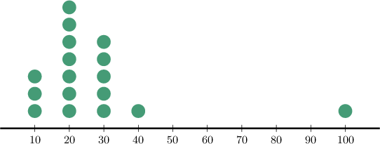

Notice that most values are concentrated between $10$ and $40,$ but one value is separated from the main group.

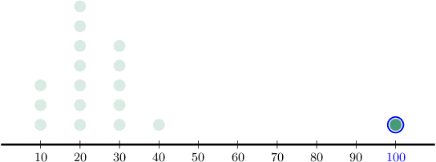

Since this value is separated from the main group, we conclude that ${\color{blue}100}$ is an outlier of the distribution.

### Example: Identifying Outliers From a Dot Plot

#### Question

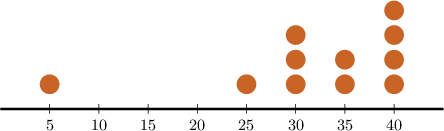

How many outliers are there for the data set whose dot plot is shown above?

#### Explanation

Notice that most values are concentrated between $25$ and $40,$ but one value is separated from the main group.

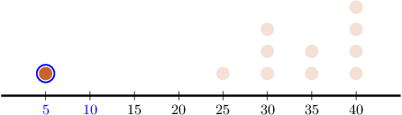

The value $\color{blue}5$ is the outlier of the distribution. Therefore, there is $1$ outlier.

### Tails, Skew, and Symmetry

A **tail** of a distribution is a part that extends away from the main cluster.

If the *left tail* of the distribution is longer than the right tail, then we say that the distribution is **left-skewed** (or **negatively skewed**). An example of a left-skewed distribution is shown below.

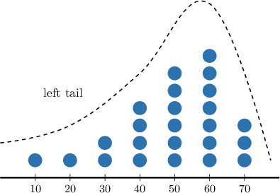

Similarly, if the *right tail* of the distribution is longer than the left tail, then we say that the distribution is **right-skewed** (or **positively skewed**). An example of a right-skewed distribution is shown below.

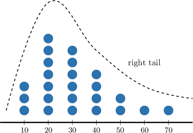

If the tails of the distribution are the same, we say that the distribution is **symmetric**. An example of a symmetric distribution is shown below.

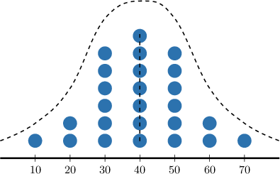

### Example: Identifying Symmetry and Skew From a Dot Plot

#### Question

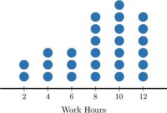

The dot plot above shows the working hours of a small group of employees. Each dot represents a single employee. What is the shape of the distribution?

#### Explanation

From the dot plot, we see that the distribution is left-skewed. It has a long tail on the left-hand side.

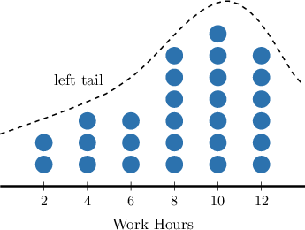

### The Mean and Median of a Symmetric Distribution

When a distribution is perfectly symmetric, the mean lies at the **midpoint** of the distribution.

To demonstrate, consider the symmetric distribution below:

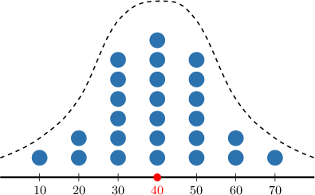

To calculate this distribution's mean (midpoint), we find the mean of the two most extreme values. The largest value is $70$, and the smallest value is $10.$ Therefore,

$$

\begin{aligned}mean & =\frac{10+70}{2} \\ & =\frac{80}{2} \\ & =40.\end{aligned}

$$

Also, when a distribution is perfectly symmetric, *the mean and the median are equal*. Therefore, for the dataset above, we have

$$

\textrm{median} = 40.

$$

### Example: Calculating Mean and Median for Symmetric Data Sets

#### Question

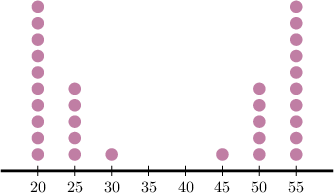

Find the mean and median of the dataset shown above.

#### Explanation

Recall that when a distribution is perfectly symmetric,

- the mean and the median are equal, and

- the mean (and median) lie at the midpoint of the distribution.

Notice that this dataset is symmetric.

To calculate the mean (midpoint) of this distribution, we find the mean of the two most extreme values. The largest value is $55$, and the smallest value is $20.$ Therefore,

$$

\textrm{mean} = \dfrac{55+20}{2} = \dfrac{75}{2} = 37.5.

$$

Therefore, the mean is $37.5$ and the median is $37.5.$

### The Effect of Skew on the Mean

Let's now consider the right-skewed distribution below.

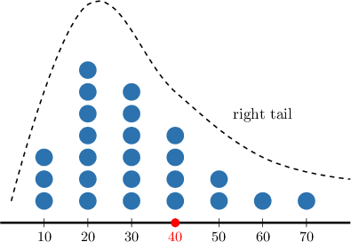

Notice that the midpoint (i.e., the mean of the two most extreme values) is also ${\color{red}{40}}.$

Since the distribution is *right*-skewed, most of the data points lie to the *left* of the midpoint. Consequently, the mean also lies to the left of the midpoint.

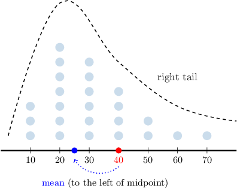

The situation is reversed when the distribution is left-skewed.

In this case, most of the data points lie to the *right* of the midpoint. Consequently, the mean also lies to the right of the midpoint.

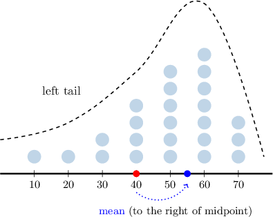

### Example: Estimating the Location of the Mean From a Dot Plot

#### Question

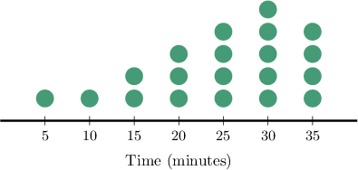

The dot plot above shows how much time each student in Mr. Johnson's class spent studying math on a particular day. Each dot represents a single student.

Which of the following statements are true?

1. The distribution is approximately symmetric.

2. The mean of the distribution equals $20\, \text{min}.$

3. The mean of the distribution exceeds $20 \, \text{min}.$

4. The mean of the distribution is less than $20 \, \text{min}.$

#### Explanation

Let's examine the statements one by one.

- Statement I is false. The distribution is left-skewed (since we have a longer tail on the left). It is not symmetric.

- Statement III is true, while statements II and IV are false. All of the data is situated between $5$ and $35$ minutes. If the data were symmetric, then the mean would be given by the midpoint, which is However, since the distribution is left-skewed, most of the data points are concentrated on the right-hand side. This indicates that the mean of our distribution lies to the right of the midpoint. So, the mean is ** $20$ minutes.

Therefore, the correct answer is "III only."
