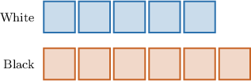
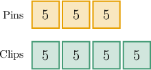
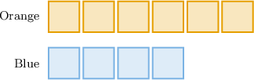
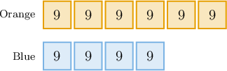
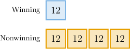

# Tape Diagrams

Source: https://www.mathacademy.com/topics/556?courseId=31
Topic ID: 556

## Prerequisites

- [Introduction to Ratios](./534-introduction-to-ratios.md)

## Lesson

### Introduction

We can illustrate ratios with a **tape diagram**, where each box represents a unit.

The tape diagram below shows the ratio between the number of black hair ties and white hair ties there are in the package Anabelle bought.

In this diagram, each box represents a hair tie. So, what is the ratio of white hair ties to black hair ties?

The tape diagram for white hair ties shows $\color{blue}5$ boxes, so Anabelle has $\color{blue}5$ white hair ties.

Likewise, the tape diagram for black hair ties contains $\color{red}6$ boxes, so she has $\color{red}6$ black hair ties.

Therefore, the ratio of white hair ties to black hair ties is ${\color{blue}5}:{\color{red}6}.$

### Example: Computing Ratios From Tape Diagrams

#### Question

The tape diagram below shows the ratio between small and big tokens in a desk game. What is the ratio of big tokens to all tokens?

#### Explanation

The tape diagram for big tokens shows $4$ boxes. So, there are $4$ big tokens.

Altogether, there are $12+4=16$ boxes. So, there are $16$ tokens in all.

Therefore, the ratio of big tokens to all tokens is $4:16.$

### Example: Creating Tape Diagrams Given a Ratio

#### Question

Abbie and Kate are making cupcakes. Abbie makes $5$ cupcakes for every $7$ that Kate makes. Which tape diagram represents the given scenario?

#### Explanation

We are told that:

Abbie makes $\color{blue}5$ cupcakes for every $\color{red}7$ that Kate makes.

So, in a tape diagram, Abbie's tape must contain $\color{blue}5$ boxes, while Kate's tape should have $\color{red}7$ boxes.

Therefore, the diagram is the following:

### Computing Ratios Using Tape Diagrams With Multiple Units

In some tape diagrams, each box can represent more than one unit.

For instance, the ratio of pins to paper clips in a case is given by the tape diagram below. If there are $15$ pins in the case, how many paper clips are there in total?

We are told that there are $15$ pins in the case, but the tape diagram for pins shows $3$ boxes. Therefore, each box in the diagram above represents $15 \div 3 = 5$ units.

Now, we fill the number $5$ in each box of both tapes:

Since there are $4$ boxes corresponding to paper clips, and each box represents $5$ units, the total number of paper clips is

$$

4 \times 5 = 20 \, .

$$

So, there are $20$ paper clips in Mrs. Robinson's case.

### Example: Interpreting Tape Diagrams Using Multiple Units

#### Question

The tape diagram below shows the ratio between the number of orange plastic building blocks and blue plastic building blocks that Tom has. If there are $54$ orange plastic building blocks, how many plastic building blocks are there altogether?

#### Explanation

We are told that there are $54$ orange plastic building blocks. The tape diagram for orange plastic building blocks shows $6$ boxes. Therefore, each box in the diagram above represents $54 \div 6 = 9$ plastic building blocks.

Now, we fill the number $9$ in each box of both tapes:

Since there are $10$ boxes corresponding to the plastic building blocks in total, and each box represents $9$ plastic building blocks, the total number of plastic building blocks is:

$$

10 \times 9 = 90

$$

So, there are $90$ plastic building blocks.

### Example: Computing Ratios From Tape Diagrams Using Multiple Units

#### Question

A jar contains $60$ raffle tickets. The ratio of winning tickets to nonwinning tickets is shown in the diagram above. How many nonwinning tickets are in the jar?

#### Explanation

The tape diagram shows $1$ box corresponding to winning tickets, and $4$ boxes corresponding to nonwinning tickets. Therefore, the ratio of winning to nonwinning tickets is $1:4.$

We are told that there are $60$ tickets in total. The tape diagram has $1+4=5$ boxes in total. Therefore, each box in the diagram above represents $60 \div 5 = 12$ tickets.

Now, we fill the number $12$ in each box of both tapes:

Since there are $4$ boxes corresponding to nonwinning tickets, and each box represents $12$ tickets, the number of nonwinning tickets must be:

$$

4 \times 12 = 48.

$$

So, there are $48$ nonwinning tickets in the jar.
