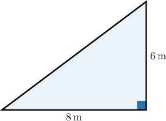
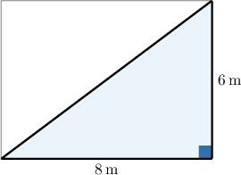
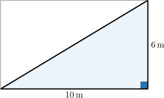
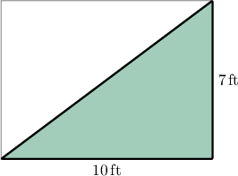

# Areas of Right Triangles

Source: https://www.mathacademy.com/topics/575?courseId=31
Topic ID: 575

## Prerequisites

- [Classifying Figures Based on Angles](./6368-classifying-figures-based-on-angles.md)
- [Areas of Rectangles](./6766-areas-of-rectangles.md)

## Lesson

### Introduction

Let's look at the following right triangle.

How can we find its area?

It turns out that:

The area of a right triangle is half the area of the corresponding rectangle:

$$

\text{Area of Triangle} = \dfrac{1}{2} \cdot \text{(Area of Rectangle)}.

$$

In our case, the corresponding rectangle has dimensions $8\:\text{m}$ by $6\:\text{m}.$

The area of the rectangle is

$$

\begin{aligned}Area of Rectangle & =8\,m⋅6\,m \\ & =(8⋅6)\,(m⋅m) \\ & =48\,m^{2}.\end{aligned}

$$

Therefore, the area of the triangle is

$$

\textrm{Area of Triangle} = \dfrac{1}{2} \cdot 48 = 24 \: \text{m}^2.

$$

Let’s see more examples.

### Example: Finding the Area of a Right Triangle

#### Question

Find the area of the triangle.

#### Explanation

The area of a right triangle is half the area of the corresponding rectangle:

$$

\text{Area of Triangle} = \dfrac{1}{2} \cdot \text{(Area of Rectangle)}

$$

In our case, the corresponding rectangle has dimensions $10\:\text{m}$ by $6\:\text{m}.$

The area of the rectangle is

$$

\text{Area of Rectangle} = 10 \cdot 6 = 60 \: \text{m}^2.

$$

Therefore, the area of the triangle is

$$

\begin{aligned}Area of Triangle=\frac{1}{2}⋅60=30\,m^{2}.\end{aligned}

$$

### Example: Finding the Area of a Right Triangle From a Description

#### Question

A flowerbed in the shape of a right triangle has a base length of $10\,\textrm{ft}$ and a width of $7\,\textrm{ft}.$ What is the area of the flowerbed?

#### Explanation

Let's sketch our flowerbed based on the description.

The area of a right triangle is half the area of the corresponding rectangle:

$$

\text{Area of Triangle} = \dfrac{1}{2} \cdot \text{(Area of Rectangle)}

$$

In our case, the corresponding rectangle has dimensions $10\:\text{ft}$ by $7\:\text{ft}.$ So, the area of the rectangle is

$$

\text{Area of Rectangle} = 10 \cdot 7 = 70 \: \text{ft}^2.

$$

Therefore, the area of the triangle is

$$

\begin{aligned}Area of Triangle=\frac{1}{2}⋅70=35\,ft^{2}.\end{aligned}

$$
