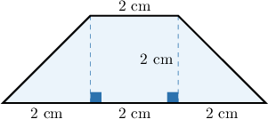
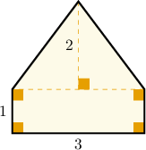
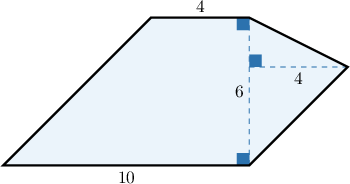
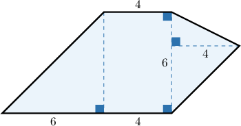
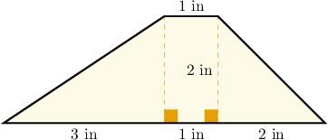
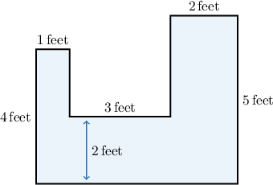
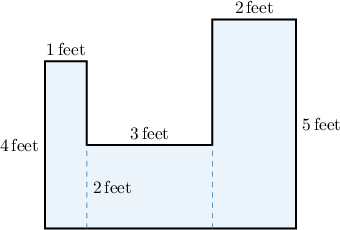

# Finding Areas of Polygons Using Decomposition

Source: https://www.mathacademy.com/topics/576?courseId=31
Topic ID: 576

## Prerequisites

- [Areas of Triangles](./6769-areas-of-triangles.md)

## Lesson

### Introduction

We can find the area of some polygons by decomposing them into triangles and rectangles, then adding up their areas.

To demonstrate, let's find the area of the trapezoid below.

This shape consists of a rectangle at the center and two right triangles on the sides. We can use the usual formulae to find their areas.

The area of the triangle on the left is:

$$

\begin{aligned}Area & =\frac{1}{2}×base×height \\ & =\frac{1}{2}×2×2 \\ & =\frac{2}{2}×2 \\ & =1×2 \\ & =2\end{aligned}

$$

The area of the triangle on the right is also $2$ because its base and height are the same.

The area of the rectangle at the center is:

$$

\begin{aligned}Area & =base×height \\ & =2×2 \\ & =4\end{aligned}

$$

Therefore, to find the total area we add the areas together:

$$

\begin{aligned}Total Area & =2+2+4=8\end{aligned}

$$

Finally, let's find the units. Since all lengths are measured in centimeters, the area is measured in square centimeters. So, we have:

$$

\textrm{Total Area} = 8 \, \textrm{cm}^2

$$

### Example: Finding the Area of a Polygon Composed of a Rectangle and a Triangle

#### Question

What is the area of the polygon?

#### Explanation

This shape consists of a rectangle and a triangle.

The area of the triangle is:

$$

\begin{aligned}Area & =\frac{1}{2}×base×height \\ & =\frac{1}{2}×3×2 \\ & =\frac{3}{2}×2 \\ & =\frac{6}{2} \\ & =3\end{aligned}

$$

The area of the rectangle is:

$$

\begin{aligned}Area & =base×height \\ & =3×1 \\ & =3\end{aligned}

$$

To find the total area we add the areas together:

$$

\begin{aligned}Total Area & =3+3=6\end{aligned}

$$

### Shapes Composed From More Than Two Simpler Shapes

Now, consider shapes with more parts. Let's find the area of the figure below.

The given shape is made up of a rectangle at the center and two triangles on the sides.

Since the rectangle's top width is $4$, its bottom width is also $4$. The total base is $10$, so the base of the triangle on the left is $10 - 4 = 6$.

The area of the triangle on the left side is:

$$

\begin{aligned}Area & =\frac{1}{2}×base×height \\ & =\frac{1}{2}×6×6 \\ & =3×6 \\ & =18\end{aligned}

$$

The area of the rectangle is:

$$

\begin{aligned}Area & =base×height \\ & =4×6 \\ & =24\end{aligned}

$$

The area of the triangle on the right side is:

$$

\begin{aligned}Area & =\frac{1}{2}×base×height \\ & =\frac{1}{2}×6×4 \\ & =3×4 \\ & =12\end{aligned}

$$

To find the total area, we add the individual areas together:

$$

\begin{aligned}Total Area=18+24+12=54\end{aligned}

$$

### Example: Finding the Area of a Polygon Composed of a Rectangle and Two Triangles

#### Question

Determine the area of the trapezoid.

#### Explanation

This shape consists of a rectangle at the center and two right triangles on the sides.

The area of the triangle on the left side is:

$$

\begin{aligned}Area & =\frac{1}{2}×base×height \\ & =\frac{1}{2}×3×2 \\ & =\frac{3}{2}×2 \\ & =\frac{6}{2} \\ & =3\end{aligned}

$$

The area of the triangle on the right side is:

$$

\begin{aligned}Area & =\frac{1}{2}×base×height \\ & =\frac{1}{2}×2×2 \\ & =\frac{2}{2}×2 \\ & =\frac{4}{2} \\ & =2\end{aligned}

$$

The area of the rectangle is:

$$

\begin{aligned}Area & =base×height \\ & =1×2 \\ & =2\end{aligned}

$$

To find the total area we add the individual areas together:

$$

\begin{aligned}Total Area & =3+2+2=7\end{aligned}

$$

Now, let's find the units. Since all lengths are measured in inches, the area is measured in square inches. Therefore:

$$

\textrm{Total Area} = 7 \, \textrm{in}^2

$$

### Example: Finding the Area of a Polygon Composed of Multiple Rectangles

#### Question

Determine the area of the polygon.

#### Explanation

First, we divide the polygon into three rectangles as shown below.

The area of the rectangle on the left side is:

$$

\begin{aligned}Area & =base×height \\ & =1×4 \\ & =4\end{aligned}

$$

The area of the rectangle located in the center is:

$$

\begin{aligned}Area & =base×height \\ & =3×2 \\ & =6\end{aligned}

$$

The area of the rectangle on the right side is:

$$

\begin{aligned}Area & =base×height \\ & =2×5 \\ & =10\end{aligned}

$$

To find the total area we add the individual areas together:

$$

\begin{aligned}Total Area & =4+6+10=20\end{aligned}

$$

Now, let's find the units. Since all lengths are measured in feet, the area is measured in square feet. Therefore:

$$

\textrm{Total Area} = 20 \, \textrm{feet}^2

$$
