# Identifying Rational Numbers on a Number Line

Source: https://www.mathacademy.com/topics/6741?courseId=31
Topic ID: 6741

## Prerequisites

- [Absolute Value](./2281-absolute-value.md)
- [Natural Numbers, Integers, and Rational Numbers](./2558-natural-numbers-integers-and-rational-numbers.md)

## Lesson

### Introduction

In this lesson, we'll learn how to identify *negative* rational numbers on a number line. But first, let’s recall how to identify a rational number on the *positive* side.

To identify a fraction on a number line:

- First, look at the segment from $0$ to $1$ and count how many *equal parts* it is split into.

- Then, count how many of those parts we move from $0$ to reach the point.

For example, let's identify which improper fraction is shown on the number line below.

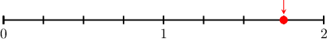

Notice that the line segment from $0$ to $1$ is split into $\color{blue}4$ equal parts. Each part represents $\dfrac{1}{\color{blue}4}$ of a whole.

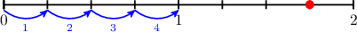

The number we are interested in is located ${\color{blue}4}+3=\color{red}7$ steps from $0$ (left to right).

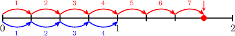

Therefore, the picture represents $\dfrac{\color{red}7}{\color{blue}4}.$

Let's see more examples.

### Example: Identifying Positive Rational Numbers on a Number Line

#### Question

What mixed number is shown on the number line?

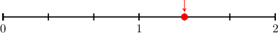

#### Explanation

The line segment from $0$ to $1$ is split into $\color{blue}3$ equal parts. Each part represents $\dfrac{1}{\color{blue}3}$ of a whole.

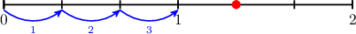

Starting from zero, we land on our point by making $\color{red}1$ whole step plus $\color{blue}1$ part step (out of a possible ${\color{blue}{3}}).$

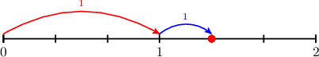

Therefore, the mixed number is ${\color{red}1}{\color{blue}\dfrac{1}{3}}.$

### Negative Rational Numbers on a Number Line

Identifying negative fractions on a number line is very similar to identifying positive fractions.

- We still look for equal parts and count how many steps it takes to reach the point.

- But negative numbers are to the *left* of $0,$ so we count steps from $0$ *right to left*, and the final answer will be *negative*.

For example, let's find out which fraction is shown on the number line below.

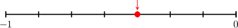

Notice that the interval between $0$ and $-1$ is split into $\color{blue}7$ equal parts.

The number we are interested in is located $\color{red}3$ steps from $0$ (right to left).

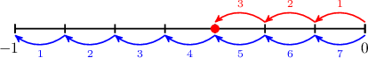

Therefore, since our number lies to the left of zero, the picture represents $-\dfrac{\color{red}3}{\color{blue}7}.$

Let's now see examples with improper fractions and mixed numbers.

### Example: Identifying Negative Rational Numbers on a Number Line

#### Question

What improper fraction is shown on the number line?

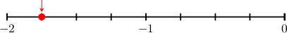

#### Explanation

Notice that the line segment from $0$ to $-1$ is split into $\color{blue}4$ equal parts. Each part represents $\dfrac{1}{\color{blue}4}$ of a whole.

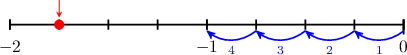

The number we are interested in is located ${\color{blue}4}+3=\color{red}7$ steps from $0$ (right to left).

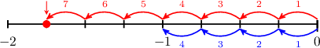

Therefore, since our number lies to the left of zero, the picture represents $-\dfrac{\color{red}7}{\color{blue}4}.$

### Example: Identifying Negative Mixed Numbers on a Number Line

#### Question

What mixed number is shown on the number line?

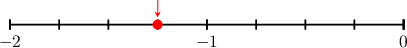

#### Explanation

The line segment from $0$ to $-1$ is split into $\color{blue}4$ equal parts. Each part represents $\dfrac{1}{\color{blue}4}$ of a whole.

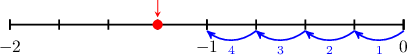

Starting from zero (right to left), we land on our point by making $\color{red}1$ whole step plus $\color{blue}1$ part step (out of a possible ${\color{blue}{4}}).$

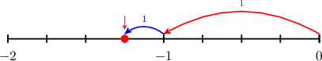

Therefore, since our number lies left of zero, the mixed number is $-{\color{red}1}{\color{blue}\dfrac{1}{4}}.$

### Absolute Values of Negative Fractions

Just like negative whole numbers, we can also have negative fractions.

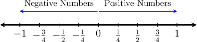

We can find the absolute value of negative fractions, like $-\dfrac{3}{2}$, in exactly the same way as whole numbers.

**Method 1**

To find the absolute value of $-\dfrac{3}{2},$ we find the distance between that number and zero on a number line.

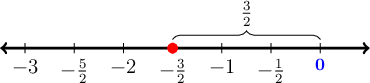

Therefore, $\left|-\dfrac{3}{2}\right|=\dfrac{3}{2}.$

**Method 2**

To find the absolute value of a rational number, we can simply drop the negative sign. So we get

$$

\begin{aligned} \left|-\dfrac{3}{2}\right|=\dfrac{3}{2}. \end{aligned}

$$

### Example: The Absolute Value of a Fraction

#### Question

Find $\left|-\dfrac{3}{4}\right|.$

#### Explanation

****

To find the absolute value of $-\dfrac{3}{4},$ we find the distance between that number and zero on a number line.

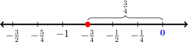

Therefore, $\left|-\dfrac{3}{4}\right|=\dfrac{3}{4}.$

****

To find the absolute value of a rational number, we can simply drop the negative sign. So we get

$$

\begin{aligned} \left|-\dfrac{3}{4}\right|=\dfrac{3}{4}. \end{aligned}

$$
