# Rational Numbers in the Coordinate Plane

Source: https://www.mathacademy.com/topics/6742?courseId=31
Topic ID: 6742

## Prerequisites

- [The Cartesian Coordinate System](./92-the-cartesian-coordinate-system.md)
- [Identifying Rational Numbers on a Number Line](./6741-identifying-rational-numbers-on-a-number-line.md)

## Lesson

### Introduction

We already know how to locate points with *integer coordinates* in the coordinate plane.

For example, to locate $(2,-1)$, we

- start at the origin $(0,0),$

- move $2$ units *right*, and

- then move $1$ unit *down*.

The same rules still apply for points with *rational coordinates* (coordinates that are fractions or decimals):

- The first coordinate, $x$, controls horizontal movement.

- The second coordinate, $y$, controls vertical movement.

But when the grid is divided into, say, *halves* between whole numbers, each part represents $0.5$ of a unit. For example, consider the point $Q$ below.

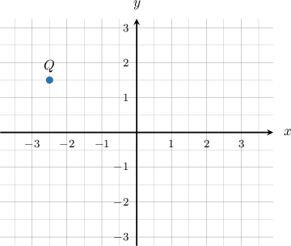

To determine the coordinates of $Q,$

- we start at the origin,

- move $2.5$ units *left* (the negative $x$ direction), and

- then $1.5$ units *up* (the positive $y$ direction).

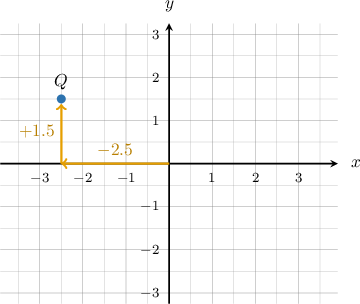

The coordinates of $Q$ are $\boxed{(-2.5,1.5)}.$

### Example: Determining the X or Y Coordinates of a Point: One-Half Divisions

#### Question

What is the $x$-coordinate of the point $T?$

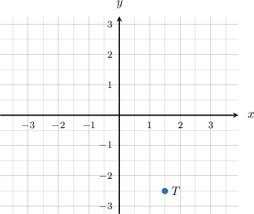

#### Explanation

To find the coordinates of $T,$ we start at the origin, move $1.5$ units **, and then $2.5$ units **.

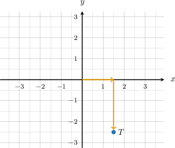

The coordinates of $T$ are $(1.5,-2.5).$ Therefore, the $x$-coordinate of $T$ is $1.5.$

### Example: Determining the Coordinates of a Point: One-Half Divisions

#### Question

What are the coordinates of the point $P?$

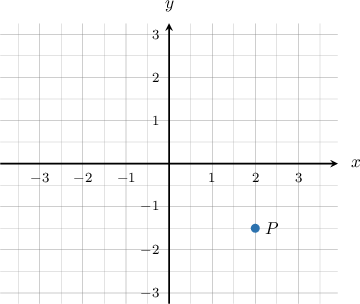

#### Explanation

To find the coordinates of $P,$ we start at the origin, move $2$ units **, and then $1.5$ units **.

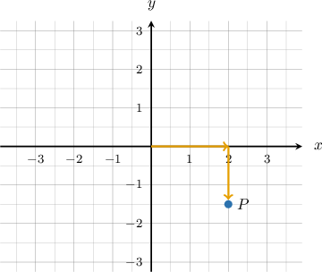

The coordinates of $P$ are $(2,-1.5).$

### Finer Divisions

In the previous examples, the grid was divided into *halves*, and each step represented $0.5$ of a unit.

Similarly, when a unit is split into $10$ equal parts, each small step will represent $0.1.$ We still count from $0,$ but now the distances are smaller and require more precision.

For instance, what are the coordinates of the point $Z?$

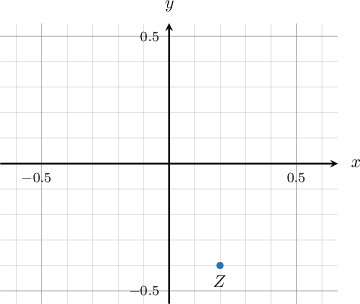

To find the coordinates of $Z,$ we start at the origin.

- First, to find the *$x$-coordinate*, we move $0.2$ units to the *right* (the positive x-direction).

- Then, to find the *$y$-coordinate*, we move $0.4$ units *down* (the negative y-direction).

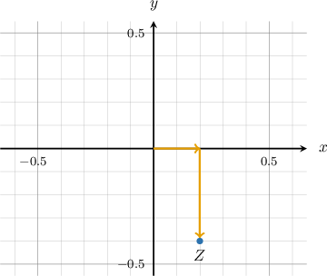

The coordinates of $Z$ are $(0.2,-0.4).$

### Example: Determining the X or Y Coordinates of a Point: One-Tenth Divisions

#### Question

What is the $y$-coordinate of the point $S?$

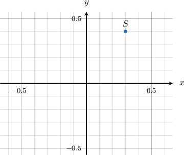

#### Explanation

To find the coordinates of $S,$ we start at the origin, move $0.3$ units **, and then $0.4$ units **.

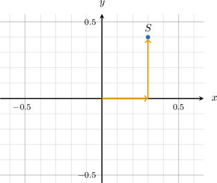

The coordinates of $S$ are $(0.3,0.4).$ Therefore, the $y$-coordinate of $S$ is $0.4.$

### Example: Determining the Coordinates of a Point: One-Tenth Divisions

#### Question

What are the coordinates of the point $W?$

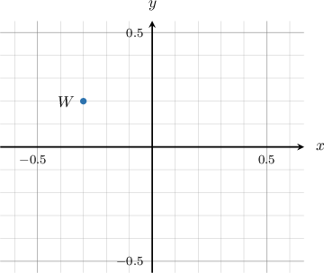

#### Explanation

To find the coordinates of $W,$ we start at the origin, move $0.3$ units **, and then $0.2$ units **.

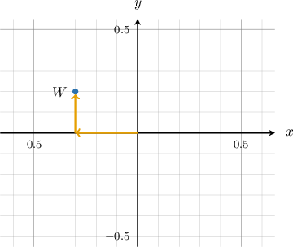

The coordinates of $W$ are $(-0.3,0.2).$
