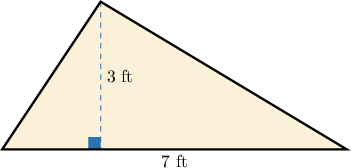
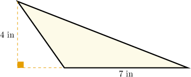
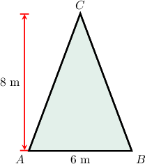
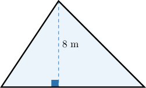
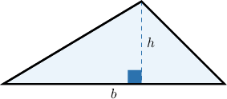

# Areas of Triangles

Source: https://www.mathacademy.com/topics/6769?courseId=31
Topic ID: 6769

## Prerequisites

- [Areas of Right Triangles](./575-areas-of-right-triangles.md)

## Lesson

### Introduction

So far, we have considered the area of a *right triangle*. But what is the area of a *general* triangle, one that is not necessarily a right triangle?

It turns out that the same idea still works.

A formula for the area of a triangle is

$$

\textrm{Area} = \dfrac{1}{2} \cdot b \cdot h,

$$

where $b$ is the base and $h$ is the corresponding height.

This formula works for *any* triangle.

Let's use this formula to find the area of the triangle below.

In our triangle,

$$

\textrm{base} = 7 \: \text{ft}, \qquad \textrm{height} = 3 \: \text{ft}.

$$

Therefore, the area of the triangle is

$$

\begin{aligned}Area & =\frac{1}{2}⋅7⋅3 \\ & =\frac{1}{2}⋅21 \\ & =10.5\,ft^{2}.\end{aligned}

$$

At the end of this lesson, we'll show how to prove the formula for the area of a triangle.

Let’s see more examples.

### Example: Finding the Area of a Triangle Given the Base and Height as Whole Numbers

#### Question

Find the area of the triangle.

#### Explanation

First, we find the height and base of the triangle:

The area of the triangle can be found by the following formula:

Substituting the values of the base and height, we get

Now, let's find the units. Since base and height are measured in inches, the area is measured in square inches. Hence,

### Example: Finding the Area of a Triangle: Word Problem

#### Question

A triangular garden plot has a base of $6$ meters and a height of $8$ meters. What is the area of the garden plot?

#### Explanation

Let's sketch our garden plot based on the description.

The height and base of the triangle are

$$

\begin{aligned}base & =6, \\ height & =8.\end{aligned}

$$

The area of the triangle can be found by the following formula:

$$

\textrm{Area} = \dfrac{1}{2} \times \textrm{base} \times \textrm{height}.

$$

Substituting the values of the base and height, we get

$$

\begin{aligned}Area & =\frac{1}{2}×6×8 \\ & =3×8 \\ & =24.\end{aligned}

$$

Now, let's find the units. Since base and height are measured in meters, the area is measured in square meters. Hence,

$$

\textrm{Area} = 24 \, \textrm{m}^2.

$$

### Example: Finding the Base of a Triangle Given the Height and Area

#### Question

Find the length of the base of a triangle given that its height is $8\, \mathrm{m}$ and its area is $30\, \mathrm{m^2}.$

#### Explanation

Let's write down what we know:

$$

\begin{aligned} & Height=8 \\ & Area=30\end{aligned}

$$

The area of the triangle can be found by the following formula:

$$

\textrm{Area} = \dfrac{1}{2} \times \textrm{base} \times \textrm{height}

$$

Substituting the values of the area and height, we get

$$

\begin{aligned}30 & =\frac{1}{2}×base×8 \\ 30 & =4×base.\end{aligned}

$$

Using the relationship between multiplication and division, we get

$$

\textrm{base} = 30 \div 4 = \dfrac{30}{4} = \dfrac{15}{2}.

$$

Now, let's find the units. Since the area is measured in square meters and the height is measured in meters, the base is measured in meters. Hence,

$$

\textrm{base} = \dfrac{15}{2}\, \textrm{m}.

$$

### Proof of the Formula For the Area of a Triangle

We know that the area formula for a triangle is

$$

\mathcal{A} = \dfrac{1}{2} \cdot b \cdot h,

$$

where $b$ is a base and $h$ is the corresponding height.

But where does this formula come from?

To understand this, consider the triangle below, with base $b$ and height $h.$

Let's draw a rectangle around it, as follows:

We have two pairs of right triangles with equal areas (each pair is indicated with arrows).

The area of the enclosing rectangle is $b \cdot h.$ Since the triangle occupies exactly half of this area, we have

$$

\mathcal{A} = \dfrac{1}{2} \cdot b \cdot h.

$$
