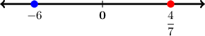
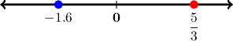

# Comparing Rational Numbers

Source: https://www.mathacademy.com/topics/965?courseId=31
Topic ID: 965

## Prerequisites

- [Comparing Decimals](../grade-5/2286-comparing-decimals.md)
- [Interpreting Fractions as Division](../grade-4/2409-interpreting-fractions-as-division.md)
- [Comparing Negative Numbers](./2444-comparing-negative-numbers.md)
- [Comparing Fractions Using Common Denominators](../grade-4/4204-comparing-fractions-using-common-denominators.md)
- [Identifying Rational Numbers on a Number Line](./6741-identifying-rational-numbers-on-a-number-line.md)

## Lesson

### Introduction

In this lesson, we will learn how to *compare rational numbers*, including:

- positive and negative fractions, and

- positive and negative decimals.

This lesson builds directly on ideas we already know. Just like before:

- numbers to the *left* on a number line are *smaller*, and

- numbers to the *right* on a number line are *greater*.

This rule works for *all rational numbers*, not just integers.

For example, let’s compare $\dfrac{4}{7}$ and $-6.$

First, we plot both numbers on a number line (not to scale):

- the negative integer, $-6,$ goes to the *left* of zero, and

- the positive fraction, $\dfrac{4}{7},$ goes to the *right* of zero.

Any number to the right is *greater* than a number to the left, so $\dfrac{4}{7}$ is *greater than* $-6.$

Therefore, the correct statement must be the following:

$$

\dfrac{4}{7} > -6

$$

Let's see more examples.

### Example: Comparing Positive and Negative Rational Numbers

#### Question

Fill in the correct symbol below to make the statement true.

$$

𝐴

$$

#### Explanation

First, we plot both numbers on a number line (not to scale):

- the negative number, $-1.6,$ goes to the left of zero, and

- the positive number, $\dfrac{5}{3},$ goes to the right of zero.

Any number to the left is less than a number to the right. So, $-1.6$ is ** $\dfrac{5}{3}.$

Therefore, the correct statement must be the following:

$$

-1.6 \boxed{< } \dfrac{5}{3}

$$

### Example: Comparing Negative Fractions With Like Denominators

#### Question

Fill in the correct symbol below to make the statement true.

$$

𝐴

$$

#### Explanation

We have two negative fractions, which we write as

$$

\dfrac{(-8)}{5} \qquad\text{and}\qquad \dfrac{(-11)}{5}.

$$

The fractions have equal denominators. So, we can compare them by looking at the numerators only.

Since $-8 > -11,$ the correct statement must be

$$

-\dfrac{8}{5} \boxed{>} -\dfrac{11}{5}.

$$

### Example: Comparing Negative Fractions With Unlike Denominators

#### Question

Fill in the correct symbol below to make the statement true.

$$

𝐴

$$

#### Explanation

We cannot compare the fractions directly as they don't have a common denominator.

The least common denominator in this case is $36.$

- To put $-\dfrac{7}{9}$ over a denominator of $36,$ we multiply the numerator and denominator by $4{:}$

- To put $-\dfrac{5}{12}$ over a denominator of $36,$ we multiply the numerator and denominator by $3{:}$

So, we have two negative fractions, which we write as

$$

\dfrac{(-28)}{36} \qquad\text{and}\qquad \dfrac{(-15)}{36}.

$$

Thus, we can now compare the fractions by looking at the numerators only.

Since $-28 < -15,$ the correct statement must be

$$

-\dfrac{28}{36} < -\dfrac{15}{36},

$$

or, equivalently,

$$

-\dfrac{7}{9} \boxed{<} -\dfrac{5}{12}.

$$

### Comparing Decimals

When comparing *decimals*, we use the same ideas you already know from comparing integers, together with *place value* and *absolute value*.

The process looks as follows.

- **Step 1:** Align the decimal points. Always write the decimals so their decimal points line up. If one number has fewer decimal places, you can add trailing zeros without changing its value.

- **Step 2:** Remember how negative numbers work. When both decimals are negative, they both lie to the *left* of zero on a number line, and the number *closer to zero* is *greater*. To decide which number is closer to zero, we compare their *absolute values*.

For example, let’s compare $-3.14$ and $-0.90.$

To see which number is closer, we look at their distances from $0$ using absolute value:

$$

|-3.14| = 3.14 \qquad\text{and}\qquad |-0.90| = 0.90

$$

Since $0.90 < 3.14,$ the number $-0.90$ is closer to $0$ than $-3.14.$

Therefore, $-3.14$ is *less than* $-0.90,$ and the correct comparison is

$$

-3.14 < -0.90.

$$

### Example: Comparing Negative Decimals

#### Question

Fill in the correct symbol below to make the statement true.

$$

𝐴

$$

#### Explanation

Both numbers are negative, so they are both to the ** of zero on a number line.

Among negative numbers, the one ** is **.

To see which number is closer, we look at their distances from $0$ using absolute value:

$$

|-3.28| = 3.28 \qquad\text{and}\qquad |-3.6| = 3.6

$$

Since $3.28 < 3.6,$ the number $-3.28$ is closer to $0$ than $-3.6.$

Therefore, $-3.28$ is ** $-3.6,$ and the correct comparison is the following:

$$

-3.28 \boxed{>} -3.6

$$

