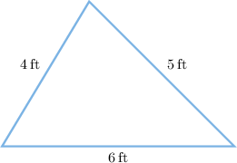
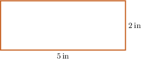
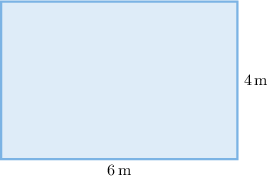
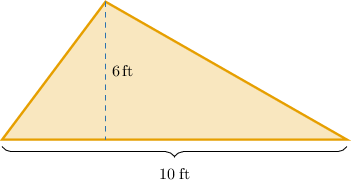

# Calculating Perimeters and Areas of Scaled Shapes

Source: https://www.mathacademy.com/topics/1235?courseId=37
Topic ID: 1235

## Prerequisites

- [Areas of Triangles](./1397-areas-of-triangles.md)
- [Calculating Lengths From Scale Drawings](./1408-calculating-lengths-from-scale-drawings.md)

## Lesson

### Introduction

Recall that when a figure is scaled, all of its side lengths are multiplied by the same number. Because perimeter is found by adding side lengths, the perimeter is multiplied by that same number as well:

*If all side lengths of a figure are multiplied by a scale factor $k,$ then the perimeter is also multiplied by $k$.*

This rule allows us to predict how the perimeter changes without recomputing everything from scratch. Let's verify that this rule works for the triangle below by calculating the perimeter before and after scaling.

Suppose all side lengths of the triangle are doubled. How does the perimeter of the scaled triangle change compared to the original one?

First, the perimeter of the original triangle is

$$

\begin{aligned}Original Perimeter & =6+5+4 \\ & =15\,ft.\end{aligned}

$$

Next, we double all the lengths:

$$

\begin{aligned}2⋅6 & =12\,ft \\ 2⋅5 & =10\,ft \\ 2⋅4 & =8\,ft\end{aligned}

$$

Now, we find the perimeter of the new triangle:

$$

\begin{aligned}New Perimeter & =12+10+8 \\ & =30\,ft.\end{aligned}

$$

Finally, comparing the new perimeter to the original perimeter gives

$$

\begin{aligned}\frac{New Perimeter}{Original Perimeter} & =\frac{30}{15}=2.\end{aligned}

$$

Therefore, the ratio of the new perimeter to the original perimeter is $2:1.$ Just as the rule predicted, doubling the side lengths doubled the perimeter!

### Example: Calculating the Perimeter in Scaled Shapes

#### Question

Consider the rectangle above. Suppose both the length and the height of the rectangle are doubled. Which of the following statements is true?

1. The perimeter of the original rectangle is $14\:\text{in}.$

2. The perimeter of the scaled rectangle is $28\:\text{in}.$

3. The ratio of the new perimeter to the original perimeter is $4:1.$

#### Explanation

Let's examine the statements in turn.

- Statement I is true. The perimeter of a rectangle is

- Statement II is true. First, double both the length and the height: Now, find the perimeter of the new rectangle:

- Statement III is false. Comparing the new perimeter to the original perimeter gives So, the ratio of the new perimeter to the original perimeter is $2:1,$ not $4:1.$

Therefore, the correct answer is "I and II only".

### Areas in Scale Drawings

Again, when a figure is scaled, all of its side lengths are multiplied by the same number. However, area depends on *two dimensions* (such as length and height for a rectangle), so the area changes faster than the side lengths.

If all side lengths of a figure are multiplied by a scale factor $k,$ then the area is multiplied by $k^2.$

This means that if all lengths are doubled, the area becomes four times as large. If all lengths are tripled, the area becomes nine times as large, and so on. For example, consider the rectangle below.

Suppose both the length and the height of the rectangle are doubled. How is the area of the scaled rectangle changed compared to the original one?

First, the area of the original rectangle is

$$

\begin{aligned}Original Area & =length⋅height \\ & =6⋅4 \\ & =24\,m^{2}.\end{aligned}

$$

Next, we double both the length and the height:

$$

\begin{aligned}2⋅6 & =12\,m \\ 2⋅4 & =8\,m\end{aligned}

$$

Now, we find the area of the new rectangle:

$$

\begin{aligned}New Area & =length⋅height \\ & =12⋅8 \\ & =96\,m^{2}.\end{aligned}

$$

Finally, comparing the new area to the original area gives

$$

\begin{aligned}\frac{New Area}{Original Area} & =\frac{96}{24}=4.\end{aligned}

$$

Therefore, the new area is $4$ times as large as the original area.

### Example: Calculating the Area in Scaled Shapes

#### Question

Consider the triangle above. Suppose both the length of the base and the height of the triangle are divided by $2.$ Which of the following statements are true?

1. The area of the original triangle is $60\:\text{ft}^2.$

2. The area of the scaled triangle is $30\:\text{ft}^2.$

3. The ratio of the new area to the original area is $1:4.$

#### Explanation

Let's examine the statements in turn.

- Statement I is false. The area of the triangle is So, the original area is $30 \: \text{ft}^2,$ not $60 \: \text{ft}^2.$

- Statement II is false. First, divide all the lengths: Now, find the area of the new triangle: So, the new area is $\dfrac{15}{2} \: \text{ft}^2,$ not $30 \: \text{ft}^2.$

- Statement III is true. Comparing the new area to the original area gives

Therefore, the correct answer is ****.
