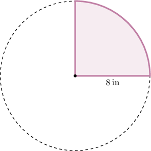
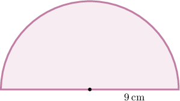
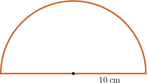
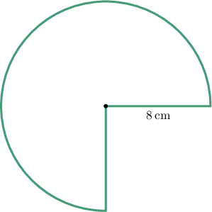
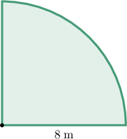

# Finding Areas and Perimeters of Part-Circles

Source: https://www.mathacademy.com/topics/1648?courseId=37
Topic ID: 1648

## Prerequisites

- [The Circumference of a Circle](./520-the-circumference-of-a-circle.md)
- [The Area of a Circle](./522-the-area-of-a-circle.md)
- [The Perimeter of a Polygon](./1386-the-perimeter-of-a-polygon.md)

## Lesson

### Introduction

In this lesson, we will learn how to find the area and perimeter of parts of circles, such as quarter circles, semicircles, and three-quarter circles.

For example, consider the quarter circle with a radius of $8\:\textrm{in}$ below. Let's find its area.

Recall that the area of a circle is given by

$$

\mathcal{A}=\pi r^2,

$$

where $r$ is the radius.

So, the area of the quarter-circle is

$$

\mathcal{A}_{\text{quarter}} = \dfrac{1}{4}\mathcal{A} = \dfrac{1}{4} \pi r^2.

$$

Using $\pi \approx 3.14$ and $r=8\:\text{in},$ we have

$$

\begin{aligned}A_{quarter} & =\frac{1}{4}𝜋𝑟^{2} \\ & ≈\frac{1}{4}⋅3.14⋅8^{2} \\ & =\frac{1}{4}⋅3.14⋅64 \\ & =3.14⋅16 \\ & =50.24.\end{aligned}

$$

Therefore, the area is approximately $50.24 \: \textrm{in}^2.$

Let see another example.

### Example: Computing the Area of a Part of a Circle

#### Question

What is the area of the semicircle with a radius of $9\:\textrm{cm}?$ Use the approximation $\pi \approx 3.14.$

#### Explanation

Recall that the area of a circle is given by

$$

\mathcal{A}=\pi r^2,

$$

where $r$ is the radius.

So, the area of the semicircle is

$$

\mathcal{A}_{\text{semi}} = \dfrac{1}{2}\mathcal{A} = \dfrac{1}{2} \pi r^2.

$$

Using $\pi \approx 3.14$ and $r=9\:\text{cm},$ we have

$$

\begin{aligned}A_{semi} & =\frac{1}{2}𝜋𝑟^{2} \\ & ≈\frac{1}{2}⋅3.14⋅9^{2} \\ & =\frac{1}{2}⋅3.14⋅81 \\ & =127.17.\end{aligned}

$$

Therefore, the area is approximately $127.17 \: \textrm{cm}^2.$

### Perimeters of Circle's Parts

Given a part of a circle (quarter circle, semicircle, or three-quarter circle), we can also compute its perimeter.

For example, what is the perimeter of the semicircle with a radius of $10\:\textrm{cm}?$

The perimeter of a semicircle includes

- one diameter (two radii), and

- half of the circumference.

The circumference of a full circle is

$$

C = 2\pi r.

$$

So, half of the circumference is

$$

\dfrac{1}{2} \cdot 2\pi r = \pi r.

$$

Thus, the total perimeter is

$$

P = 2r + \pi r.

$$

Using $\pi \approx 3.14$ and $r=10\:\text{cm},$ we have

$$

\begin{aligned}𝑃 & ≈2⋅10+3.14⋅10 \\ & =20+31.4 \\ & =51.4.\end{aligned}

$$

Therefore, the perimeter is approximately $51.4 \: \textrm{cm}.$

### Example: Computing the Perimeter of a Part of a Circle

#### Question

What is the perimeter of the three-quarter circle with a radius of $8\:\textrm{cm}?$ Use the approximation $\pi \approx 3.14.$

#### Explanation

The perimeter of a three-quarter circle includes

- two radii, and

- three-quarters of the circumference.

The circumference of a full circle is

$$

C = 2\pi r.

$$

So, three-quarters of the circumference is

$$

\dfrac{3}{4} \cdot 2\pi r = \dfrac{3}{2}\pi r.

$$

Thus, the total perimeter is

$$

P = 2r + \dfrac{3}{2}\pi r.

$$

Using $\pi \approx 3.14$ and $r=8\:\text{cm},$ we have

$$

\begin{aligned}𝑃 & =2⋅8+\frac{3}{2}⋅3.14⋅8 \\ & =16+37.68 \\ & =53.68.\end{aligned}

$$

Therefore, the perimeter is approximately $53.68 \: \textrm{cm}.$

### Areas and Perimeters of Parts of a Circle in Context

Now, let's see an application of the above in a real-world context.

A circular garden is divided into four equal sections, and only one section is planted with flowers. The radius of the garden is $8\:\textrm{m}.$

Using the approximation $\pi \approx 3.14,$ what is the area of the section that is planted?

Recall that the area of a circle is given by

$$

\mathcal{A}=\pi r^2,

$$

where $r$ is the radius.

So, the area of one quarter of the circle is

$$

\mathcal{A}_{\text{quarter}} = \dfrac{1}{4}\mathcal{A} = \dfrac{1}{4} \pi r^2.

$$

Using $\pi \approx 3.14$ and $r=8\:\text{m},$ we have

$$

\begin{aligned}A_{quarter} & =\frac{1}{4}𝜋𝑟^{2} \\ & ≈\frac{1}{4}⋅3.14⋅8^{2} \\ & =\frac{1}{4}⋅3.14⋅64 \\ & =3.14⋅16 \\ & =50.24.\end{aligned}

$$

Therefore, the area is approximately $50.24 \: \textrm{m}^2.$

### Example: Solving Word Problems Involving Parts of Circles

#### Question

A semicircular patio has a radius of $10\:\textrm{ft}.$

Using the approximation $\pi \approx 3.14,$ what is the area of the patio?

#### Explanation

Recall that the area of a circle is given by

$$

\mathcal{A}=\pi r^2,

$$

where $r$ is the radius.

So, the area of the semicircle is

$$

\mathcal{A}_{\text{semi}} = \dfrac{1}{2}\mathcal{A} = \dfrac{1}{2} \pi r^2.

$$

Using $\pi \approx 3.14$ and $r=10\:\text{ft},$ we have

$$

\begin{aligned}A_{semi} & =\frac{1}{2}𝜋𝑟^{2} \\ & ≈\frac{1}{2}⋅3.14⋅10^{2} \\ & =\frac{1}{2}⋅3.14⋅100 \\ & =3.14⋅50 \\ & =157.\end{aligned}

$$

Therefore, the area is approximately $157 \: \textrm{ft}^2.$
