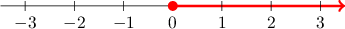
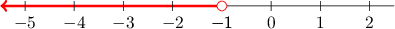

# Inequalities

Source: https://www.mathacademy.com/topics/178?courseId=37
Topic ID: 178

## Prerequisites

- [Comparing Negative Numbers](../grade-5/2444-comparing-negative-numbers.md)
- [Constructing Algebraic Expressions](../prealgebra/3721-constructing-algebraic-expressions.md)

## Lesson

### Introduction

An **inequality** is a mathematical statement that represents a set of numbers on the number line. For example, the set of numbers that are greater than or equal to $0$ can also be represented by the inequality

$$

x \; {\color{red}\geq} \; 0

$$

Here, the sign ${\color{red}\geq}$ means "greater than or equal to." So the above statement in words is "$x$ is greater than or equal to zero." For example,

- the numbers $0,$ $1,$ and $7.321$ all satisfy the inequality, while

- the numbers $-0.01,$ $-8,$ and $-123$ do not.

We can represent this inequality visually using a number line. To do so, we first plot the number zero as a red dot on the number line. The rest of the numbers that are greater than or equal to $0$ lie to the right of $0,$ so we represent them using a red line that extends to the right of $0\mathbin{:}$

In general, there are four types of inequalities:

$\ge\quad$ *greater than or equal* - this is represented by a filled circle $\Large\color{red}\bullet$ and an arrow that goes to the right $\Large\color{red}\boldsymbol{\rightarrow}$

$>\quad$ *greater than* - this is represented by an empty circle $\Large\color{red}\circ$ and an arrow that goes to the right $\Large\color{red}\boldsymbol{\rightarrow}$

$\le\quad$ *less than or equal* - this is represented by a filled circle $\Large\color{red}\bullet$ and an arrow that goes to the left $\Large\color{red}\boldsymbol{\leftarrow}$

$<\quad$ *less than* - this is represented by an empty circle $\Large\color{red}\circ$ and an arrow that goes to the left $\Large\color{red}\boldsymbol{\leftarrow}$

### Example: Finding the Inequality Represented by a Number Line

#### Question

What inequality corresponds to the red colored graph shown in the number line below?

#### Explanation

The red arrow indicates that $x$ should consist of all the values greater than $2.$ In addition, the filled red circle at $2$ implies that $x$ can be equal to $2.$

Therefore, the highlighted region represents the numbers that are greater than or equal to $2.$ This corresponds the inequality $x \geq 2.$

### Example: Constructing the Number Line for a Given Inequality

#### Question

Represent $x < -1$ on a number line.

#### Explanation

The symbol "$<$" means "less than." So, the inequality $x < -1$ represents the numbers that are less than $-1.$

On a number line, the numbers less than $-1$ are the numbers that are left of $-1.$ So, we should draw an arrow going to the left of $-1.$

However, the number $-1$ itself is not less than $-1,$ so we should not include it in our representation. To exclude $-1,$ we draw an empty circle around $-1.$

