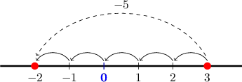
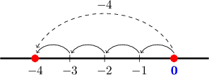

# Subtracting a Positive Number From a Smaller Positive Number

Source: https://www.mathacademy.com/topics/327?courseId=37
Topic ID: 327

## Prerequisites

- [Negative Numbers](../grade-5/2442-negative-numbers.md)
- [Subtracting Three-Digit Numbers](../grade-4/3907-subtracting-three-digit-numbers.md)

## Lesson

### Introduction

When we subtract a positive number from another positive number, we move towards the left on the number line.

For example, let's consider the following subtraction problem:

$$

3 - 5

$$

To subtract $5$ from $3,$ we start at $3$ on the number line and move $5$ places to the left.

When we do this, we land at $-2.$ Therefore,

$$

3-5 = -2.

$$

### Example: Subtracting a Positive Number From a Non-Negative Number

#### Question

What is the value of $0 - 4?$

#### Explanation

To subtract $4$ from $0,$ we start at $0$ on the number line and move $4$ places to the left.

When we do this, we land at $-4.$ Therefore, $0-4 = -4.$

### Subtraction With Larger Numbers

It is impractical to use number lines to subtract large numbers.

However, a neat trick makes subtracting a positive number from a smaller positive number very easy!

As an example, let's consider the following subtraction problem:

$$

{\color{red}{37}} - {\color{blue}{68}}

$$

Since $68$ is larger than $37,$ the answer *must be negative*.

We start by solving an easier problem: subtracting the numbers *in the reverse order*. In our case, the reverse problem is

$$

{\color{blue}{68}} - {\color{red}{37}}.

$$

Next, we carry out the subtraction:

$$

\begin{aligned} & & \,\,\, & \,\,\, \\ & & \,\,\,6\,\,\, & \,\,\,8\,\,\, \\ \,\,\,\,−\,\,\,\, & & \,\,\,3\,\,\, & \,\,\,7\,\,\, \\ & & \,\,\,3\,\,\, & \,\,\,1\,\,\,\end{aligned}

$$

So, we have

$$

{\color{blue}{68}} - {\color{red}{37}} = 31.

$$

However, since our answer must be negative, we need to change the sign of the answer above.

Therefore, we conclude that

$$

{\color{red}{37}} - {\color{blue}{68}} = -31.

$$

And that's it!

Let's use the same idea to subtract two three-digit numbers.

### Example: Subtracting a Positive Number From a Non-Negative Number With Larger Numbers

#### Question

Find the value of $170 - 281.$

#### Explanation

Since $281$ is larger than $170,$ the answer will be negative.

We start by solving an easier problem:

$$

281 - 170

$$

Next, we carry out the subtraction:

$$

\begin{aligned} & & \,\,\, & \,\,\, & \,\,\, \\ & & \,\,\,2\,\,\, & \,\,\,8\,\,\, & \,\,\,1\,\,\, \\ \,\,\,\,−\,\,\,\, & & \,\,\,1\,\,\, & \,\,\,7\,\,\, & \,\,\,0\,\,\, \\ & & \,\,\,1\,\,\, & \,\,\,1\,\,\, & \,\,\,1\,\,\,\end{aligned}

$$

So, we have

$$

281-170 = 111.

$$

However, since our answer must be negative, we need to change the sign of the answer above.

Therefore, we conclude that

$$

170 - 281 = -111.

$$
