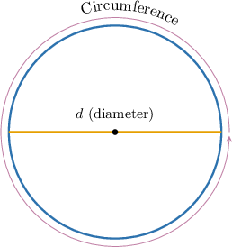
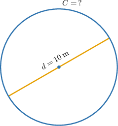
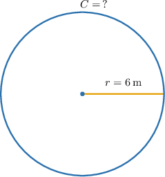

# The Circumference of a Circle

Source: https://www.mathacademy.com/topics/520?courseId=37
Topic ID: 520

## Prerequisites

- [Introduction to Circles](./7211-introduction-to-circles.md)
- [Perimeters of Shapes](../grade-5/7743-perimeters-of-shapes.md)

## Lesson

### Introduction

The **circumference** of a circle is the length of the path that goes around the circle.

The circumference is usually denoted by the letter $C.$

One important fact about the circumference is that, for *any* circle, no matter how small or large it is, the ratio of circumference $C$ to diameter $d$ is a fixed number! Specifically,

$$

\dfrac{C}{d} = \pi \approx 3.141\,592\,653...

$$

This important irrational number is called **pi** (pronounced "pie") and we use the Greek letter $\pi$ to express it. So, we can calculate the circumference by using the following formula:

$$

C = \pi d

$$

### Using Approximations of Pi

Notice that $\pi=3.141\,592\,653\dots$ represents an infinite (non-repeating) decimal, meaning that its decimal digits go on forever and do not form any repeating pattern. That's why, in practice, we'll often use an approximation of $\pi,$ say, to two decimal digits:

$$

\pi \approx 3.14

$$

For example, let's find the approximate circumference of a circle with a diameter of $10\:\textrm{m},$ shown below.

The circumference of a circle is

$$

C = \pi d,

$$

where $d$ is the diameter.

Using $\pi \approx 3.14,$ we obtain

$$

\begin{aligned}𝐶 & =𝜋𝑑 \\ & ≈3.14⋅10 \\ & =31.4.\end{aligned}

$$

Therefore, the circumference is approximately $31.4 \: \textrm{m}.$

**Watch out!** Since we used an approximate value for $\pi,$ we get an approximate circumference, not an exact one!

### Example: Calculating the Circumference of a Circle Given the Diameter

#### Question

Using the approximation of $\pi \approx 3.14,$ find the circumference of a circle with a diameter of $7\:\textrm{cm}.$

#### Explanation

The circumference of a circle is

$$

C = \pi d,

$$

where $d$ is the diameter.

Using that $\pi \approx 3.14,$ we obtain

$$

\begin{aligned}𝐶 & =𝜋𝑑 \\ & ≈3.14⋅7 \\ & =21.98.\end{aligned}

$$

Therefore, the circumference is approximately $21.98 \: \textrm{cm}.$

### Formula for Circumference Using the Radius

Recall that in any circle, the diameter is twice as long as the radius:

$$

d = 2r

$$

So, we can write the formula for the circumference as

$$

C = \pi d = 2\pi r.

$$

For example, let's find the circumference of a circle with a radius of $6\:\textrm{m}.$

Using $\pi \approx 3.14,$ we obtain

$$

\begin{aligned}𝐶 & =2𝜋𝑟 \\ & ≈2⋅3.14⋅6 \\ & =3.14⋅12 \\ & =37.68.\end{aligned}

$$

Therefore, the circumference is approximately $37.68 \: \textrm{m}.$

### Example: Calculating the Circumference of a Circle Given the Radius

#### Question

Using the approximation of $\pi \approx 3.14,$ find the circumference of a circle with a radius of $8 \: \textrm{cm}.$

#### Explanation

The circumference of a circle is

$$

C = 2\pi r,

$$

where $r$ is the radius.

Using that $\pi \approx 3.14,$ we obtain

$$

\begin{aligned}𝐶 & =2𝜋𝑟 \\ & ≈2⋅3.14⋅8 \\ & =3.14⋅16 \\ & =50.24.\end{aligned}

$$

Therefore, the circumference is approximately $50.24 \: \textrm{cm}.$

### Solving for Radius or Diameter

We can also solve for the diameter or radius given the circumference of the circle.

For example, using the approximation of $\pi \approx 3.14,$ let's find the radius of a circle with a circumference of $62.8\:\textrm{cm}.$

The circumference of a circle is

$$

C = 2\pi r,

$$

where $r$ is the radius.

Given that $\pi \approx 3.14,$ we obtain the following equation, which we solve for $r{:}$

$$

\begin{aligned}𝐶 & =2𝜋𝑟 \\ 62.8 & =2⋅3.14⋅𝑟 \\ 62.8 & =6.28𝑟 \\ 𝑟 & =\frac{62.8}{6.28} \\ & =10.\end{aligned}

$$

Therefore, the radius is approximately $10 \: \textrm{cm}.$

### Example: Finding the Radius or Diameter of a Circle Given the Circumference

#### Question

Using the approximation of $\pi \approx 3.14,$ find the diameter of a circle with a circumference of $50.24\:\textrm{cm}.$

#### Explanation

The circumference of a circle is

$$

C = \pi d,

$$

where $d$ is the diameter.

Using that $\pi \approx 3.14,$ we obtain the following equation, which we solve for $d{:}$

$$

\begin{aligned}𝐶 & =𝜋𝑑 \\ 50.24 & =3.14𝑑 \\ 𝑑 & =\frac{50.24}{3.14} \\ & =16.\end{aligned}

$$

Therefore, the diameter is approximately $16 \: \textrm{cm}.$

### Circumference in Real World Context

Now, let's see an application of the above in a real-world context.

A circular garden has a radius of $11 \: \textrm{ft}.$ A fence is built all the way around the garden.

Using the approximation of $\pi \approx 3.14,$ find the total length of the fence.

The circumference of a circle is

$$

C = 2\pi r,

$$

where $r$ is the radius.

We are given that the radius of the garden is $r=11 \: \textrm{ft}.$

Using that $\pi \approx 3.14,$ we obtain

$$

\begin{aligned}𝐶 & =2𝜋𝑟 \\ & ≈2⋅3.14⋅11 \\ & =69.08.\end{aligned}

$$

Therefore, the circumference is approximately $69.08\: \textrm{ft}.$

### Example: Calculating the Circumference of a Circle in Word Problems

#### Question

A circular garden path has a total distance around it of $94.2\:\textrm{m}.$

Using the approximation of $\pi \approx 3.14,$ find the diameter of the path.

#### Explanation

The circumference of a circle is

$$

C = \pi d,

$$

where $d$ is the diameter.

The total distance around the path corresponds to its circumference, so $C=94.2\:\textrm{m}.$

Using that $\pi \approx 3.14,$ we obtain the following equation, which we solve for $d{:}$

$$

\begin{aligned}𝐶 & =𝜋𝑑 \\ 94.2 & =3.14𝑑 \\ 𝑑 & =\frac{94.2}{3.14} \\ & =30.\end{aligned}

$$

Therefore, the diameter is approximately $30 \: \textrm{m}.$
