# Comparing Data Set Visualizations Using Standard Deviation and MAD

Source: https://www.mathacademy.com/topics/6188?courseId=37
Topic ID: 6188

## Prerequisites

- [Symmetry, Skew, and Outliers](../prealgebra/2502-symmetry-skew-and-outliers.md)
- [Histograms](../prealgebra/2510-histograms.md)

## Lesson

### Introduction

In a previous lesson, we saw that the *mean absolute deviation* (or MAD) of a data set measures how "spread out" a data set is.

Another statistic we can calculate to measure spread is the **standard deviation.** We won't discuss the details of how to calculate standard deviation here. For now, it's sufficient to know that it's a number that summarizes the spread of a data set, similar to MAD.

We can often determine which group has more deviation by examining how spread out the data appears; the more spread out the group, the larger the standard deviation (or mean absolute deviation). Let's demonstrate this by comparing the standard deviations of the datasets in the following example.

Suppose a teacher recorded the exam scores, as percentages, of students in two different classes. This information is displayed using the histograms shown below.

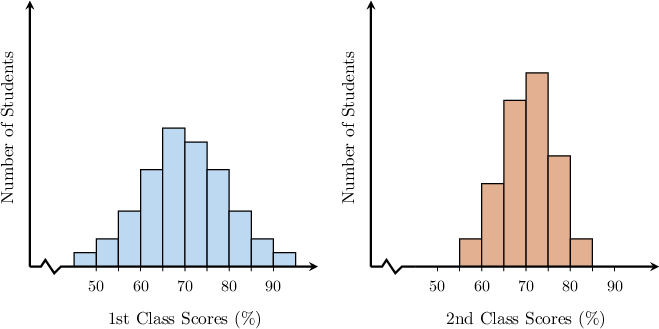

A *larger* standard deviation means the data points are more *spread out*, while a *smaller* standard deviation indicates that the data points are *clustered more closely around the mean*.

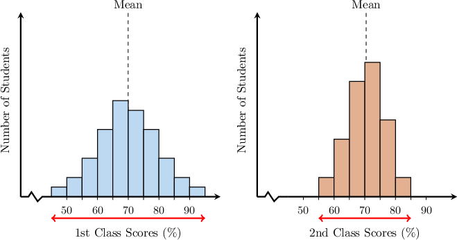

Since the dataset corresponding to the first group is *more* spread out, the standard deviation of the first group is *greater than* that of the second group.

**IMPORTANT**: Only compare spreads when the plots use the same horizontal scale (same units, axis range, tick spacing, and group width). Otherwise, a group that looks more spread out may actually have a smaller deviation.

For example, the histograms below represent the *exact same* datasets as in the example above, but on different horizontal scales.

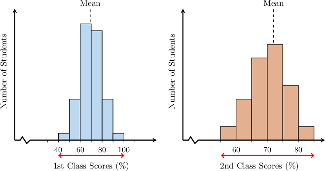

A quick look fools us into thinking the $2$nd class scores are more spread. But we previously concluded that the $1$st class scores are more spread. In reality, we cannot draw a conclusion from these plots, as the horizontal scales differ.

If the horizontal scales of two plots differ, we would need to replot on a common scale before concluding.

### Example: Comparing Visual Data Using MAD and Standard Deviation

#### Question

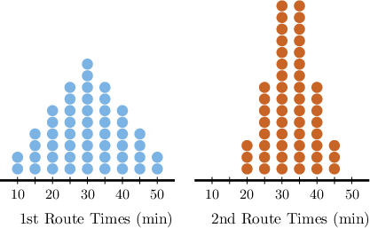

A dispatcher recorded the delivery times, in minutes, for two courier routes. This information is displayed using the dot plots shown above. Which group has the larger mean absolute deviation?

#### Explanation

Mean absolute deviation (MAD) is a statistical measure that indicates how much the values in a dataset deviate from the mean.

A larger MAD means the data points are more spread out, while a smaller MAD indicates that the data points are clustered more closely around the mean.

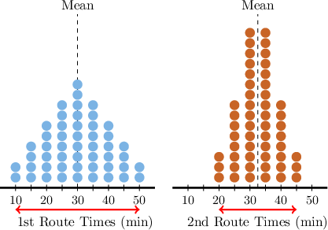

Therefore, since the dataset corresponding to the first group is more spread out, the mean absolute deviation (MAD) of the first group is greater than the MAD of the second group.

### Data Sets With Identical Shapes

When two datasets have identical shapes and the same range, their deviations will be the same.

To demonstrate, consider the two dot plots below, which represent the test scores (out of $100$) recorded by a teacher from two different classes. Let's compare the standard deviations of both classes.

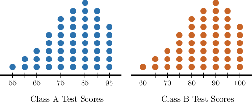

Recall that a larger standard deviation means the data points are more spread out, while a smaller standard deviation indicates that the data points are clustered more closely around the mean.

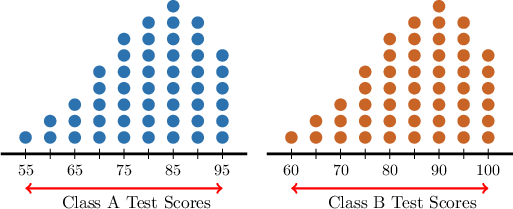

In this case, the ranges of both datasets are equal - only their positions along the horizontal axis differ:

- $\text{Range}(\text{A}) = 95-55 = 40$

- $\text{Range}(\text{B}) = 100-60 = 40$

Notice, also, that the dot plots have *precisely the same shape.*

Since both dot plots have the same range and identical shape, the spread of each dataset relative to its mean is the same.

Therefore, the standard deviation of Class $\text{A}$ is *the same as* the standard deviation of Class $\text{B}{:}$

### Data Sets With Identical Ranges

When two datasets have the same range but different shapes, their deviations are usually *not* the same.

Consider the two dot plots below, which represent the number of minutes members spent exercising per day in two different workout rooms at a fitness center. Which dataset has a greater standard deviation?

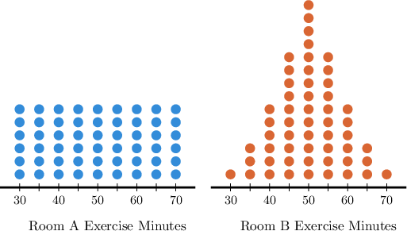

Recall that a larger standard deviation means the data points are more spread out, while a smaller standard deviation indicates that the data points are clustered more closely around the mean.

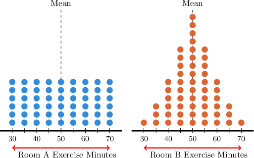

In this case, the ranges of the datasets are the same, but the dot plots have different shapes.

Notice that the data points corresponding to Room $\text{A}$ are more spread out from the mean, while those of Room $\text{B}$ cluster more near the center (on average)

Therefore, the standard deviation of Room $\text{A}$ is *greater than* the standard deviation of Room $\text{B}{:}$

### Example: Comparing Dot Plots With Identical Ranges Using MAD

#### Question

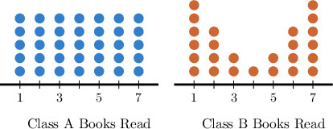

A school recorded the number of books read by students over the summer, using a $1{-}7$ scale to indicate the number of books. This information is displayed using the dot plots shown above. Which class has a smaller mean absolute deviation (MAD)?

#### Explanation

Mean absolute deviation (MAD) is a statistical measure that indicates how much the values in a dataset deviate from the mean.

A larger MAD means the data points are more spread out, while a smaller MAD indicates that the data points are clustered more closely around the mean.

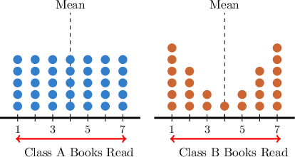

In our case, the ranges of the datasets are the same, but the dot plots have different shapes.

Notice that the data points corresponding to Class B concentrate further from the mean than those of Class A, which are spread uniformly.

Therefore, the mean absolute deviation (MAD) of Class A is ** the MAD of Class B.

### Example: Comparing Dot Plots With Identical Ranges Using Standard Deviation

#### Question

A call center supervisor recorded the duration (in minutes) of customer support calls for two teams. This information is displayed using the dot plots shown below. Which team has a smaller standard deviation?

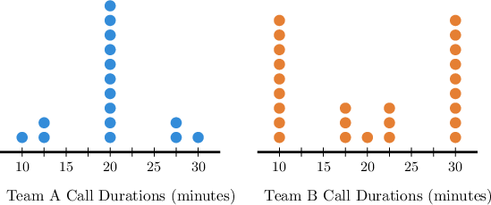

#### Explanation

Standard deviation is a statistical measure that indicates how much the values in a dataset deviate from the mean.

A larger standard deviation means the data points are more spread out, while a smaller standard deviation indicates that the data points are clustered more closely around the mean.

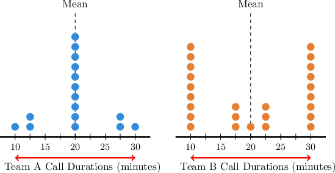

In our case, the ranges of the datasets are the same, but the dot plots have different shapes.

Notice that the data points corresponding to Team $\text{B}$ are concentrated further from the mean than the data points of Team $\text{A}.$

Therefore, the standard deviation of Team $\text{A}$ is smaller than the standard deviation of Team $\text{B}.$

### Example: Comparing Histograms With Identical Ranges Using MAD and Standard Deviation

#### Question

A streaming service analyzed the episode lengths, in minutes, for two different genres. This information is displayed using the histograms shown below. Compare the range, shape, and mean absolute deviation of the two distributions.

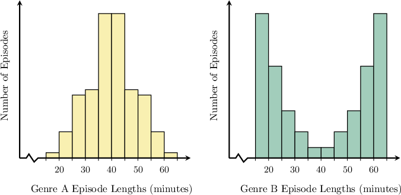

#### Explanation

Mean absolute deviation (MAD) is a statistical measure that indicates how much the values in a dataset deviate from the mean.

A larger MAD means the data points are more spread out, while a smaller MAD indicates that the data points are clustered more closely around the mean.

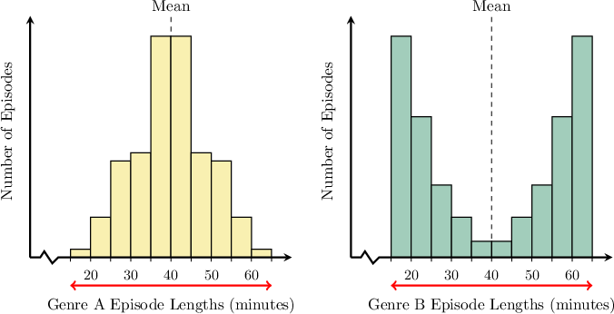

In our case, the ranges of the datasets are the same, but the histograms have different shapes.

Notice that the data points corresponding to the second group are concentrated further from the mean than the data points of the first group.

Therefore, the mean absolute deviation (MAD) of the first group is smaller than the MAD of the second group.
